#! https://zhuanlan.zhihu.com/p/549175616
# 光栅化和采样

**Prerequisite**

全文的相关的数学知识可以参考[《凡人渲染传—数学篇》](https://www.zhihu.com/column/c_1534298442822557696)
### Fourier Transform


**Fourier Series**

* 
$$
f(x) = \frac{A}{2} + \frac{2A\cos(tw)}{\pi} + \frac{2A\cos(3tw)}{3\pi} + \frac{2A\cos(5tw)}{5\pi} +\frac{2A\cos(7tw)}{7\pi} +\frac{2A\cos(7tw)}{7\pi}+ \dots
$$

**Fourier Transform**
作用： [图像傅里叶变换](https://www.robots.ox.ac.uk/~az/lectures/ia/lect2.pdf) 将信号从时域便换到频域
Decomposes A Signal Into Frequencies

输入一个时间t(有的也表示为x)的函数,输出一个频率函数
$$
F(w) = \int_{-\infty}^{\infty}f(t)e^{-2\pi(iwt) \text{d}t}
$$
输入频率w的函数，输出一个关于x的正弦（余弦）函数。 
$$
f(x) =  \int_{-\infty}^{\infty}F(w)e^{2\pi(iwx) \text{d}w}
$$

Higher Frequencies Need Faster Sampling

* 低频信号：充分采样以进行合理重建
* 高频信号采样不足：重建错误地似乎来自低频信号

走样的分析： 在给定采样率下无法区分的两个频率


**傅里叶图像时域到频域的转换**

使用傅里叶变换对图像进行分析的时候需要将图像从时域信号转化到频域，如下图所示：
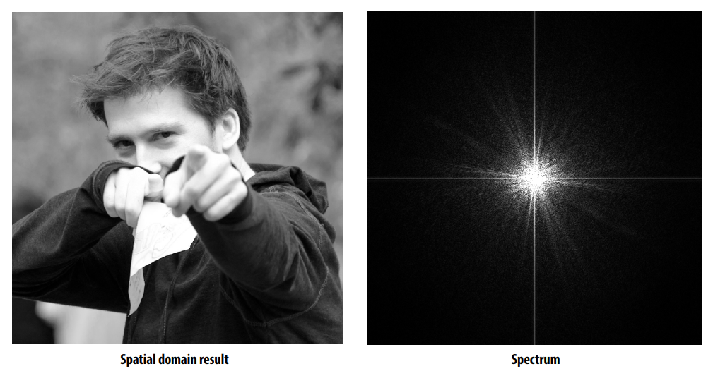
具体转换规则：
1. 左图人像转化成灰度图，灰度值的大小对应z轴高度。这样就形成了凹凸不平的曲面
  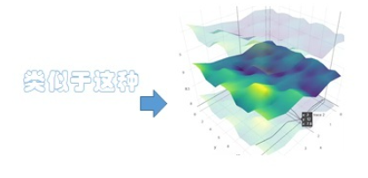
2. 右图为频域图，频域信息对应到图中的每一个点：
    频率f： 点到图片中点的距离。
    振幅A： 点的灰度值。
    (波形面的)方向n： 中心点到该点的方向。
    相位$\phi$: 被舍弃掉了。


### Rasterizing triangles 
**光栅化过程**

扫描线算法：(ps: 这是以前的方法，现代都是用GPU都是基于tiled base并行处理)
MVP矩阵变换和viewport映射后（一般再vertex shader阶段处理），得到三角形顶点(顶点不仅仅位置信息，还包含其他属性如 颜色，UV坐标等。。。)对应的屏幕像素坐标。
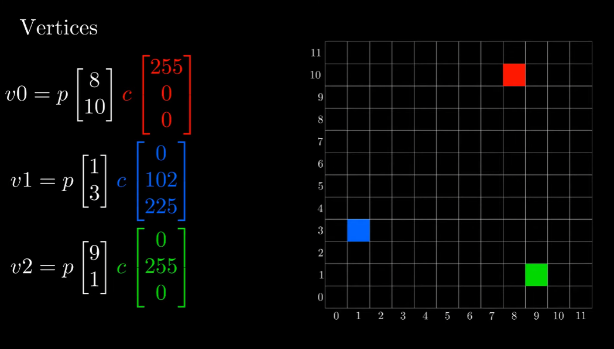

使用Bresenham 画出两点之间的像素点，`保存两点之间新的像素点`，然后给新的像素点插值着色。
  - Bresenham：eg $P1(8, 10), p2(1, 3)\Longrightarrow y = \frac{7}{8}x + 2, 125$ 
  - Liner Interpolation: 在两点之间插值着色。 
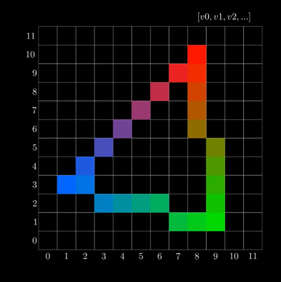

使用扫描线算法填充三角形
  - 遍历x方向像素点，每次y轴相等的，按从左到右排序，保存在数组中.  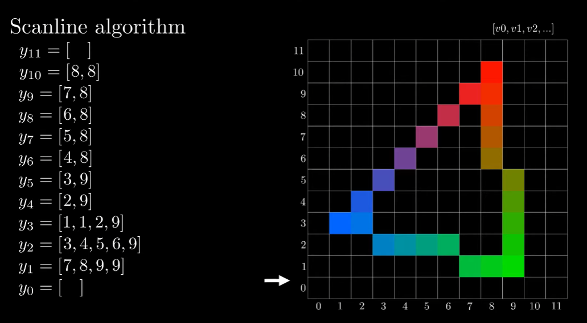
  - 在y轴建立的数组中索引到对应x轴的像素点。 找到左边的端点和右边的端点的两个像素点，扫描填充像素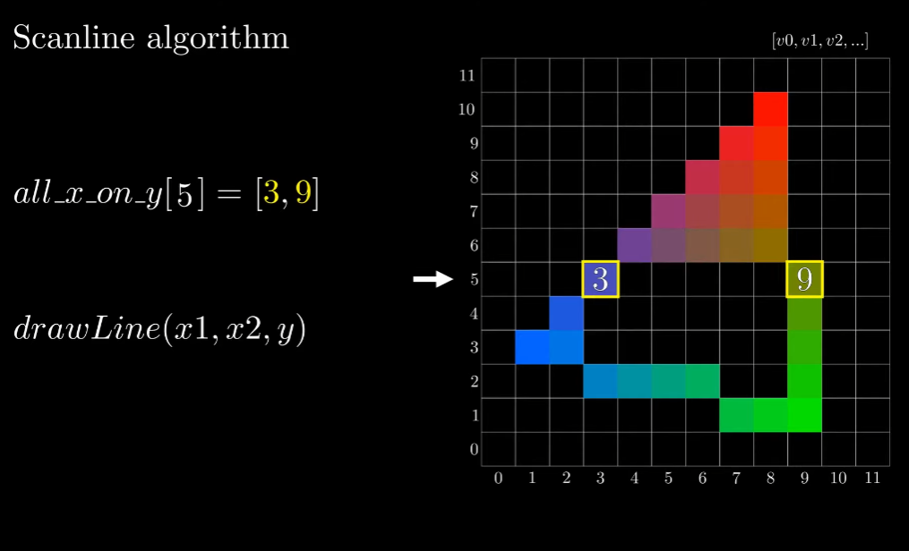

最终完成的光栅化三角形
   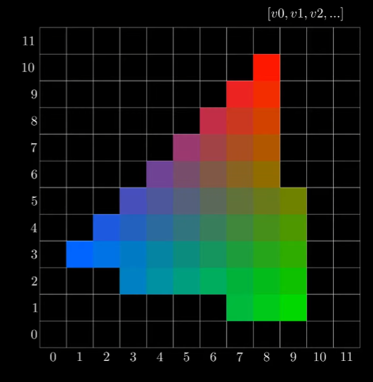

**测试点是否在三角形内 Point_in_triangle_test**
（ps：`判断测试算法对每个像素都是一样，可以在GPU上并行测试`）
判断像素的中心坐标是不是在三角形内，从而决定是否需要进行下一步的像素着色（作为fragment Shader的输入）。

方法——： 利用三角形内角和定理
检查一个点是否在三角形中的一种常见方法是找到将点连接到三角形三个顶点中的每一个的向量，并将这些向量之间的角度相加。如果角度和为 2*pi，则该点在三角形内，否则不在。它可以工作，但速度很慢。

方法二：同侧技术
对于在三角形 ABC 内的点，它必须在 AB 下方、BC 左侧和 AC 右侧。如果其中任何一项测试失败，点就不再三角形内部。
有多种方式：如下面的就是通过叉乘判断是否同方向。 
```c++
函数 SameSide(p1,p2, a,b)
    cp1 = CrossProduct(ba, p1-a)
    cp2 = CrossProduct(ba, p2-a)
    如果 DotProduct(cp1, cp2) >= 0 则返回 true
    否则返回假
函数 PointInTriangle(p, a,b,c)
    如果 SameSide(p,a,b,c) 和 SameSide(p,b,a,c)
        和 SameSide(p,c, a,b) 然后返回 true
    否则返回假
```

另一种就是三条边分别建立直线方程：
$$Ax + bx +c = 0\\$$ 
将P点带入其中，如果方程小于0，就在左侧，大于0，就在右侧,**这里的直线是有方向性的**！当三条边都满足在左侧的时候就在内部。
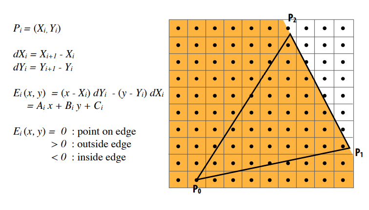 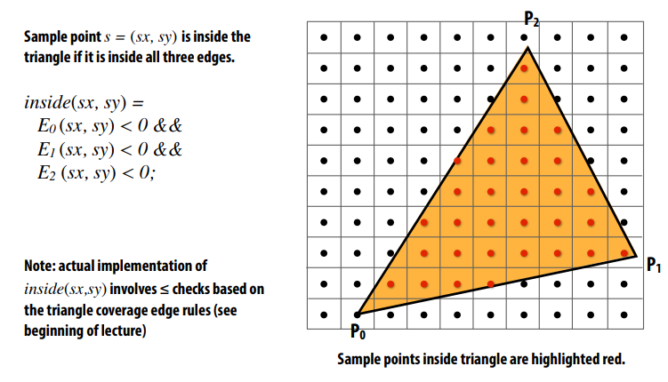

方法三： [利用向量计算重心坐标](https://youtu.be/HYAgJN3x4GA)
$$
\vec{AP} = w_1 \vec{AB} + w_2\vec{AC} \qquad   (w_1 \ge 0, w_2 \ge 0, (w_1 +w_2) \le 1)\\
$$

**tiled triangle traversal (Tiled based)**

在每个tile 内并行计算测试算法，现代GPU的性能瓶颈一般在内存读写上，在计算上并不会特别消耗。
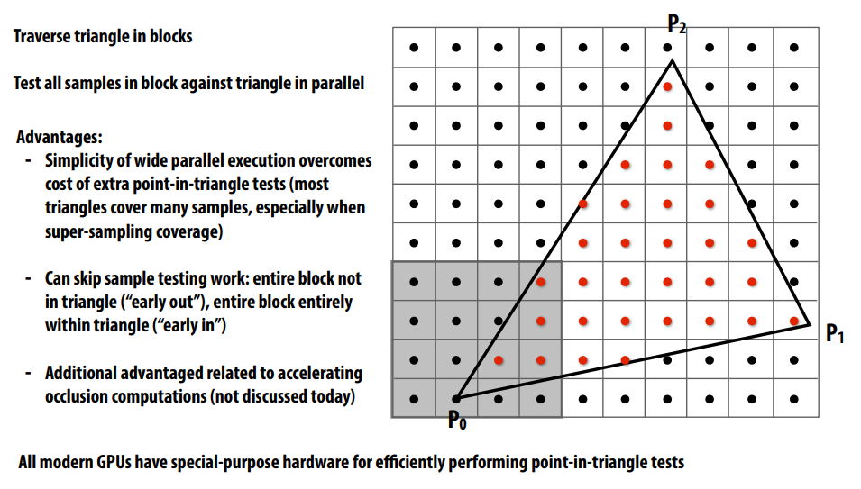


**采样和重建**
参考[Games101 采样理论知识补充](https://zhuanlan.zhihu.com/p/547407165)
采样：将连续信号转变为离散信号的过程， 重建：将采样的离散信号还原到连续信号中。


光栅化: 一个像素点对应一个坐标点，对这个坐标点采样，判断它在不在三角形里面，
采样： 本质是重复频域（频率）上的内容。 Repeating Frequency Contents

为什么图像频域长这样？  
理解二维图像傅里叶变换， 

采样的问题：
- Aliasing：（原始频域经过重复后出现重叠） 走样，表现为锯齿
  


**反走样Anti-Aliasing:**
- Option 1: 增加采样率 Increase sampling rate
  - increasing the distance between replicas in the Fourier domain
  - Higher resolution displays, sensors, framebuffers
  -  `采样频率越大体现在在时域上就是T越小， 因此频域的f = 1 /T 就会大， 原始信号频率f进行卷积操作（也就是复制粘贴信号）越不容易发生混叠。 这样就能避免走样了`
- Option 2: Filtering
  - `去掉一些频率的信号Getting rid of certain frequency contents` 
  - 采样之前去掉图片中高频，可以参考之前写的[Games101 采样理论知识补充](https://zhuanlan.zhihu.com/p/547407165)于是就不会有重叠了：
  - 这里抗锯齿可以看作 = filtering = averaging （可以看作一种低通滤波器）
  

抗锯齿方法: 
先模糊再采样  Pre-Filter → Sample


最理想的状态：像素的颜色值为负责的区域内的平均值。


**Sampling Artifacts** (Errors / Mistakes / Inaccuracies) in Computer Graphics
- Jaggies (Staircase Pattern)：an example of “aliasing” – a sampling error
  
  - 空间上Signals are changing too frequent (high frequency), but sampled too slowly
- Moiré Patterns in Imaging 摩尔纹
  
- Wagon Wheel Illusion (False Motion)：倒着转的轮子
  - `采样速度跟不上样本变化速度`
  - 时间上Signals are changing too fast (high frequency), but sampled too slowly


**Antialiasing Today**
- No free lunch!
  - MSAA：每个像素多次采样，求平均。太浪费性能
  - 优化：不使用均匀分布，采样复用
  - 怎样分布样本才能达到最好的覆盖效果：Blue Noise?
- Milestones：目前得到广泛应用
  - FXAA (Fast Approximate AA)：先获得有锯齿的图，再后处理去除锯齿（很快）
    - 找到边界，换成没有锯齿的边界，（图像匹配）非常快
    - 方法和采样无关，采样虽然有误，但是这种方法可以弥补
  - TAA (Tem‘poral AA) ：时序信息，借助前面帧的信息
    - 最近刚刚兴起
    - 静态场景，相邻两帧同一像素用不同的位置来sample
    - 把MSAA的Sampling分布在时间上
    - 运动情况下怎么办？
- Super resolution / super sampling 超分辨率
  - From low resolution to high resolution
  - Essentially still “not enough samples” problem 类似抗锯齿
  - DLSS (Deep Learning Super Sampling) 猜

Visibility / Occlusion

## 深度缓存 Z-buffer

Painter's Algorithm：由远及近画画，覆盖

- 深度计算与排序：O(nlogn)
- 可能有无法排序的情况：例如三个三角形互相重叠

Z-buffer：对每个像素多存一个深度

- 实际coding中，(smaller z -> further, larger z -> closer)

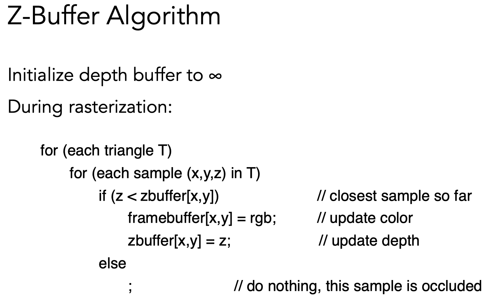

复杂度：O(n) for n triangles 并不是排序，而是只要最值

需要保证三角形进入顺序和结果无关

无法处理透明物体


**参考资料：**

[形象展示傅里叶变换]: 可以参考我渲染数学篇的傅里叶变换内容。

[games101_06_Reasterization](https://www.bilibili.com/video/BV1X7411F744?p=6&share_source=copy_web&vd_source=e84f3d79efba7dc72e6306f35613222e)

[Rasterizer Algorithm Explanation] (https://youtu.be/t7Ztio8cwqM)

[Point_in_triangle_test](https://blackpawn.com/texts/pointinpoly/)
