# Rasterization and  sample

### Fourier Transform
**Fourier Series**
参考资料：
[形象展示傅里叶变换](https://www.bilibili.com/video/BV1pW411J7s8?share_source=copy_web&vd_source=e84f3d79efba7dc72e6306f35613222e)
[games101_06_Reasterization](https://www.bilibili.com/video/BV1X7411F744?p=6&share_source=copy_web&vd_source=e84f3d79efba7dc72e6306f35613222e)
傅里叶级数： 任何周期函数都可以写成正弦和余弦的线性组合和常数项。Represent a function as a weighted sum of sines and cosines
* 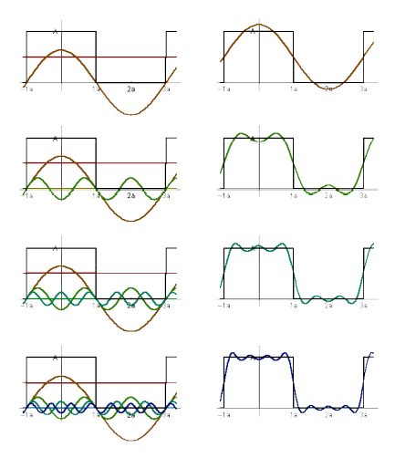
$$
f(x) = \frac{A}{2} + \frac{2A\cos(tw)}{\pi} + \frac{2A\cos(3tw)}{3\pi} + \frac{2A\cos(5tw)}{5\pi} +\frac{2A\cos(7tw)}{7\pi} +\frac{2A\cos(7tw)}{7\pi}+ \dots
$$

**Fourier Transform**
作用： [通俗讲解：图像傅里叶变换](https://zhuanlan.zhihu.com/p/99605178) 将信号从时域便换到频域
Decomposes A Signal Into Frequencies
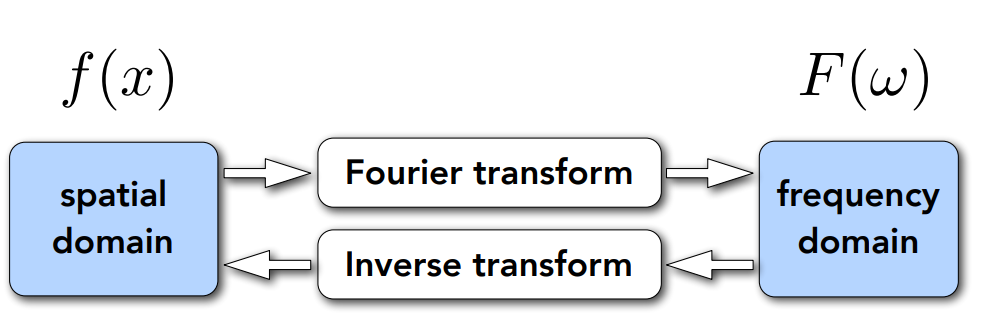
输入一个时间t(有的也表示为x)的函数,输出一个频率函数
$$
F(w) = \int_{-\infin}^{\infin}f(t)e^{-2\pi(iwt) \text{d}t}
$$
输入频率w的函数，输出一个关于x的正弦（余弦）函数。 
$$
f(x) =  \int_{-\infin}^{\infin}F(w)e^{2\pi(iwx) \text{d}w}
$$

Higher Frequencies Need Faster Sampling
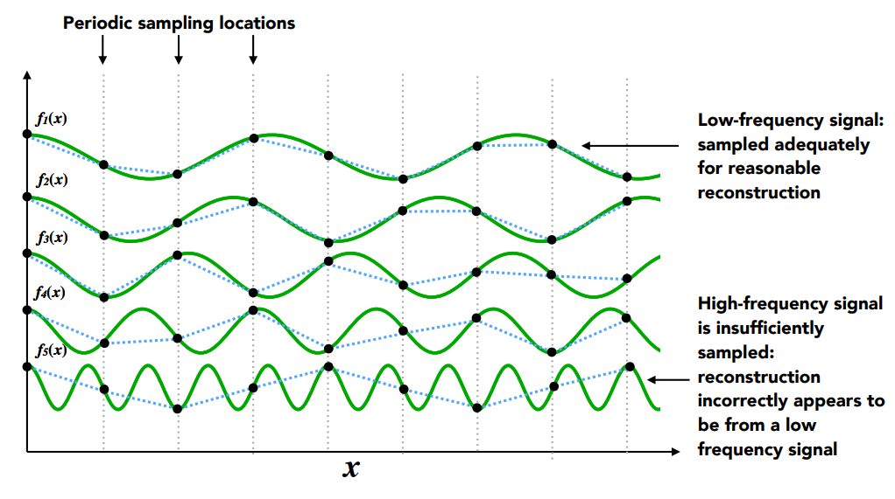
* 低频信号：充分采样以进行合理重建
* 高频信号采样不足：重建错误地似乎来自低频信号

走样的分析： 在给定采样率下无法区分的两个频率
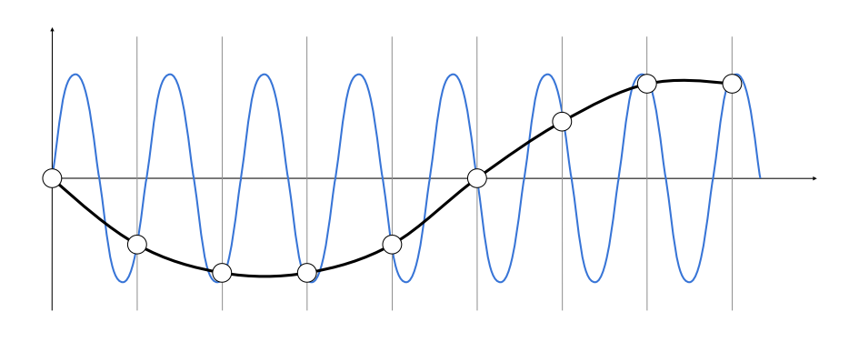

### Rasterizing triangles

**Antialiasing Idea: Blurring (Pre-Filtering) Before Sampling**

什么是Filter？
Filtering： 
- ==本质就是去掉一些频率的信号Getting rid of certain frequency contents== 滤波器
- 相当于Convolution (= filtering = averaging) 卷积（可以看作一种低通滤波器）

Antialiase: Pre-Filter → Sample
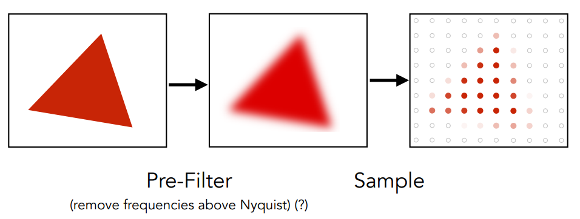
先模糊再采样 vs 先采样再模糊
- 先采样后模糊（Filter）是不行的
  - 波形重叠的情况下截断依然会有重叠

最理想的状态：像素的颜色值为负责的区域内的平均值。
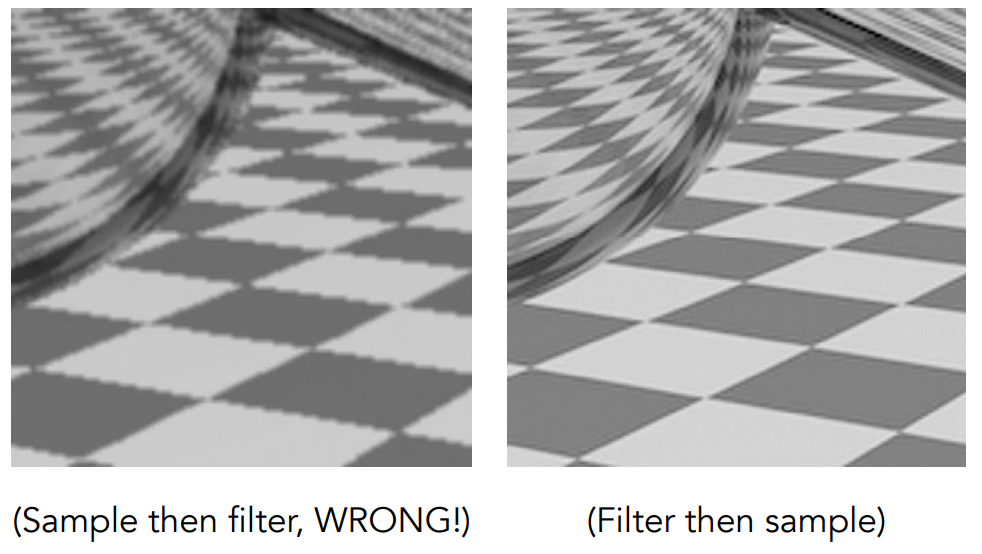

**采样**
==时域的卷积等于频域的乘积==，反之亦然
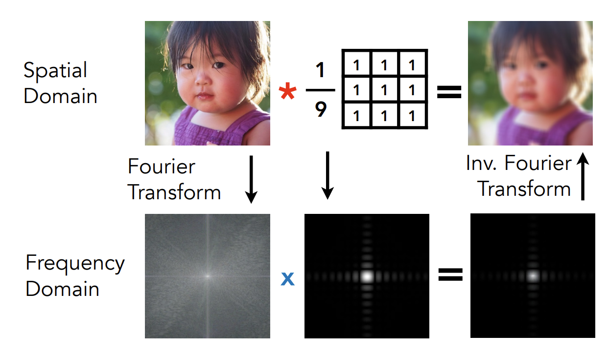
光栅化: 一个像素点对应一个坐标点，对这个坐标点采样，判断它在不在三角形里面，
采样： 本质是重复频域（频率）上的内容。 Repeating Frequency Contents
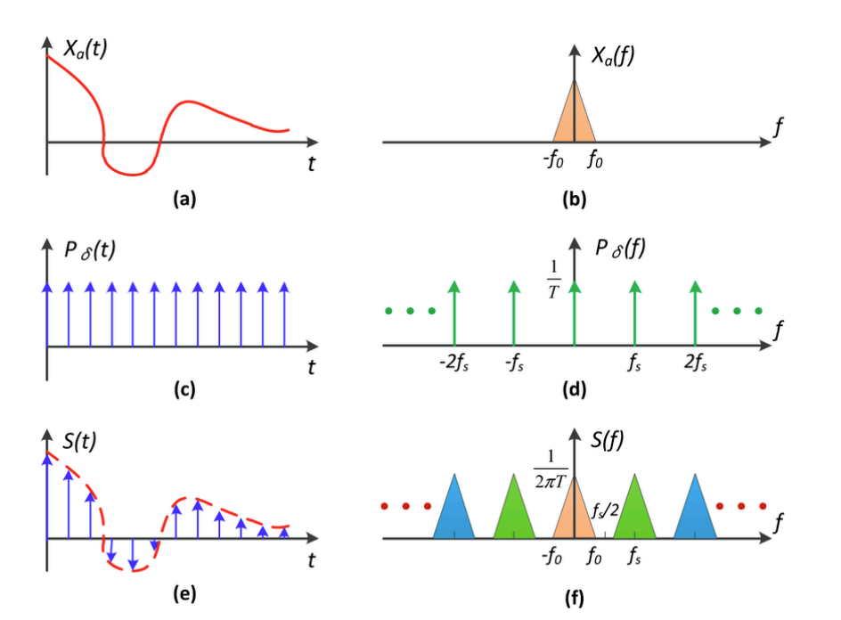

采样的问题：
- Aliasing：（原始频域经过重复后出现重叠） 走样，表现为锯齿
  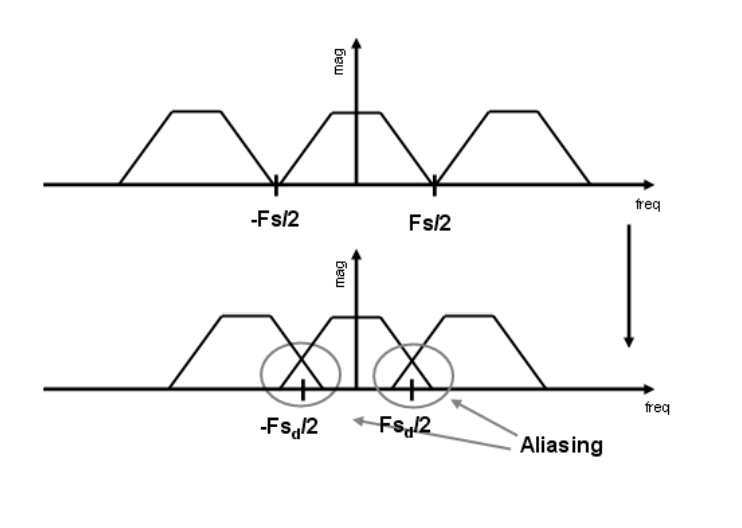

反走样Anti-Aliasing: 
- Option 1: 增加采样率 Increase sampling rate
  - increasing the distance between replicas in the Fourier domain
  - Higher resolution displays, sensors, framebuffers
  - costly & may need very high resolution
  - ==采样频率越大体现在在时域上就是T越小， 因此频域的f = 1 /T 就会大， 原始信号频率f进行卷积操作（也就是复制粘贴信号）越不容易发生混叠。 这样就能避免走样了==
- Option 2: Antialiasing
  - Filtering out high frequencies before sampling
  - 于是就不会有重叠了：
  - Antialiasing = Limiting, then repeating

1. 时域如何变成频域的？ 
2. 图像卷积在频域中的表现。

Sampling Artifacts (Errors / Mistakes / Inaccuracies) in Computer Graphics
- Jaggies (Staircase Pattern)：an example of “aliasing” – a sampling error
  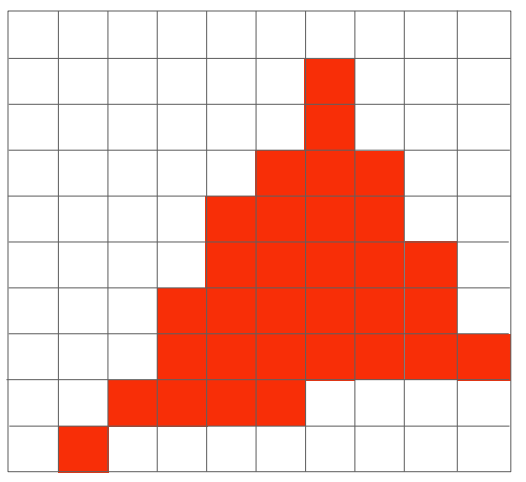
  - 空间上Signals are changing too frequent (high frequency), but sampled too slowly
- Moiré Patterns in Imaging 摩尔纹
  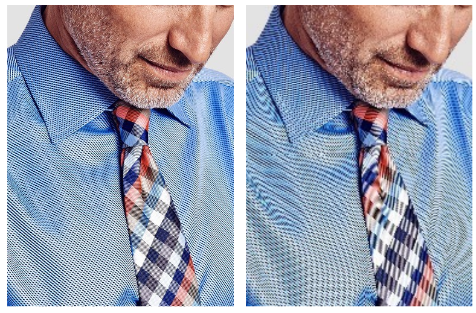
- Wagon Wheel Illusion (False Motion)：倒着转的轮子
  - ==采样速度跟不上样本变化速度==
  - 时间上Signals are changing too fast (high frequency), but sampled too slowly
- ……

Sampling = Repeating Frequency Contents
sampling 是在频域上 copy & paste 波形
Aliasing = Mixed Frequency Contents
采样率不够的 copy & paste 导致波形会有重叠
How Can We Reduce Aliasing Error?
- Option 1: Increase sampling rate
  - increasing the distance between replicas in the Fourier domain
  - Higher resolution displays, sensors, framebuffers
  - costly & may need very high resolution

- Option 2: Antialiasing
  - Filtering out high frequencies before sampling
  - 于是就不会有重叠了：
  - Antialiasing = Limiting, then repeating
但是连续域的平均值是很难求的，计算量巨大

Antialiasing By Supersampling (MSAA)
- 近似方法
- Monte-Carlo
- 像素的颜色值为负责的区域内取样多次颜色值的平均。

Antialiasing Today
- No free lunch!
  - MSAA：每个像素多次采样，求平均。太浪费性能
  - 优化：不使用均匀分布，采样复用
  - 怎样分布样本才能达到最好的覆盖效果：Blue Noise?
- Milestones：目前得到广泛应用
  - FXAA (Fast Approximate AA)：先获得有锯齿的图，再后处理去除锯齿（很快）
    - 找到边界，换成没有锯齿的边界，（图像匹配）非常快
    - 方法和采样无关，采样虽然有误，但是这种方法可以弥补
  - TAA (Tem‘poral AA) ：时序信息，借助前面帧的信息
    - 最近刚刚兴起
    - 静态场景，相邻两帧同一像素用不同的位置来sample
    - 把MSAA的Sampling分布在时间上
    - 运动情况下怎么办？
- Super resolution / super sampling 超分辨率
  - From low resolution to high resolution
  - Essentially still “not enough samples” problem 类似抗锯齿
  - DLSS (Deep Learning Super Sampling) 猜

Visibility / Occlusion

## 深度缓存 Z-buffer

Painter's Algorithm：由远及近画画，覆盖

- 深度计算与排序：O(nlogn)
- 可能有无法排序的情况：例如三个三角形互相重叠

Z-buffer：对每个像素多存一个深度

- 实际coding中，(smaller z -> further, larger z -> closer)

复杂度：O(n) for n triangles 并不是排序，而是只要最值

需要保证三角形进入顺序和结果无关

无法处理透明物体