#! https://zhuanlan.zhihu.com/p/551785904
# 颜色和感知 Color and Perception

# Physical Basis of Color

光: 不同波长的电磁辐射（可见光光谱范围内400~700nm）不同波长的光具有不同的折射率

 Spectrum of Light 光谱: 被色散开的单色光按波长（或频率）大小而依次排列的图案/Oscillations of different frequencies (wavelengths)
 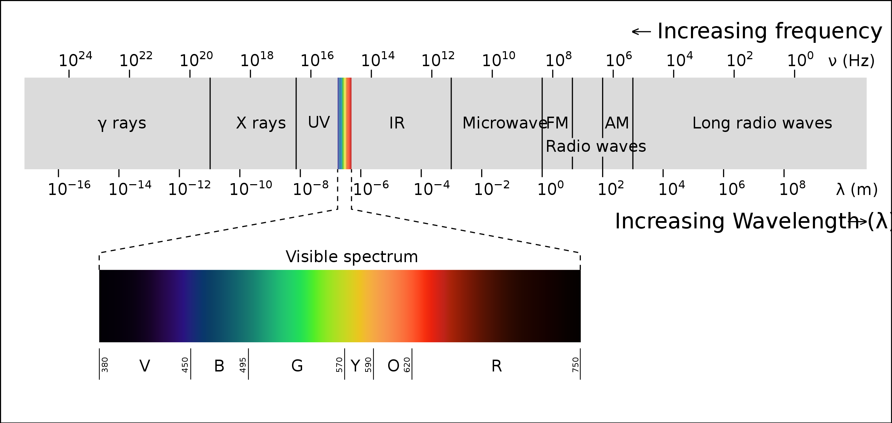

Spectral Power Distribution (SPD) 谱功率密度：不同波长对应的能量分布

- 单位： radiometric units / nanometer (e.g. watts / nm) 辐射度单位/纳米（例如瓦特/纳米）
- 线性：可叠加 Linearity of Spectral Power Distributions

Color 颜色：是人的一种感知，不是光线的一种根本属性 a phenomenon of human perception; it is not a universal property of light
- 不同波长的光 Different wavelengths of light are not “colors”

人眼的简单介绍：瞳孔=光圈，晶状体=透镜，视网膜=感光元件

视网膜上的感光细胞 Retinal Photoreceptor Cells
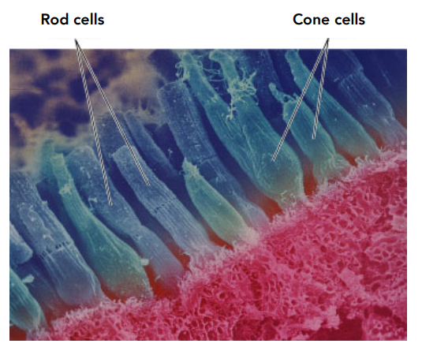
- Rods：视杆细胞，棒状，很多，感知光的强度（而非波长）
- Cones：视锥细胞，锥形，较少，产生“颜色”的感觉
  - 不同的人的视锥细胞分布大不一样 Fraction of Three Cone Cell Types Varies Widely
  - Three types of cones S, M, and L (corresponding to peak response at short, medium, and long wavelengths), each with different spectral sensitivity

# Spectral response of cones

Spectral Response of Human Cone Cells: Three types of cones: S, M, and L cones (corresponding to peak response at short, medium, and long wavelengths)
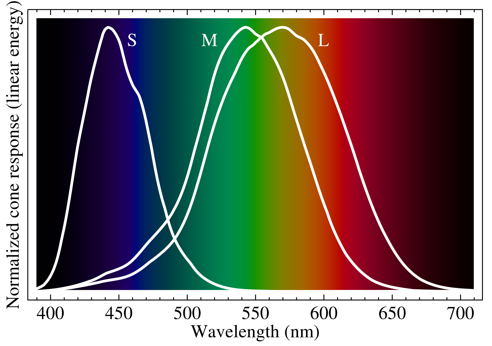

将锥体对单色光（具有单一波长能量的光）的响应可视化为 3D 空间中的点
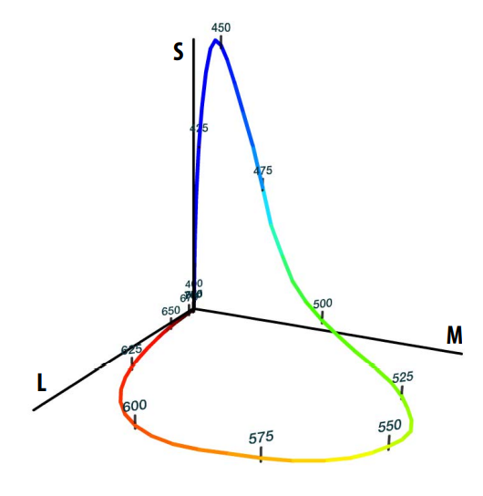

于是不同视锥细胞的信号强度=其对所有波长的光的响应的积分
$$
\begin{align*} 
S &=\int_{\lambda} \Phi(\lambda) S(\lambda) \text{d}\lambda \\ 
M &=\int_{\lambda} \Phi(\lambda) M(\lambda) \text{d}\lambda \\ 
L &=\int_{\lambda} \Phi(\lambda) L(\lambda) \text{d}\lambda \\
\end{align*}
$$

于是有 任何一束光 → (S,M,L) → Color 的对应，人眼只知道(S,M,L)，不知道原来的光线分布（SPD）

# Metamerism （同⾊异谱）

同⾊异谱：不同的SPD → 同样的(S,M,L) = 同样的Color
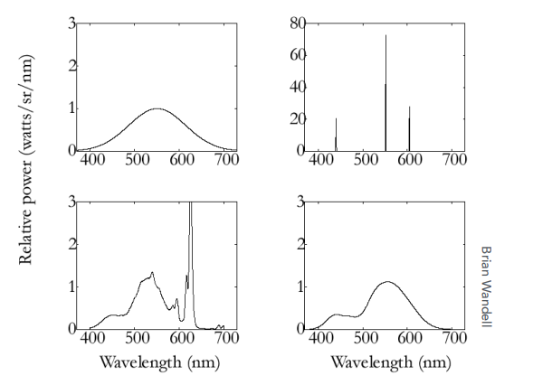

Metamers are two different spectra (∞-dim) that project to the same (S,M,L) (3-dim) response.
- These will appear to have the same color to a human The existence of metamers **is critical to color reproduction**Matching
- Don’t have to reproduce the full spectrum of a real world scene
- Example: A metamer can reproduce the perceived color of a real-world scene on a display with pixels of only three colors 通过显示器的三色光，也可以混合出现实中的种种色彩（虽然背后的光谱一般完全不一样）

# Color Reproduction / Matching 颜色匹配、重建

通过混合的方式

计算机的成像系统是加色系统：

- 给定一组主色（例如RGB）的光谱分布（S，M，L？）$s_{R}(\lambda), s_{G}(\lambda), s_{B}(\lambda)$
- 调整三种主色的强度并相加，得到一种颜色 $R s_{R}(\lambda)+G s_{G}(\lambda)+B s_{B}(\lambda)$
- 于是这种颜色就可以用(R,G,B)这三个标量表示。
- 于是也可以通过实验确定不同颜色的(R,G,B)表示->Additive Color Matching Experiment

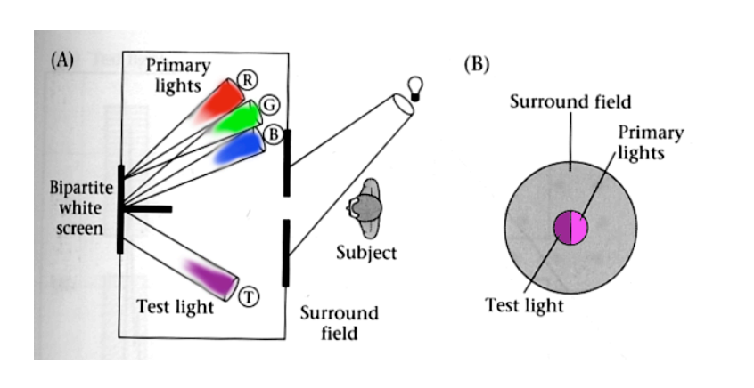

有些颜色怎么混合也混不出来，但是通过给原色加色，就可以混合出来，那么将最后混合的颜色中减去加上的颜色，就是对这种颜色的表示→系数会有负数！

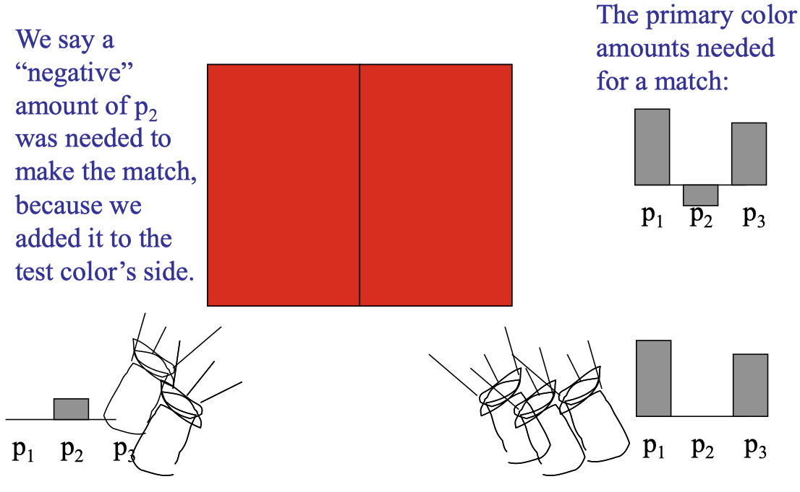

## CIE RGB Color Matching Experiment

主光 RGB 都是单一波长的光
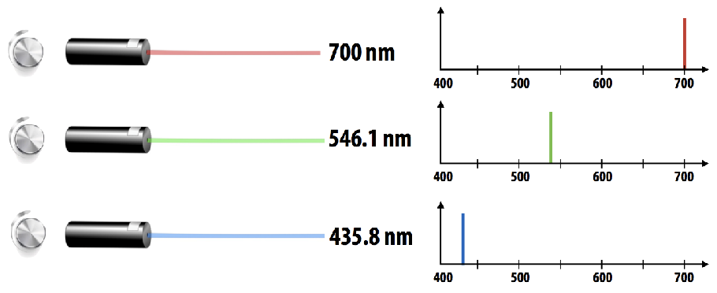
测量多少强度的三种主光加起来会 = 测试光一样的颜色

**颜色匹配函数 color matching functions:**  三种主光各自多少强度加起来会获得和测试光一样的颜色。

Graph plots how much of each CIE RGB primary light must be combined to match a monochromatic light of wavelength given on x-axis

**使用颜色匹配函数重建颜色 Color Reproduction with Matching Functions**  横轴：单一波长光的波长，纵轴：主光强度
现实的光线 = 许多不同强度单一波长光的积分
现实的光线表示的颜色 = 许多不同强度单一波长光的Color Matching值的积分 → (R,G,B)
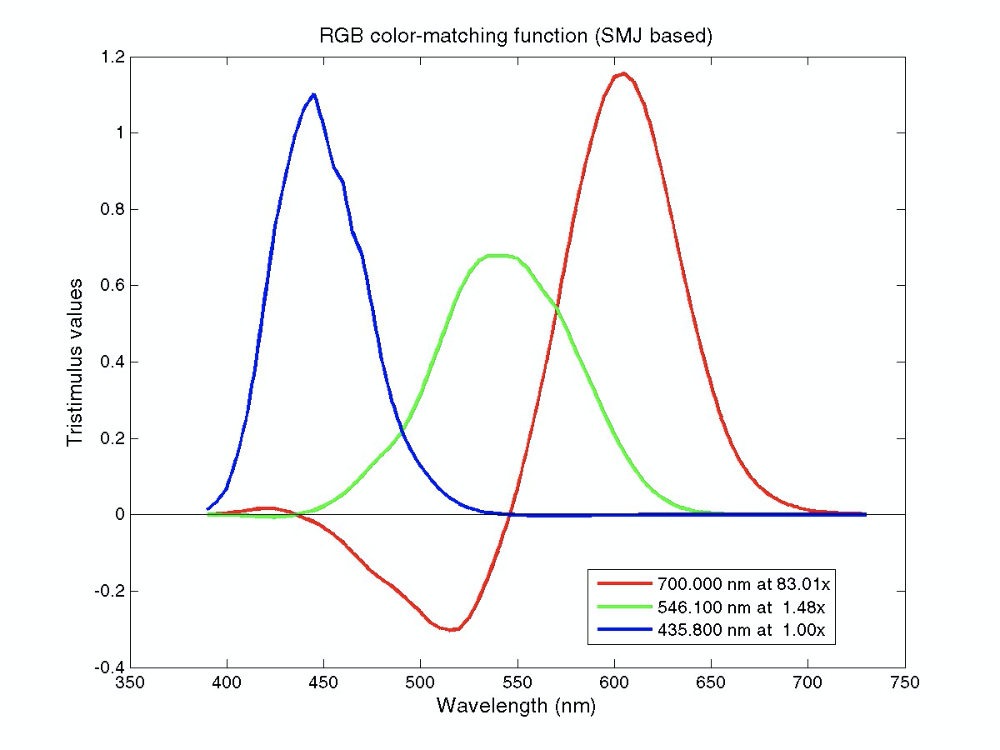

$$
\begin{align*} 
S &=\int_{\lambda} \Phi(\lambda) \bar{r}(\lambda) \text{d}\lambda \\ 
M &=\int_{\lambda} \Phi(\lambda) \bar{g}(\lambda) \text{d}\lambda \\ 
L &=\int_{\lambda} \Phi(\lambda) \bar{b}(\lambda) \text{d}\lambda \\
\end{align*}
$$

# Color Spaces and Color Models 颜色空间和颜色模型
* 通常，使用颜色模型从某个颜色空间指定颜色 In general, specify a color from some color space using a color model
* 色彩空间就像艺术家的调色板：我们可以选择各种颜色 Color space is like artist’s palette: full range of colors we can choose from 
* 颜色模型是指定颜色空间中特定颜色的方式：Color model is the way a particular color in a color space is specifed: 
  - artist’s palette: “yellow ochre” 
  - RGB color model: 204, 119, 34

**Gamut (⾊域)**：
* 色域是由一组原色生成的一组色度  the set of chromaticities generated by a set of color primaries
* 不同的色彩空间代表不同的色彩范围 Different color spaces represent different ranges of colors
* 所以它们有不同的色域，即它们覆盖色度图上的不同区域So they have different gamuts, they cover different regions on the chromaticity diagram
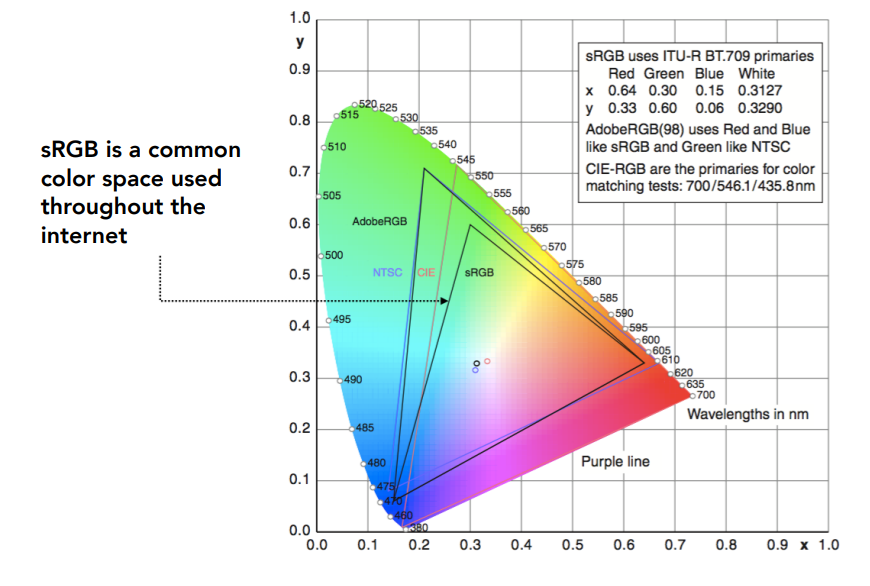

## Standard Color Spaces

Standardized RGB (sRGB)

- makes a particular monitor RGB standard
- other color devices simulate that monitor by calibration
- widely adopted today
- gamut (⾊域) is limited

## A Universal Color Space: CIE XYZ

**CIE XYZ color matching functions**
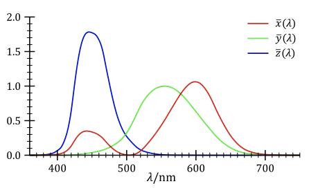

Imaginary set of standard color primaries X, Y, Z
- 主色是虚拟的，不存在的。Primary colors with these matching functions do not exist
- **Y is luminance** (brightness regardless of color) (亮度)

为何如此设计？

- Matching functions are strictly positive 没有负数
- Span all observable colors 覆盖所有可见光

将(X,Y,Z) 归一化获得(x,y,z)（x + y + z = 1）, 然后对(x,y)做枚举，获得一张二维图像，表示在Y（亮度）固定的情况下，不同X，Z对应的颜色。

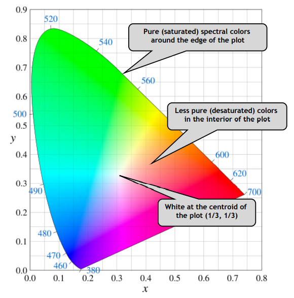

- since x + y + z = 1, we only need to record two of the three
- usually choose x and y, leading to (x, y) coords at a specific brightness Y
- The curved boundary: spectral locus
  - corresponds to monochromatic light (each point representing a pure color of a single wavelength)
- Any color inside is less pure, mixed

### HSV Color Space (Hue-Saturation-Value)

符合艺术家使用直觉 Axes correspond to artistic characteristics of color
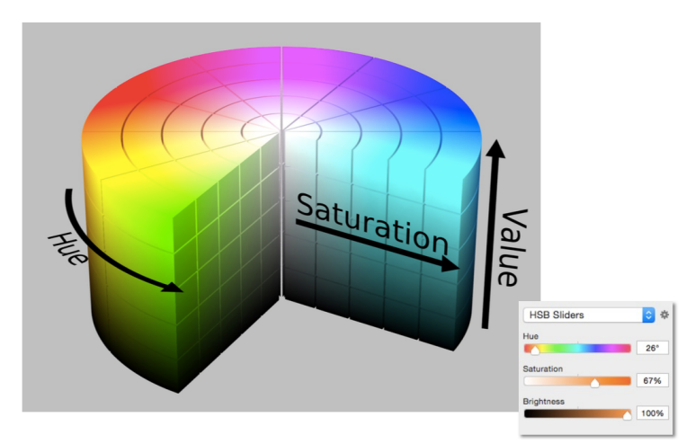

Hue(⾊调)
- the “kind” of color, regardless of attributes
- colorimetric correlate: dominant wavelength
- artist’s correlate: the chosen pigment color

Saturation (饱和度)
- the “colorfulness”
- colorimetric correlate: purity
- artist’s correlate: fraction of paint from the colored tube

Lightness (or value) (亮度) 颜色的明暗度
- the overall amount of light
- colorimetric correlate: luminance
- artist’s correlate: tints are lighter, shades are darker

### CIELAB Space (AKA L*a*b*)

A commonly used color space that strives for perceptual uniformity
- L* is lightness (brightness)
- a* and b* are color-opponent pairs
- a* is red-green 正方向：红色，负方向：绿色
- b* is blue-yellow
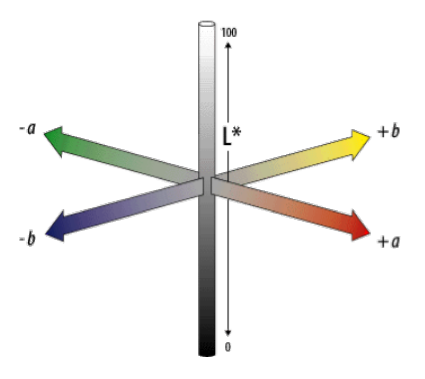

CIELAB是基于互补色理论（Opponent Color Theory）

There’s a good neurological basis for the color space dimensions in CIE LAB
- the brain seems to encode color early on using three axes:
- white — black, red — green, yellow — blue
- the white — black axis is lightness; the others determine hue and saturation

one piece of evidence: you can have a light green, a dark green, a yellow-green, or a blue-green, but you can’t have a reddish green (just doesn’t make sense)
* thus red is the opponent to green

人眼是奇怪的
- 视觉暂留 
- 视错觉 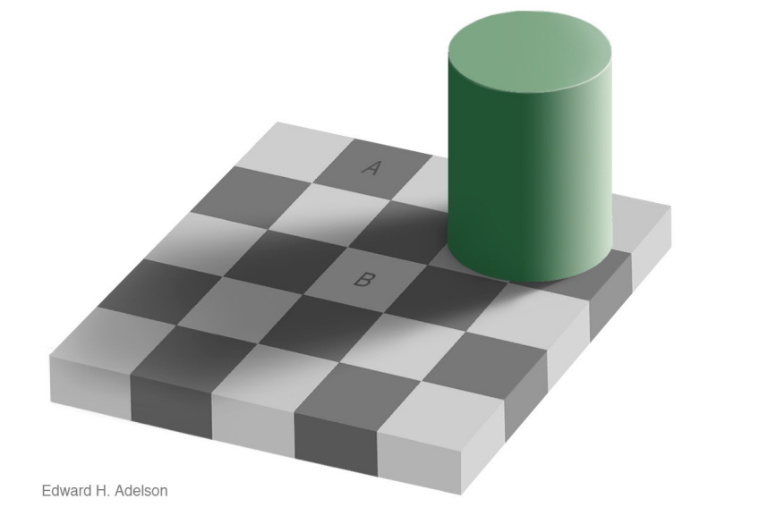
- 颜色的相对性 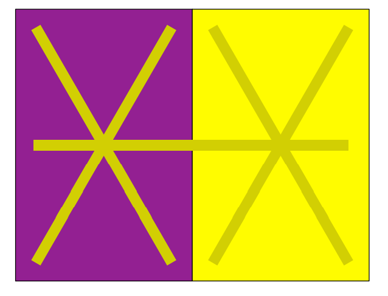

# 减色系统

典型：CMYK: A Subtractive Color Space 颜料越混越黑

- Cyan, Magenta, Yellow, and Key
- 靛蓝、品红、黄色、黑色

**HDR**
- Gamma Correction矫正：Radiance → 颜色，因为显示器上颜色显示是非线性的，需要抵消

**参考资料**

1. [games101] (https://www.bilibili.com/video/BV1X7411F744?p=20&share_source=copy_web&vd_source=e84f3d79efba7dc72e6306f35613222e)