#! https://zhuanlan.zhihu.com/p/549572824
# 从辐射度量学理解BRDF

### 如何量化光的测量？
**Radiometry**
* 用于测量 EM 辐射（光）的单位和测量系统 System of units and measures for measuring EM(electromagnetic) radiation (light)
* 光的几何光学模型
  * 光子直线传播
  * 以射线为代表
  * 波长 << 物体大小
  * 无衍射、干涉…… 

我们要测量什么（为什么？）
* 许多物理过程将能量转化为光子
  * 例如，白炽灯泡将热量转化为光（黑体辐射）
  * 恒星（太阳！）的核聚变产生光子
* 每个光子携带少量能量
* 想要某种方式记录“多少能量”
* 光子撞击物体的能量~“亮度”
  * 胶片、眼睛、CCD 传感器、晒伤、太阳能电池板……
  * 需要这些信息来制作准确（漂亮！）的图像
* 简化假设：“稳态”过程
* 照明达到稳定状态需要多长时间？

假设辐射能量就是 总共击中的光子数量 Radiant energy is “total # of hits”
* One idea: just store the total number of “hits” that occur 
anywhere in the scene, over the complete duration of the scene 
* This quantity captures the total energy of all the photons hitting 
the scene*

辐射通量 Radiant flux is “hits per second”
* 对于人类感知水平的照明现象，通常可以安全地假设立即达到平衡。
▪ 所以，而不是记录一些（任意）的总能量持续时间，记录每秒总点击数可能更有意义
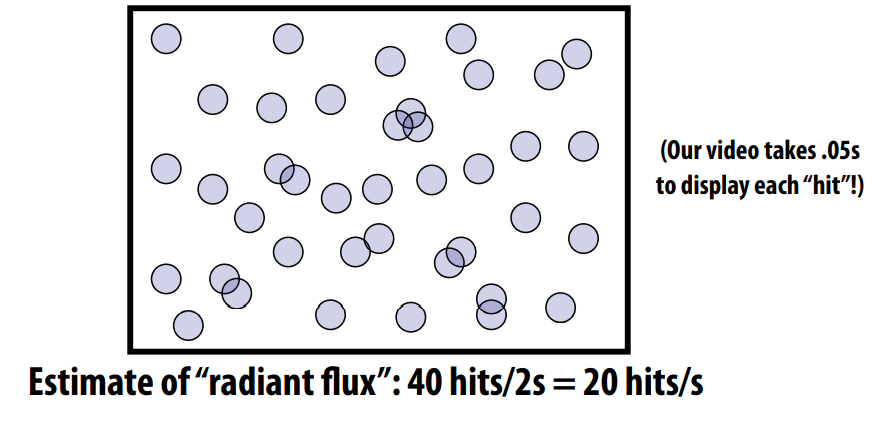

辐照度 Irradiance is “#hits per second, per unit area”
* Typically we want to get more specifc than just the total 
* To make images, also need to know where hits occurred 
* So, compute hits per second in some “really small” area, divided by area

使用辐射度估计生成的图像 Image generation as irradiance estimation
* 最终图像上呈现的是每个像素点的辐射度
* From this point of view, our goal in image generation is to estimate the irradiance at each point of an image (or really: the total radiant fux per pixel…):

### 测量照度 Measuring illumination

**radiant energy**
How can we be more precise about the amount of energy? 
▪ Said we were just going to count “the 
number of hits,” but do all hits contribute same amount of energy? 
▪ Energy of a single photon:
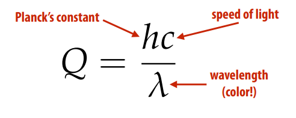

**radiant fux (power)**
* 通量：传感器接收（或光发射）的单位时间能量（瓦特） energy per unit time (Watts) received by the sensor (or emitted by the light)
$$\Phi = \lim_{\Delta \to 0} \frac{\Delta Q}{\Delta t} = \frac{\text{d}Q}{\text{d}t}\left[\frac{J}{s}\right]\\$$
> 瓦特（符号：W）是国际单位制的功率单位。1瓦特的定义是1焦耳/秒（1 J/s）$$\left[\frac{J}{s}\right]\\$$

* 也可以换个方向理解：flux 的时间积分是总辐射能
$$Q = \int_{t_0}^{t_1}\Phi(t)\text{d}t\\$$

**irradiance**
* Radiant fux: time density of energy 
* Irradiance: area density of radiant fux
Given a sensor of with area A, we can consider the average fux over the entire sensor area:$\frac{\Phi}{A}$
Irradiance (E) is given by taking the limit of area at a single point on the sensor:
$$
E(p)=\lim\limits_{\Delta \to 0}\frac{\Delta\Phi(p)}{\Delta A}=\frac{d\Phi(p)}{dA}\left[\frac{W}{m^2}\right]\\
$$

### 如何用辐射度量化表示颜色
**光谱能量分布  Spectral power distribution**
* Describes irradiance per unit wavelength
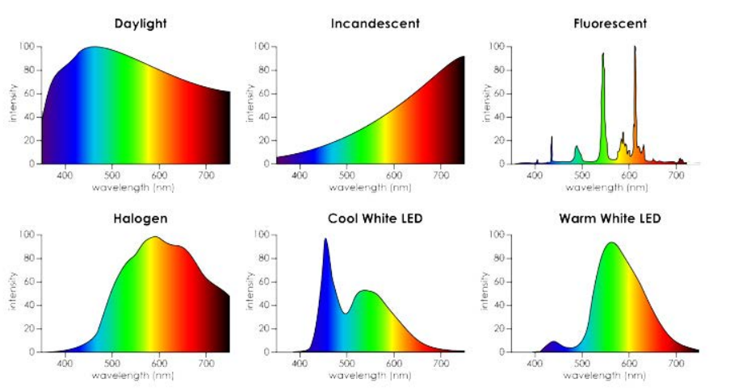

**Lambert’s Law**
Why do some parts of a surface look lighter or darker?

* 表面辐照度与光方向和表面法线之间夹角的余弦成正比Irradiance at surface is proportional to cosine of angle between light direction and surface normal.
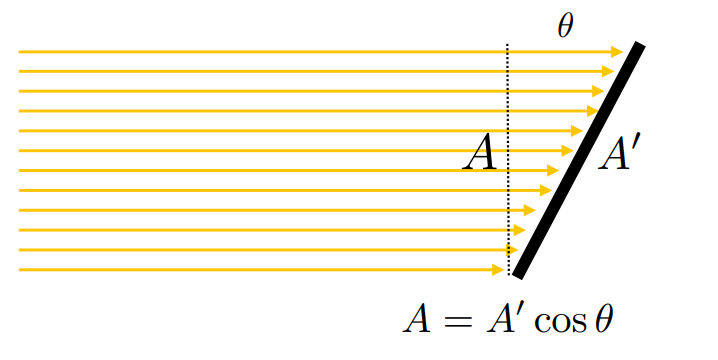
$$E = \frac{\Phi}{A^\prime} = \frac{\Phi \cos\theta}{A}\\$$
* 对表面进行着色的最基本方法：取单位表面法线（N）和单位方向光（L）的点积

**Angles and solid angles**
* Angle : ratio of subtended arc length on circle to radius 
  * $\theta=\frac{l}{r}$
  * circle has $2\pi$ radians
* Solid angle : ratio of subtended area on sphere to radius squared 
  * $\Omega=\frac{A}{r^2}$
  * sphere has $4\pi$ steradians

**Differential solid angle**

$$
\begin{align*}
\text{d}\omega&=\frac{dA}{r^2}\\
dA&=(r\ \text{d}\theta)(r\sin\theta\ \text{d}\phi)\\
  &=r^2\sin\theta\ \text{d}\theta \text{d}\phi\\
\text{d}\omega&=\sin \theta\ \text{d}\theta \text{d}\phi\\
\end{align*}\\
$$
Differential solid angle is just that tiny area on the unit sphere 
Will use $\omega $to donate a direction vector (unit length)

**Isotropic point source**

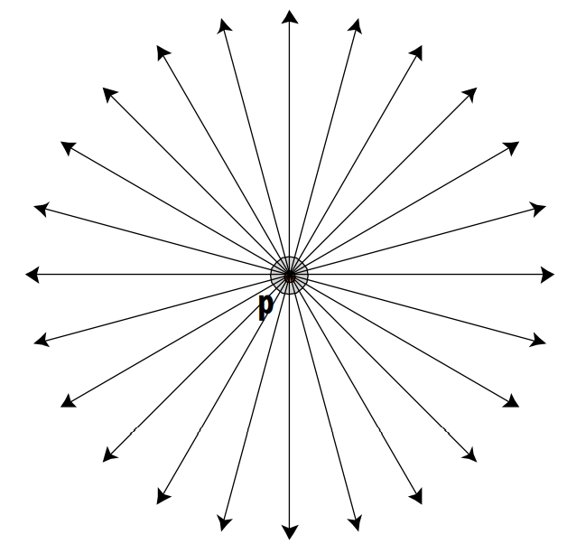
$$
\Phi=\int_{H(r)^2}E(r)\ dA = 4\pi r^2 E(r) \\
E(r)=\frac{\Phi}{4\pi r^2} \\
$$
`Irradiance falloff with distance`
$$\frac{E(r_2)}{E(r_1)}=(\frac{r_1}{r_2})^2\\$$
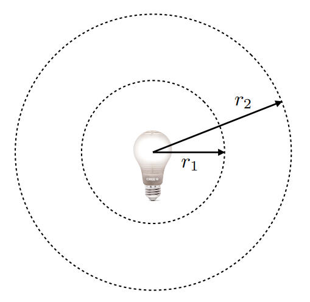

**radiant intensity**
Power per solid angle emanating from a point source 
$$
I(\omega)=\frac{\text{d}\Phi}{\text{d}\omega}\left[\frac{W}{S_r}\right]\\
$$

**Radiance**

Radiance is the solid angle density of irradiance
$$
L(\mathbf{p},\omega)=\lim\limits_{\Delta\to0}\frac{\Delta E_\omega(\mathbf{p})}{\Delta\omega}=\frac{\text{d}E_\omega(\mathbf{p})}{\text{d}\omega}(W/m^2\text{sr})\\
$$
where $E_\omega$ denotes that the differential surface area is oriented to face in the direction $\omega$
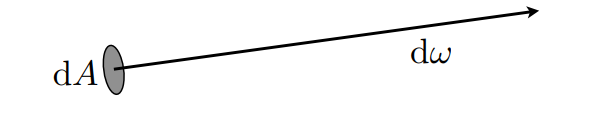

In other words, radiance is energy along a ray defned by origin point p and direction $\omega$

**Surface Radiance**
$$
L(\mathbf{p},\omega)=\frac{\text{d} E(\mathbf{p})}{\cos\theta\ \text{d}\omega}=\frac{\text{d}^2\Phi(\mathbf{p})}{\cos\theta\ \text{d}A\text{d}\omega}\\
$$
$\cos\theta$ accounts for different surface orientation

**Spectral Radiance**

To summarize, radiance is: `radiant energy per unit time per unit area per unit solid angle `

要真正获得对光的完整描述，我们必须再进一步分解：每单位时间每单位面积每单位立体角每单位波长的辐射能 To really get a complete description of light we have to break this down just one more step: radiant energy per unit time per unit area per unit solid angle per unit wavelength 
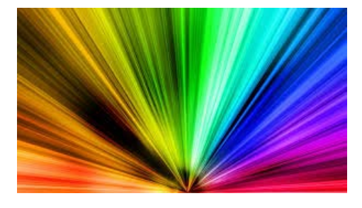

`为什么我们要将能量分解到光谱辐射这个粒度， 因为一旦我们有了光谱辐射，我们就可以完整地描述环境中的光！`

**Incident vs. Exitant Radiance**

Often need to distinguish between incident radiance and exitant radiance functions at a point on a surface 

In general: $L_i(\mathbf{p},\omega)\ne L_o(\mathbf{p},\omega)$

**Properties of radiance**

* adiance is a fundamental feld quantity that characterizes the distribution of light in an environment
  * Radiance is the quantity associated with a ray
  * Rendering is all about computing radiance 
* Radiance is constant along a ray (in a vacuum) 
* A pinhole camera measures radiance 

**Irradiance from the environment**

Computing flux per unit area on surface, due to incoming light from all directions. 
$$
E(\mathbf{p},\omega)=\int_{H^2}L_i(\mathbf{p},\omega)\cos\theta\ \text{d}\omega \\
$$

**Simple case: irradiance from uniform hemispherical source**
$$
\begin{align*}
E(\mathbf{p})
&=\int_{H^2}L\cos\theta\ \text{d}\omega\\
&=L\int_0^{2\pi}\int_0^{\frac{\pi}{2}}\cos\theta\sin\theta\ \text{d}\theta\text{d}\phi\\
&=L\pi\\
\end{align*}\\
$$
**Irradiance from a uniform area source**
$$
\begin{align*}
E(\mathbf{p})
&=\int_{H^2}L(\mathbf{p},\omega)\cos\theta\ \text{d}\omega\\
&=L\int_\Omega\cos\theta\ \text{d}\omega\\
&=L\Omega^\perp \\
\end{align*}
$$

> $\Omega^\perp$ is Projected solid angle
> * Cosine*weighted solid angle 
> * Area of object O projected onto unit sphere, then projected onto plane 

**Uniform disk source (oriented perpendicular to plane)**
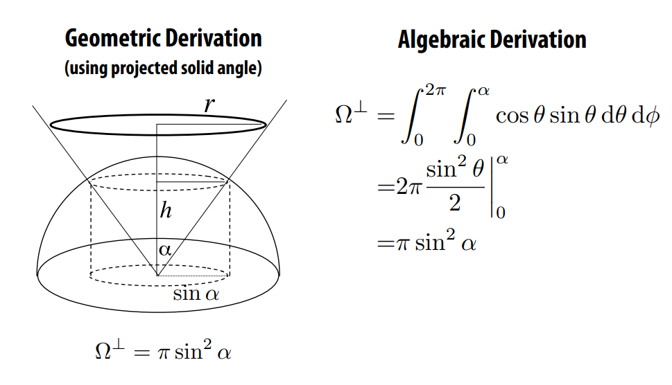

**Ambient occlusion**

* Assume spherical (vs. hemispherical) light source, “at infnity”
* Irradiance is now rotation, translation invariant
* Can pre*compute, “bake” into texture to enhance shading 

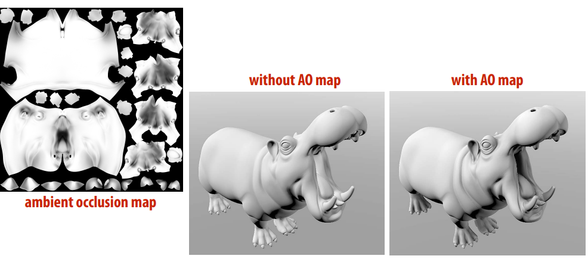

### 人眼视觉与辐射度关联

**More realistic light models via “goniometry”**
测角图测量作为角度函数的光强度Goniometric diagram measures light intensity as function of angle
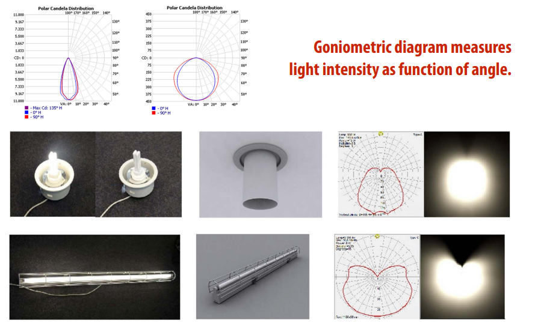

**Photometry: light + humans**
人眼相应函数
* 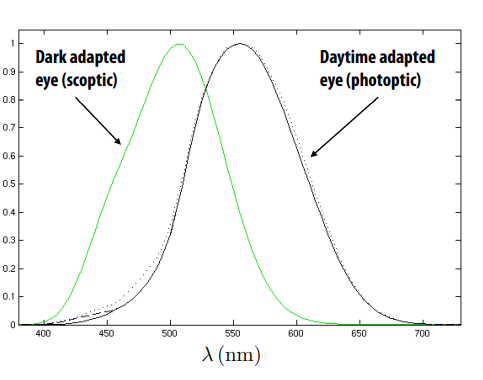
* 所有辐射量在光度学中都有等价物
* 光度学：说明人类视觉系统对电磁辐射的反应
* 亮度 (Y) 是与辐射度相对应的光度量：对所有波长的辐射度、眼睛的光效曲线的权重进行积分，例如：
$$Y(p, \omega )= \int_{0}^{\infty}  L(p, \omega, \lambda) V(\lambda) \text{d}\lambda \\$$

**辐射和光度的术语 Radiometric and photometric terms**
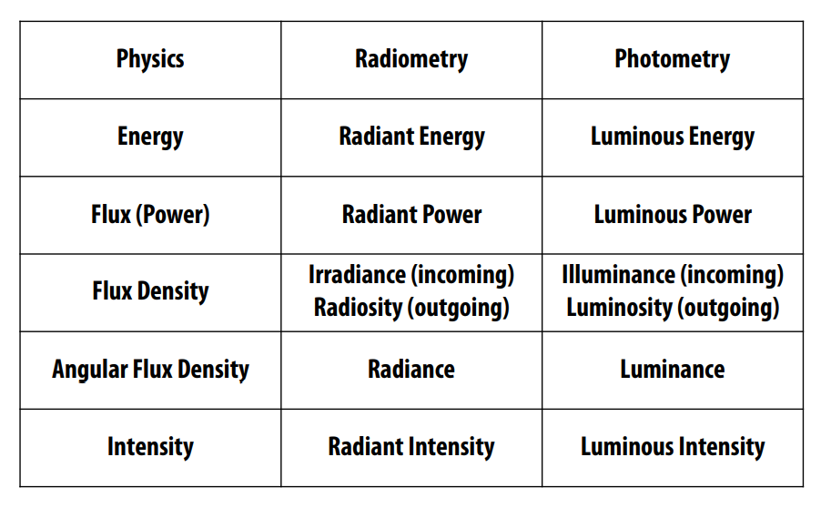
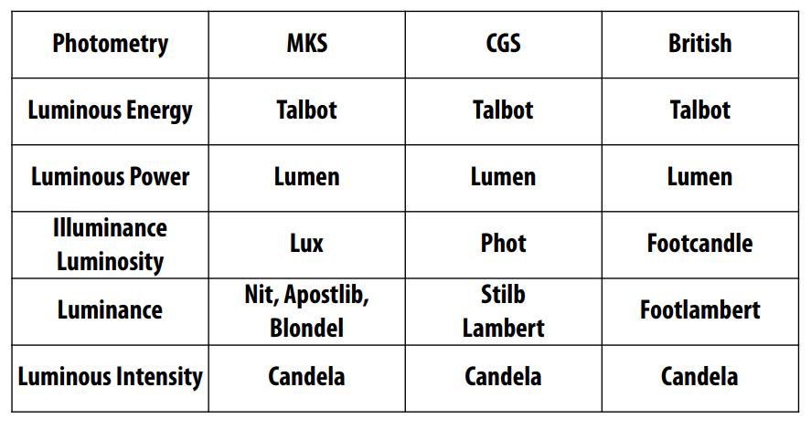
“Thus one nit is one lux per steradian is one candela per square meter is 
one lumen per square meter per steradian. Got it?” —James Kajiya

### What information are we missing?
* 最初采用光的“几何光学”模型
* 错过小尺度效应（例如衍射/虹彩）
* 还有大尺度效应（例如，由于重力引起的光弯曲）
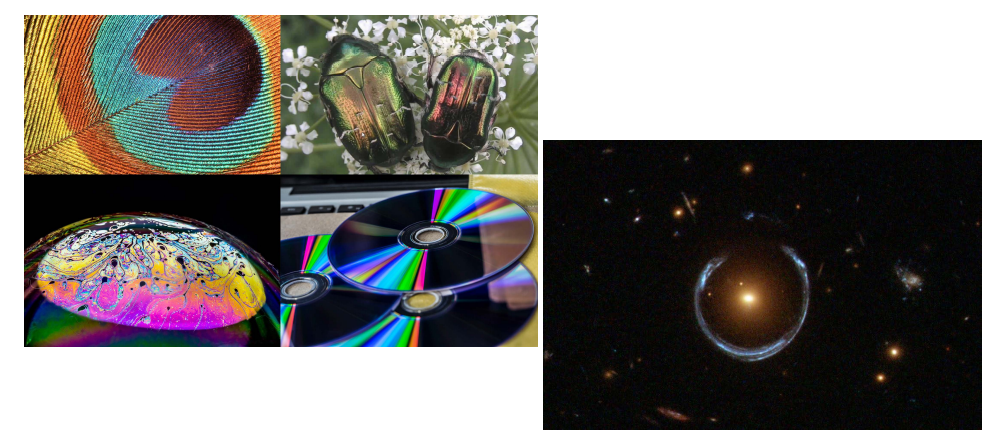

### 下一章引入BRDF概念

**参考：**
[goniometry] (https://www.visual-3d.com/tools/photometricviewer/)