#! https://zhuanlan.zhihu.com/p/545564030
# 从BRDF散射模型到渲染方程 The Rendering Equation
### prerequisite 
理解radiance和irradiance
什么是irradiance ？
总结：
  - radiance 可以理解为一条光线所携带的能量
  - irradiance 为一个极小面上所有入射光线能量的集合
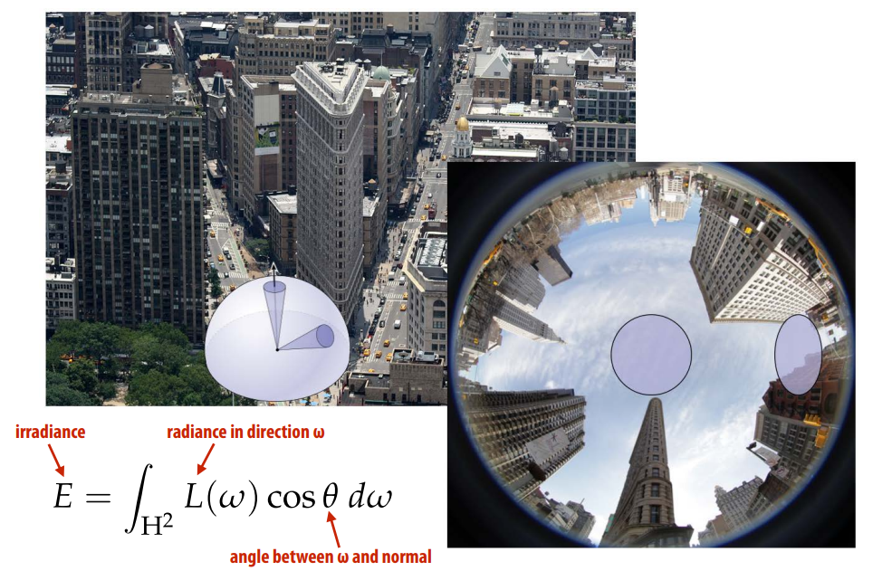
什么是radiance ？ 
* Radiance at point p in direction N is radiant energy (“#hits”) per unit time, per solid angle, per unit area perpendicular to N.
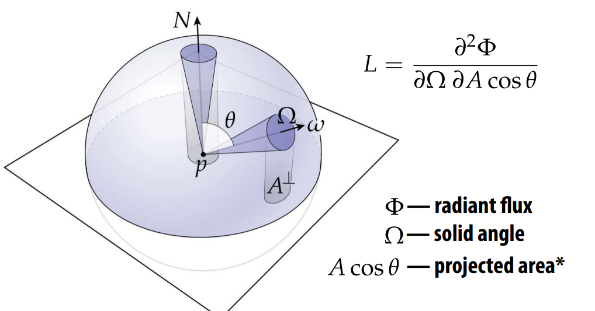
* **Confusing** : this $\cos\theta$  has to do with parameterization of sphere, not Lambert’s law
* 理解兰伯特$\cos{\theta}$ 与 球面积分$\cos{\theta}$的不同tale of two consines
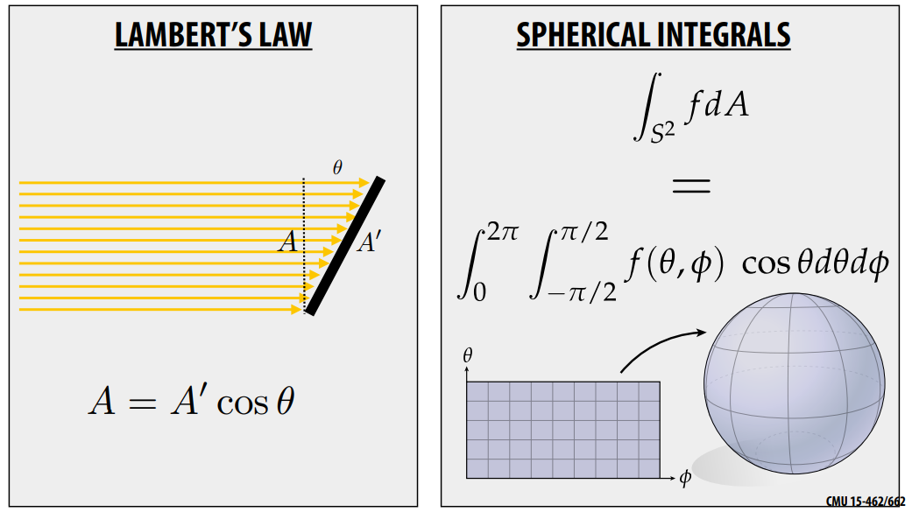

### 如何使用radince生成图像
**The rendering Equation**
* Core functionality of photorealistic renderer is to estimate radiance at a given point p, in a given direction ωo
* 对渲染方程求和：Summed up by the rendering equation (Kajiya)
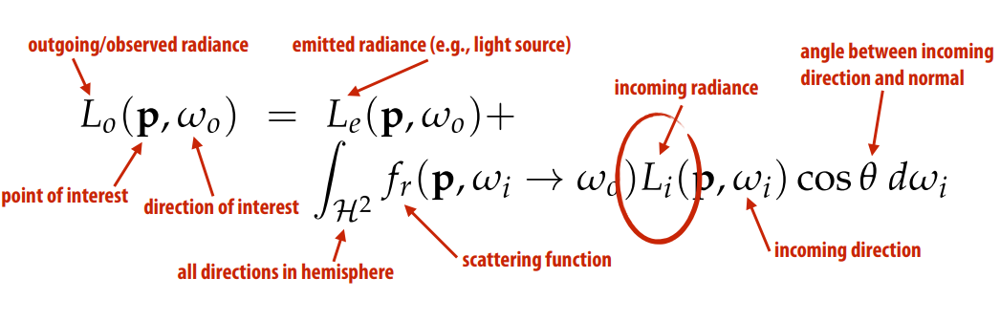
  1. outgoing/observation
  2. incoming radiance 未知 
* 深入理解Rendering Equation： 
> $$
> Lo(\mathbf{p}, \omega_o) = L_e(\mathbf{p}, \omega_o) + \int_{\mathcal{h^2}}f_r(\mathbf{p, \omega_i}\to\omega_o )L_i(\mathbf{p}, \omega_i)(\omega_i\cdot\mathbf{N}(\mathbf{p}))\text{d}\omega_i \\
> $$
* 由于一条光线的radiance输入来自另外一条光线的输出所以需要通过递归方法求解方程 
* Recursive Raytracing

  - 这就是为什么使用路径追踪而不是光栅化的原因： 光栅化无法递归的得到incoming radiance。
  - 光线来源于光源，其他gometry的reflection
  - 输出结果： **观察方向**的radiance 
* 渲染器用光线路径来计算radiance  Renderer measures radiance along a ray
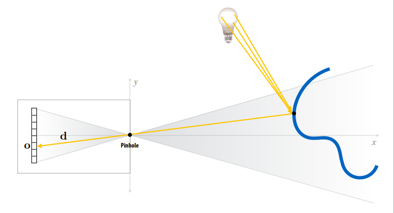

### 光的反射如何影响出射的辐射度 How does refection of light affect the outgoing radiance?

Refection models
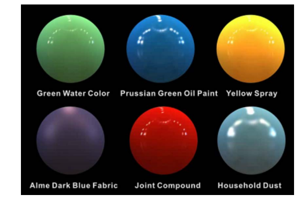
* 反射定义： 光线进入物体表面在相同一侧离开，且频率不改变。 Refection is the process by which light incident on a surface interacts with the surface such that it leaves on the incident (same) side without change in frequency
* 选择什么样的反射方程决定了物理表面什么颜色
$$f_r(\mathbf{p}, \omega_i\to\omega_o)$$

基础的反射函数 Some basic refection functions
**`需要找到一个合适的光线传输模型来表现这些反射现象。`**
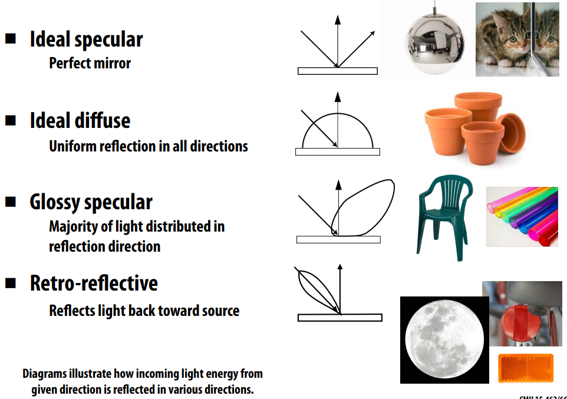

### 根据这些反射函数建立散射模型来

Models of Scattering
1. 微表面：  Photon_on_surface
   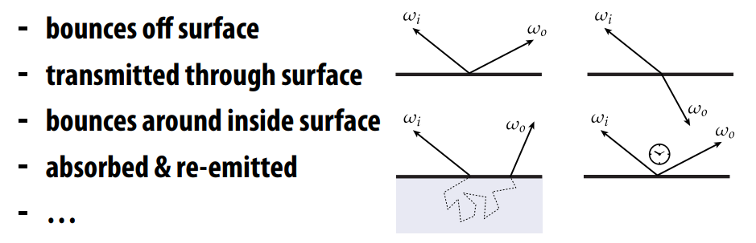
2. 能量守恒： What goes in must come out! (Total energy must be conserved)
3. 采用BRDF模型： In general, can talk about “probability*” a particle arriving from a given direction is scattered in another direction

Scattering off a surface: 
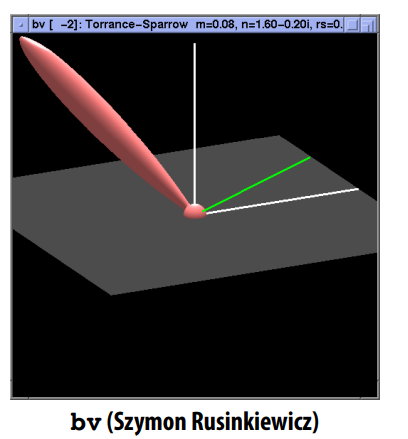
* the BRDF(Bidirectional refectance distribution function)
* Encodes behavior of light that “bounces off” surface
* Given incoming direction ωi, how much light gets scattered in any given outgoing direction ωo.
* 表面散射分布描述： $f_r( \omega_i\to\omega_o)$
由以上前提引出brdf概念

**BRDF有如下的两个重要性质**
* Helmholtz互异性： 就是交互入射方向和反射方向，BRDF计算出来的结果是一致的 $f(p, w_i) = f(p, w_o)$
* 能量守恒
* **可以理解brdf为一束入射光的投射到表面$\Delta\mathbf{p}$点光通量与该点某一个观察方向的出射光光通量的比值，BRDF同时满足Helmholtz互异性，对一束入射光的所有反射光比值加总（积分），由能量守恒可知必然$\le1$**
$$
f_r(\omega_i\to\omega_o)\ge0\\
f_r(\omega_i\to\omega_o)=f_r(\omega_o\to\omega_i)\\
\int_{\mathcal{H}^2}f_r(\omega_i\to\omega_o)\cos\theta\ \text{d}\omega_i\le1 \\
$$


BRDF的辐射度描述  Radiometric description of BRDF
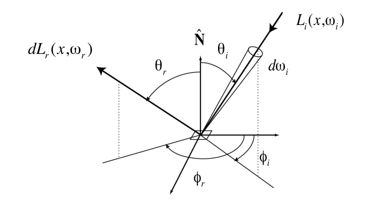
$$
f_r(\omega_i\to\omega_o) = \frac{\text{d}L_o(\omega_o)}{\text{d}E_i(\omega_i)}
=\frac{\text{d}L_o(\omega_o)}{\text{d}L_i(\omega_i)\cos\theta}\left[\frac{1}{sr}\right]\\
$$

Example: Lambertian refection
* Assume light is equally likely to be refected in each output direction
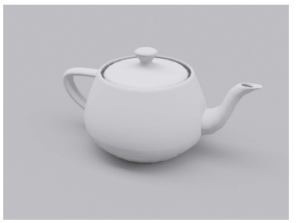
* 由于各个出射光一样：$ f_r=f_r(\mathbf{p}, \omega_i\to\omega_o)$
> diffuse derivative:
$$
\begin{align*}
f_r(\mathbf{p})&=\frac{\rho(\mathbf{p})}{\pi}\\
L_o(\mathbf{p},\omega_o) &=\int_{\mathcal{H}^2}{f_r(\mathbf{p})L_i(\mathbf{p},\omega_i)\cos\theta}\ \text{d}\omega_i\\
&=f_r(\mathbf{p})\int_{\mathcal{H}^2}{L_i(\mathbf{p},\omega_i)\cos\theta}\ \text{d}\omega_i\\
&=f_r(\mathbf{p})E(\mathbf{p})\\
&=\frac{\rho(\mathbf{p})}{\pi}E(\mathbf{p})\\
\end{align*}\\
$$
> $\rho(\mathbf{p})​$ is albedo, between 0 and 1, because:
$$
0 \le\int_{\mathcal{H}^2}{f_r(\mathbf{p})\cos\theta}\ \text{d}\omega_i\le 1\\
0 \le\frac{\rho(\mathbf{p})}{\pi}\int_0^{2\pi}\int_0^\frac{\pi}{2}          cos\theta\sin\theta\ \text{d}\phi\text{d}\theta\le 1\\
0\le\rho(\mathbf{p})\le 1\\
$$

Example: perfect specular refection

* Specular refection BRDF
$$L_o(\theta_o,\phi_o)=L_i(\theta_i,\phi_i)\\$$
$$
f_r(\theta_i,\phi_i;\theta_o,\phi_o)=
\begin{cases}
\frac{1}{\cos\theta_i}       &      & {\theta_o=\theta_i \text{ and }\phi_i=\phi_o\pm\pi}\\
0     &      & \text{otherwise}\\
\end{cases} \\
$$

**TransmissionLight**
* 光穿过介质 refracts:Transmitted angle depends on relative index of refraction of material ray is leaving/entering
* 折射 Snell`s  Law  

$$
\begin{align*}{ccl}
\eta_i\sin\theta_i
&=\eta_t\sin\theta_t\\
\cos\theta_t
&=\sqrt{1-\sin^2\theta_t}\\
&=\sqrt{1-(\frac{n_i}{n_t})^2\sin^2\theta_i}\\
&=\sqrt{1-(\frac{n_i}{n_t})^2(1-\cos^2\theta_i)}  &\left(1-(\frac{n_i}{n_t})^2(1-\cos^2\theta_i)<0)\right)
\end{align*}\\
$$
eg: 人眼视角 Optical manhole
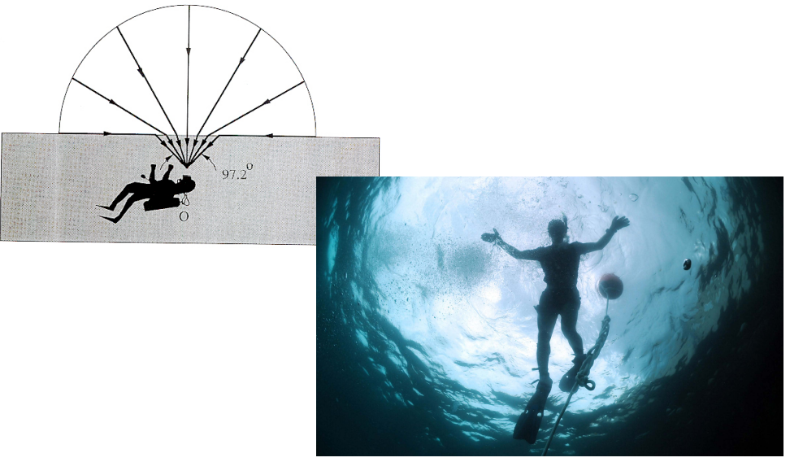
* 菲涅尔反射 Fresnel reflection:
大部分材质都随着视角增加而反射增加 Many real materials: refectance increases with viewing angle
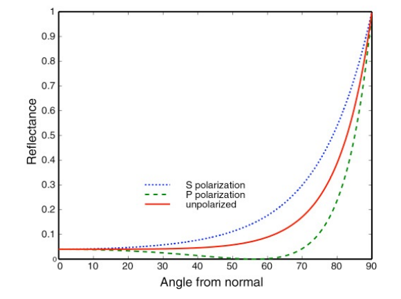
Example : Snell + Fresnel
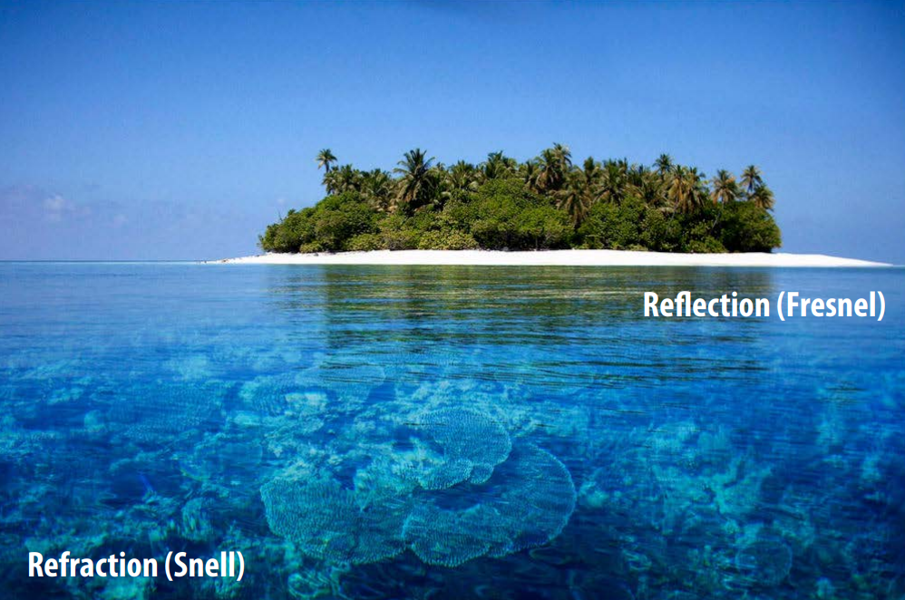

**各项异性 Anisotropic refection**
Refection depends on azimuthal angle$\phi$


**次表面散射 Subsurface scattering**
  Translucent materials: eg: jade skin

原因：光线出射点与入射点不一致 Visual characteristics of many surfaces caused by light entering at different points than it exits
  - Violates a fundamental assumption of the BRDF
  - Need to generalize scattering model (BSSRDF)： $S(\mathbf{p}_i,\omega_i,\mathbf{p}_o,\omega_o)$

BSSRDF:"Bidirectional Scattering Surface Reflectance Distributed Function
  - Generalization of BRDF; describes exitant radiance at one point due to incident differential irradiance at another point:
$$
L_o(\mathbf{p}_o,\omega_o)=
\int_\mathcal{A}
\int_{\mathcal{H}^2}
{S(\mathbf{p}_i,\omega_i,\mathbf{p}_o,\omega_o)L_i(\mathbf{p_i},\omega_i)\cos\theta}
\ \text{d}\omega_i\text{d}A \\
$$

> compare BRDF: 
$$
L_o(\mathbf{p},\omega_o)=L_e(\mathbf{p},\omega_o) + \int_{\mathcal{H}^2}f_r(\mathbf{p},\omega_i\to\omega_o)L_i(\mathbf{p},\omega_i)\cos\theta \ \text{d}\omega_i \\
$$


### 有什么相对简单的算法能够捕获所有的行为？ 

**The refection equation** 
* Approximate integral via Monte Carlo integration：
* Generate directions $\omega_j$ sampled from some distribution $p(\omega)$ 
* Compute the estimator 
$$
\frac{1}{N}\sum_{j=1}^N\frac{f_r(\mathbf{p},\omega_j\to\omega_r)L_i(\mathbf{p},\omega_j)\cos\theta_j}{p(\omega_j)} \\
$$
* *为了降低方差$p(\omega_j)​$ 应该尽量符合BRDF入射光线分布。 To reduce variance $p(\omega_j)​$ should match BRDF or incident radiance function*

```c++
// Assume:
// Ray ray hits surface at point hit_p
// Normal of surface at hit point is hit_n

Vector3D wr = -ray.d; // outgoing direction
Spectrum Lr = 0.;
for (int i = 0; i < N; ++i) {
    Vector3D wi; // sample incident light from this direction
    float pdf; // p(wi)
    
    generate_sample(brdf, &wi, &pdf); // generate sample according to brdf
    
    Spectrum f = brdf->f(wr, wi);
    Spectrum Li = trace_ray(Ray(hit_p, wi)); // compute incoming Li
    Lr += f * Li * fabs(dot(wi, hit_n)) / pdf;
}
return Lr / N;
```

### 如何确定入射的radiance，how do we solve the full rendering equation? Have to determine incident radiance…
选择合适的入射光线
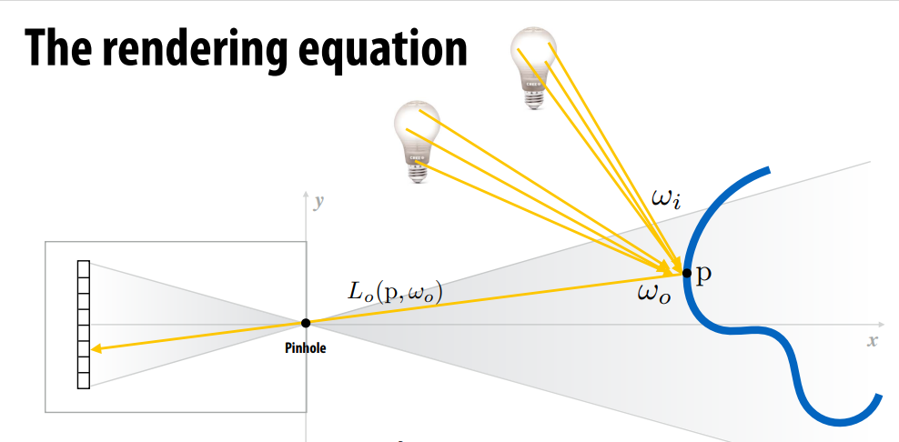
Path tracing : 拆解递归无限光线为逐束递归光线求解，take advantage of special knowledge to break up integration into “easier” components：
* 将渲染方程拆解为直接光照部分和间接光照部分： Partition the rendering equation into direct and indirect illumination ： 
* 采用蒙特卡洛积分去单独计算每部分（束光），Use Monte Carlo to estimate each partition separately 
  - One sample for each 
  - Assumption: 100s of samples per pixel 
* 采用俄罗斯轮盘赌算法：决定要不要继续，避免无线递归下去。Terminate paths with Russian roulette


