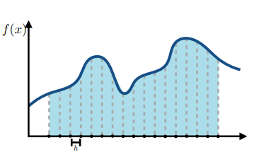
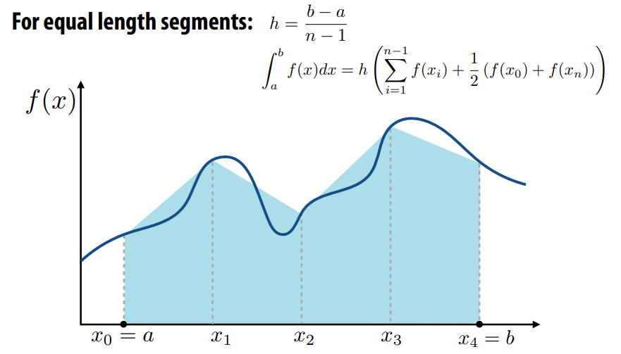
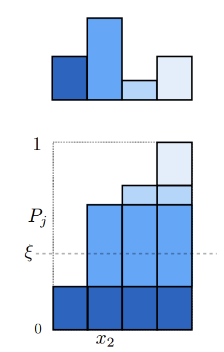
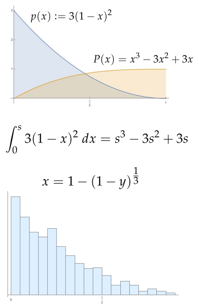
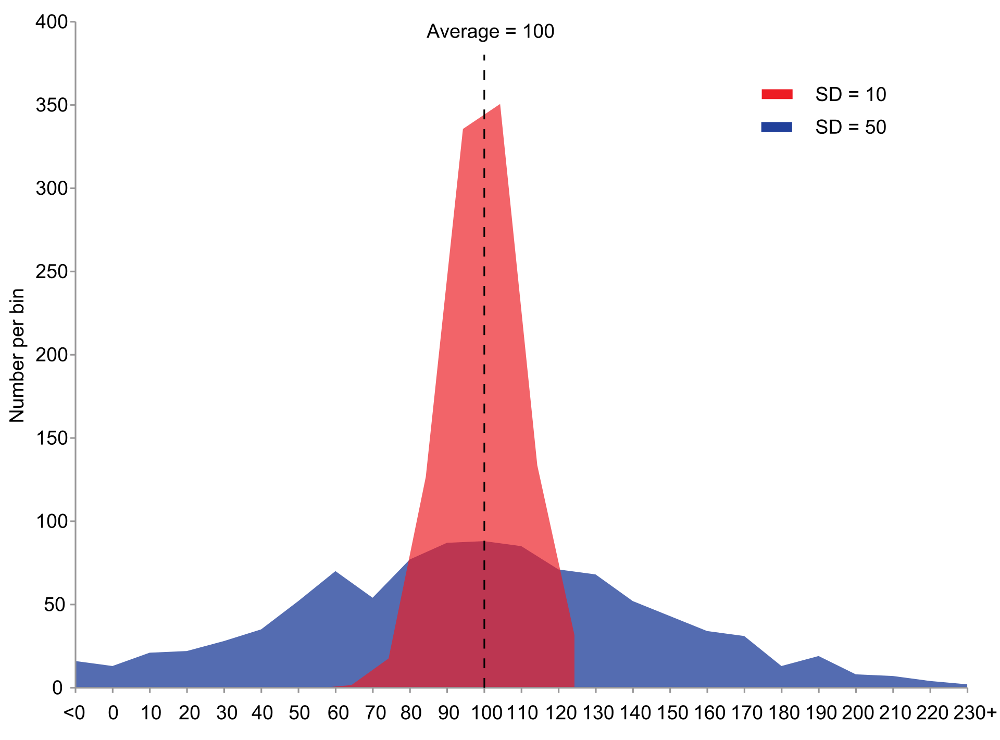
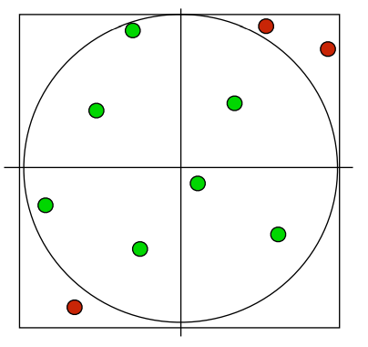

#! https://zhuanlan.zhihu.com/p/545565243
# 蒙特卡洛数值积分 Numerical Integration
数值积分用于求解渲染方程
### Overview
* 在图形中，很多概念是通过积分形式来表达的。 In graphics, many quantities we’re interested in are naturally expressed as integrals (total brightness, total area, …) 
* For very, very simple integrals, we can compute the solution analytically eg: 
$\int_0^1\frac{1}{3}x^2\text{d}x = \left[x^3\right]_0^1 = 1$

* 另外一种情况是无法使用解析解求解渲染方程的，只能采用数值方式求解。For everything else, we have to compute a numerical approximation 
* Basic idea: 
  - integral is “area under curve” 
  - sample the function at many points 
  - integral is approximated as weighted sum
  

### 我们该去对什么求积呢？what are we integrating?
**蒙特卡洛积分Monte Carlo Integration**
参考资料: [Monte Carlo数学原理](https://zhuanlan.zhihu.com/p/61611088)
利用求和思想：Recall this view of the world: Want to “sum up”—i.e., integrate!—light from all directions
average value times size of domain



**概率论基础** fundamental theorem of calculus
- 随机变量$X$: 可能取很多数值的变量
- 随机变量$X \sim p(x)$概率密度函数PDF/[Probability density function](https://en.wikipedia.org/wiki/Probability_density_function):
  $$\begin{cases}
  \quad p(x) \ge 0 \, \\ 
  \quad \int_{-\infty}^{\infty} p(x)\text{d}x = 1   \\  
  \end{cases} \\
  $$
- 期望: The average value that one obtains if repeatedly drawing samples from the random distribution.
  - 离散期望：$E[X] = \sum\limits_{i=0}\limits^{N} x_i \cdot p(x_i)$
  - 连续期望：$E[X]=\int x p(x) d x$

随机变量的属性 Properties of expectation：
- 如果某个随机变量Y是随机变量X的函数：$Y=f(X)$
- 期望的关系：$E[Y]=E[f(X)]=\int f(x) p(x) d x$

方差属性 Property of Variance:
$$
\begin{align*}
  & V[Y] = E[Y^2] - E[Y]^2 \\
  & V[\sum_{i = 1}^{N}Y_i] = \sum_{i = 1}^{N}[Y_i] \\
  & V[aY] = a^2V[Y] \\
  & V[X] = \sum_{i =1}^NP_i(x_i - \sum_{j = 1}^{N}p_j x_j )^2 \\
  & V[X] = \int_{\Omega} p(x)(x - \int_{\Omega}yp(y)\text{d}y)^2\text{d}x\\
\end{align*}\\
$$

### 逆变换采样方法 inversion method

**generate samples of a discrete random variable (with a known PDF)**
To randomly select an event, select $x_i$ if $P_{i-1}<\xi\le P_i$
$P$ 是累计概率函数 $P_j=\sum_{i=1}^j p_i$
$\xi$ 是均匀分布随机变量 $\in [0,1)$

**Sampling continuous random variables using the inversion method**
Cumulative probability distribution function $X$是代表随机变量
$$
P(x) = Pr(X < x)=\int_{-\infty}^xp(t)\ \text{d}t \\
$$
Construction of samples: solve for $x=P^{-1}(\xi)$ 
  * eg: 
    

**引入任意分布随机变量的蒙特卡洛积分方法**
Monte Carlo Integral: 一种近似积分方法：
- 有时候定积分很难精确计算（解析式求不出），使用数值方法
- 黎曼积分：分解成很多个长方形来积分
- Monte Carlo积分：随机采样
- 用任意一个PDF去采样，都可以用下面的式子求出积分的近似数值:
$$F_{N}=\frac{1}{N} \sum_{i=1}^{N} \frac{f\left(X_{i}\right)}{p\left(X_{i}\right)}$$
证明：$$\int f(x) \mathrm{d} x=\frac{1}{N} \sum_{i=1}^{N} \frac{f\left(X_{i}\right)}{p\left(X_{i}\right)} \quad X_{i} \sim p(x)$$
过程：
$$
\begin{align*}
E[F_N] &= E\left[{\frac{1}{N}\sum\limits_{i=1}\limits^N\frac{f(X_i)}{p(X_i)}}\right] \\
        &= \frac{1}{N}\sum\limits_{i=1}\limits^N \, E\left[\frac{f(X_i)}{p(X_i)}\right]\\
        &= 1\cdot\int\frac{f(x)}{p(x)}p(x)\text{d}x\\
        &=\int f(x)\text{d}x \\
\end{align*}\\
$$
==结论：蒙特卡洛随机变量的期望等于积分值==

**重要性采样**
>方差： 参考[Variance wiki](https://en.wikipedia.org/wiki/Variance) it is often represented by $\sigma^2 \,, s^{2} \,, \operatorname{Var}(X) \,, V(X)$

定义：
$$\sigma^2 = E[(X-\mu)^2] \quad or \quad  Var(X) = \frac{\sum(X-\mu)^2}{N}\\
  {\mu =\operatorname {E} [X]}\\
  \operatorname{Var}(X) = E[X^2] - E[X]^2 \\
$$

**蒙特卡洛方法的方差**
蒙特卡洛方法的方差：利用无偏估计可以通过样本方差来估计 $Q_N$的误差条(error bar)
构造随机变量： $Y = \frac{f(X)}{p(X)}$

备注： 其中推导使用了Property of Variance: $\sigma^2\left[ \sum\limits_{i=1}\limits^N Y_i\right] = \sum\limits_{i=1}\limits^N \sigma^2 \left[Y_i\right] $
$$
\begin{align*}
  \sigma^2[F_N] &=\sigma^2\left[ {\frac{1}{N}\sum\limits_{i=1}\limits^N\frac{f(X_i)}{p(X_i)}} \right] \\
  &= \frac{1}{N^2} \sum\limits_{i=1}\limits^N \sigma^2  \left[  \frac{f(X_i)}{p(X_i)} \right]  \\
  &= \frac{1}{N^2}\sum\limits_{i=1}\limits^N\sigma^2\left[Y_i\right]\\
  &= \frac{1}{N^2}\left(N \sigma^2[Y] \right)\\
  &= \frac{1}{N} \sigma^2[Y]\\
  所以有：\sigma[F_N] = \frac{1}{\sqrt{N}}\sigma[Y]\\
\end{align*}\\
$$
结论： 
1. 蒙特卡洛估值不稳定来源于随机变量$Y$ 取值的不稳定，即在$Y = \frac{f(x_i)}{p_i}$中$\frac{f(x_i)}{p_i}$值越大，就会是Y的方差越大。 从而影响蒙特卡洛估值的准确度。  所以若p(x)的形状越接近f(x)，则有益于最终结果的收敛。这就是**重要性采样**的思想
2. 估计值与理论值之间的误差可以通过增加样本数来减小，但收敛速率仅为$O(\sqrt{N})$。

## 采样理论
**prerequisite** : 
雅可比行列式： 解决多重积分变量替换和多元随机变量坐标便换求概率密度的问题
参考资料： [雅可比行列式](https://www.bilibili.com/video/BV18J41157X8?share_source=copy_web&vd_source=e84f3d79efba7dc72e6306f35613222e)


**The Inversion Method**
逆变换方法采样： 用分布在[0,1]区间的均匀随机变量去采样随机分布变量，sample is uniform, probalility is nonuniform. 


**rejection sampling**
参考资料：
1. [接受拒绝采样（Acceptance-Rejection Sampling）](https://zhuanlan.zhihu.com/p/75264565)
2. PBRT: 13.3.2 THE REJECTION METHOD
Completely different idea: pick uniform samples in square (easy)
Then toss out any samples not in square (easy)


   ```c++
   Point2f RejectionSampleDisk(RNG &rng) 
   {
      Point2f p;
      do {
        //生成[-1, 1]区间的均匀随机数
      p.x = 1 - 2 * rng.UniformFloat();
      p.y = 1 - 2 * rng.UniformFloat();
      } while (p.x * p.x + p.y * p.y > 1);
      return p;
    }
   ```
一般来说，拒绝抽样的效率取决于样本的百分比预计会被拒绝。 对于在 2D 中寻找均匀点的问题情况下，这很容易计算。 它是圆的面积除以正方形的面积：π/4≈78.5%。 
如果将该方法应用于一般在超球体中生成样本然而，在 n 维情况下，n 维超球面的体积实际上是随着 n 的增加而变为 0，这种方法变得越来越低效。
