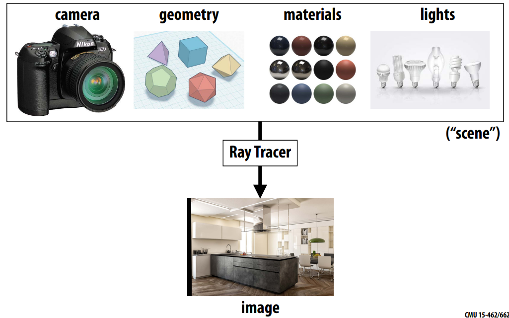
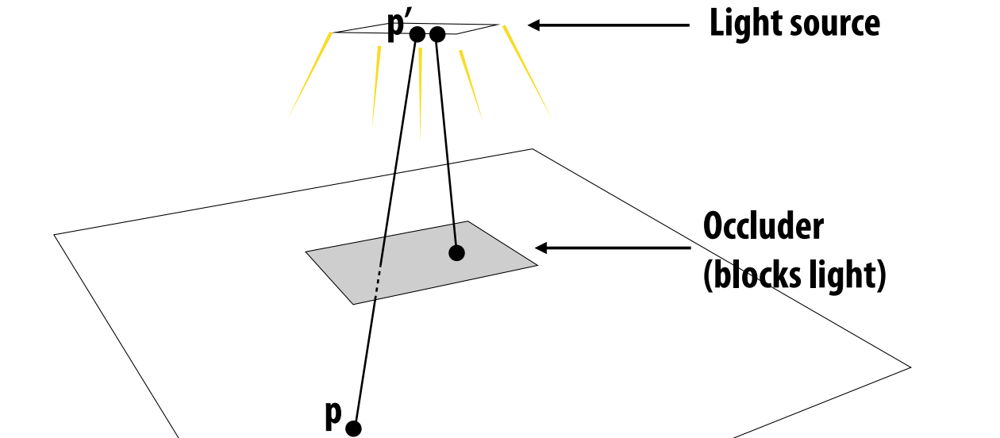
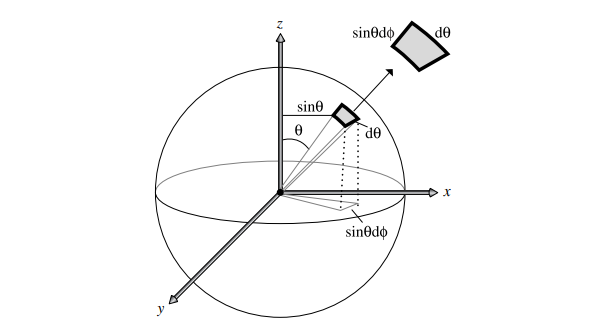
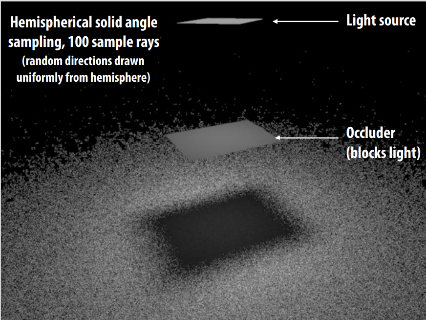
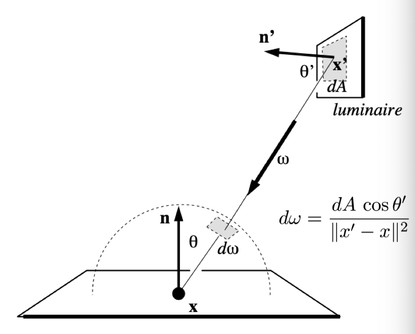
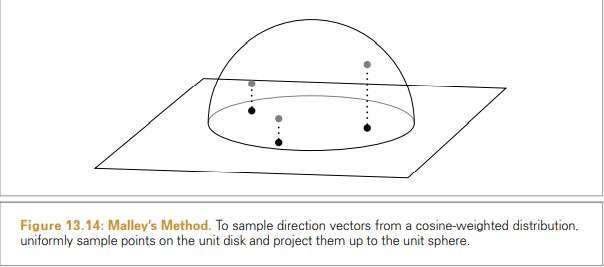
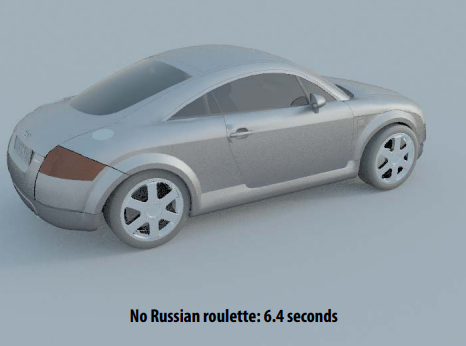
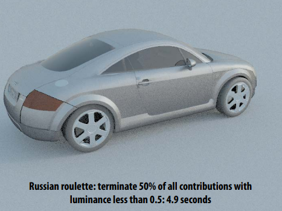

#! https://zhuanlan.zhihu.com/p/545566323
# 蒙特卡洛渲染公式整理 Monte Carlo Rendering
### Photorealistic Rendering
渲染一张真实感图片需要： 
1. camera
2. geometry
3. material
4. lights

### Monte Carlo Ray Tracing
* 在渲染方程中使用蒙特卡洛积分：To develop a full-blown photorealistic ray tracer, will need to apply Monte Carlo integration to the rendering equation 
* 对输入光线进行积分决定每一个像素的着色：To determine color of each pixel, integrate incoming light 
* 对什么函数进行积分：What function are we integrating? 
   - illumination along different paths of light 
* What does a “sample” mean in this context? 
   - ==每条光线路径就是一个采样==  each path we trace is a sample

**思考**
1. 利用均匀分布随机变量去采样
2. 预期得到什么数值： EXPECTED VALUE — what value do we get on average?
3. 如何减少方差： VARIANCE —what’s the expected deviation from the average?
4. 如何让每次采样更有效： IMPORTANCE SAMPLING — how do we (correctly) take more samples in more important regions?

### Direct Lighting

Visibility function
$$
   V(p, p^\prime) =
   \begin{cases}
      1, \quad p  "sees" \,  p^\prime \\
      0, otherwise  \\
   \end{cases}\\
$$

### uniform sampling
* 在半球面均匀采样方向 How do we uniformly sample directions from the hemisphere?  

* 使用Inversion Method采样,概率密度函数PDF如下：Picking points on unit hemisphere：
$$(\xi_1, \xi_2) = (\sqrt{1-\xi_1^2}\cos(2\pi\xi_2), \sqrt{1-\xi_1^2}\sin(2\pi\xi_2), \xi_1)$$ 
推导如下：[参考上篇数值积分中对圆的采样](https://zhuanlan.zhihu.com/p/545565243)
同时可以参考：《PBRT 13.6.1章节》
 
1. 由球面坐标转换$\text{d}\omega = \sin\theta \text{d}\theta\text{d}\phi$
2. 在半球表面进行均匀采样所以有$p(\omega) = 1/2\pi$
3. 由分布函数:
   $$
   \begin{align*}
   & P_r \{\omega \in \Omega \} = \int_\Omega p(\omega)\text{d}\omega \Longrightarrow p(θ , φ)\text{d}\theta\text{d}\phi = p(\omega)\text{d}\omega\\
   & p(θ , φ) = \sin\theta p(\omega) \\
   & p(\theta,\phi) =\frac{\sin\theta}{2\pi}\\
   \end{align*}\\
   $$
4. Inverse Method(先求边缘概率密度函数, 再求累计分布函数，最后求取反函数):
   $$
   \begin{align*}
   &p(\theta)=\sin\theta, P(\theta)=1-\cos\theta,  \Longrightarrow \theta =\cos^{-1}\xi_1(1-\xi_1 replace \xi_1)\\
   &p(\phi)=\frac{1}{2\pi}, \quad P(\phi)=\frac{\phi}{2\pi}, \Longrightarrow \phi=2\pi\xi_2\\
   \end{align*}\\
   $$
5. 转到笛卡尔坐标系得到如下结果：
   $$
   \begin{align*}
   &x= \sin\theta \cos \phi  = \sqrt{1- \xi^2} \cos(2\pi\xi_2)\\
   &y = \sin \theta \sin\phi =  \sqrt{1- \xi^2} \sin(2\pi\xi_2) \\
   &z = \cos\theta = \phi_1 \\
   \end{align*}\\
   $$
 
**直接光均匀采样Direct lighting—uniform sampling**
采样算法：
- Given surface point $\mathbf{p}​$ 
- For each of N samples:
  - Generate random direction: $\omega_i$ 
  - Compute incoming radiance $L_i$ arriving at $\mathbf{p}$ from direction: $\omega_i$,A ray tracer evaluates radiance along a ray 
  - Compute incident irradiance due to ray: $dE_i=L_i\cos\theta_i$ 
  - Accumulate $\frac{2\pi}{N}\ \text{d}E_i$ into estimator
$$
\begin{align*}
   &p(\omega) = \frac{1}{2\pi}\quad \Longrightarrow \quad  E(p) = \int L(p, \omega) \cos \theta \text{d}\omega\\
   &F_N = \frac{2\pi}{N}\sum_{i=1}^{N} \text{d}E_i \\
\end{align*}\\
$$

result: 均匀在半球面上采样会产生大量的噪声
  - 原因：均匀采样导致，环境当中光线的来源往往不是均匀的。a lot of rays are “wasted” if we uniformly sample the hemisphere at the shading point.

**对灯光区域进行采样  Direct lighting: area integral**
* Don’t need to integrate over entire hemisphere of directions (incoming radiance is 0 from most directions). 
* 对灯光进行采样：Just integrate over the area of the light (directions where incoming radiance is non-zero)and weight appropriately
   - 蒙特卡洛允许任何方式的采样，只要喂对应的x和p就行
   - 对光源积分是个很高效的想法，但是积分的对象和"Sample on x & integrate on x"的要求不匹配→只需要找到光源对应$\omega_i$的关系就行→改变积分域
   
   $$
   \begin{align*} 
   L_{o}(x, \omega_{o}) &=\int_{\Omega^{+}} f_{r}(x, \omega_{i}, \omega_{o}) L_i(x, \omega_{i})  V(p, p^\prime)  \cos \theta \text{d} \omega_{i} \\ 
   &=\int_{A} f_{r}(x, \omega_{i}, \omega_{o}) L_i(x, \omega_{i}) V(p, p^\prime) \frac{\cos \theta \cos \theta^{\prime}}{\left\|x^{\prime}-x\right\|^{2}} \text{d}A  \\
   \end{align*}\\
   $$

>Sample shape uniformly by area A(Light area)
$$
\int_{A^\prime} p(p^\prime) \text{d}A = 1  \quad \Longrightarrow  p(p^\prime) = \frac{1}{A}\\
$$
Estimator:
$$
Y_i = L_i(x, \omega_{i}) V(p, p^\prime) \frac{\cos \theta \cos \theta^{\prime}}{\left\|x^{\prime}-x\right\|^{2}}\\
F_N = \frac{A}{N}\sum_{i = 1}^{N}Y_i \\
$$

灯光采样结果(没有考虑遮挡情况)

然后我们就可以consider the radiance coming from two parts:
 1. light source (direct, no need to have RR) 直接光照
 2. other reflectors (indirect, RR) 间接光照

### 比较不同的采样方式Comparing different techniques
* 估计器中的方差表现为渲染图像中的噪声 Variance in an estimator manifests as noise in rendered images 
* 估算器效率与方差和计算成本之间的关系 Estimator efficiency measure:
  * $$ Efficiency\propto\frac{1}{Variance\times Cost}$$
* If one integration technique has twice the variance of another, then it takes twice as many samples to achieve the same variance 
* If one technique has twice the cost of another technique with the same variance, then it takes twice as much time to achieve the same variance

**Cosine-Weighted Hemisphere Sampling**
参考资料：《PBRT 13.6.3 COSINE-WEIGHTED HEMISPHERE SAMPLING 》
由散射方程中 BSDF 和入射辐射的乘积加权余弦项， 所以，Mathematically, this means that we would like to sample directions ω from a PDF :
$$
p(\omega) \propto \cos \theta \\
\begin{align*}
   \int_{\mathcal{H}^2}p(\omega) \text{d}\omega = \int_{\mathcal{H}^2}C\cos\theta \text{d}\omega &=C\int_0^{2\pi}\int_0^\frac{\pi}{2}\cos\theta\sin\theta\ \text{d}\phi\text{d}\theta=C\pi=1\\
   p(\omega)&=\frac{\cos\theta}{\pi}\\
   p(\theta,\phi)\ \text{d}\theta\text{d}\phi&=\frac{\cos\theta\sin\theta\ \text{d}\theta\text{d}\phi}{\pi}\\
   p(\theta,\phi)&=\frac{1}{\pi}\cos \theta \sin\theta\\
   p(\phi)&=\frac{1}{2\pi},&P(\phi)=\frac{\phi}{2\pi},\phi=2\pi\xi_2\\
   p(\theta)&=\sin2\theta,&P(\theta)=\frac{1}{2}-\frac{1}{2}\cos2\theta,\sin\theta=\sqrt{\xi_1}\\
   (x,y,z)&=(\sin\theta\cos\phi,\sin\theta\sin\phi,\cos\theta)\\
   &=(\sqrt{\xi_1}\cos(2\pi\xi_2), \sqrt{\xi_1}\sin(2\pi\xi_2), \sqrt{1-\xi_1})\\
\end{align*}\\
$$
>另外一种方式：
>* Malley’s method: t if we choose points uniformly from the unit disk and then generate directions by projecting the points on the disk up to the hemisphere above it, the resulting distribution of directions will have a cosine distribution

###  Path tracing: indirect illumination
$$
E(\mathbf{p},\omega_o)=\int_{\mathcal{H}^2}f_r(\mathbf{\omega_i},\omega_o)L_{o,i}(tr(\mathbf{p},w_i),-\omega_i)\cos\theta_i\ \text{d}\omega_i \\
$$
Recursively call path tracing function to compute incident indirect radiance 

**Russian roulette**
$$
L=[\frac{f_r(\omega_i\to\omega_o)L_i(\omega_i)\cos\theta_i}{p(\omega_i)}]V(\mathbf{p},\mathbf{p}')\\
$$
* 如果[ ]括号内贡献很小，不管怎样对图像的贡献都会很小
* 忽略低贡献样本会引入系统误差， 不再收敛到正确的值！
* 相反，以某种方式随机丢弃低贡献样本使估计器无偏

新的估算器：
* New estimator: evaluate original estimator with probability, reweight. Otherwise ignore.
* Same expected value as original estimator
$$
   p_{rr}E[\frac{X}{p_{rr}}]+(1-p_{rr})E[0]=E[X] \\
$$

 