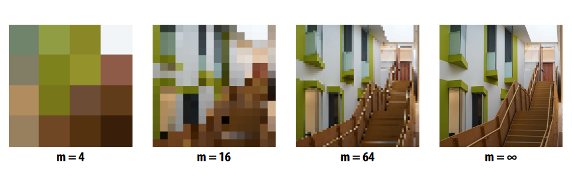
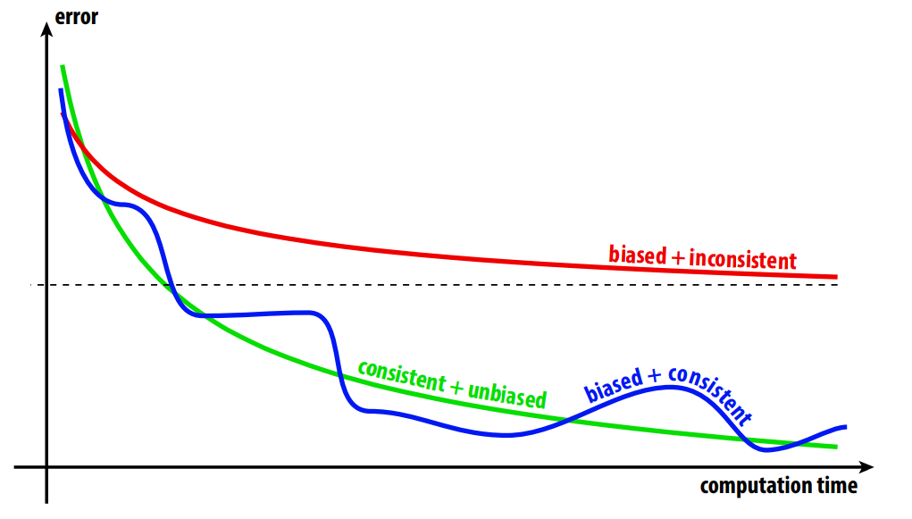
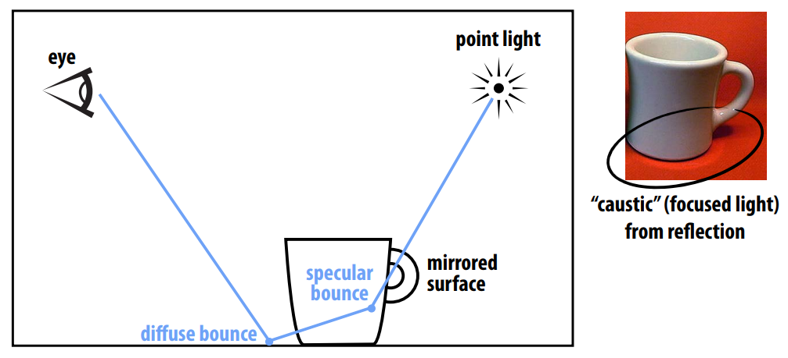

# Variance Reduction
### How do we reduce variance?
不能减少被积函数的方差！ 只能减少估计量的方差。You can’t reduce variance of the integrand! Can only reduce variance of an estimator.
**Variance of an Estimator**
ture integral : 
$$
I = \int_{\Omega}f(x)\text{d}x
$$
Monte Carlo estimate: 
$$
\hat{I} = V(\Omega)\frac{1}{N}\sum_{i =1}^{N} f(x_i) 
$$

**Bias & Consistency**
参考资料：[什么是无偏估计](https://www.zhihu.com/question/22983179/answer/404391738)
1. 一致性：“收敛到正确答案” Consistency: “converges to the correct answer”
$$
\lim_{n\to \infin} p(|I - \hat{I}| > 0 ) = 0 \\
$$
2. 无偏：“估计平均是正确的 Unbiased: “estimate is correct on average”
$$
E[I - \hat{I_n}] = 0 
$$

经验法则: 无偏估计器具有更可预测的行为/更少的参数需要调整以获得正确的结果

**Naive Path Tracing**
The probability we sample the reflected direction
- Zero

The Probability we hit a point light source
- Zero 

如果沿着各个方向随机的发射光线，specular bounce的次数会很少。 

Naive path tracing ==misses== important phenomena! ((Formally: the result is biased)

###  Importance Sampling in Rendering
根据对积分贡献的大小来采样 Simple idea: sample the integrand according to how much we expect it to contribute to the integral
naive Monte Carlo  Vs Importance sample Monte Carlo: 
$$
V(\Omega)\frac{1}{n}\sum_{i=1}^Nf(x_i)  \quad  \text{VS}  \quad  \frac{1}{n}\sum_{i=1}^N\frac{f(x_i)}{p(x_i)}
$$
- (xi are sampled proportional to p)
- 如果更频繁地对 x 进行采样，则每个样本的计数应该更少； 如果采样 x 的频率较低，则每个样本都应该计数更多 If I sample x more frequently, each sample should count for less; if I sample x less frequently, each sample should count for more
$$
L_o(\mathbf{p},\omega_o)=L_e(\mathbf{p},\omega_o) + \int_{\mathcal{H}^2}f_r(\mathbf{p},\omega_i\to\omega_o)L_i(\mathbf{p},\omega_i)\cos\theta \ \text{d}\omega_i
$$
考虑重要性采样，那么 $p(x)$ 应该接近 $f_r(\mathbf{p},\omega_i\to\omega_o)L_i(\mathbf{p},\omega_i)\cos\theta$，但我们并不知道这个函数的具体表达式，只能去一步步推导。

分别考虑乘积项

- $f_r(\mathbf{p},\omega_i\to\omega_o)$：我们可以根据BRDF来确定采样规律，如遇到镜面就往镜面反射方向采样
- $L_i(\mathbf{p},\omega_i)$：我们可以根据光源来确定采样规律，如在光源方向采样

