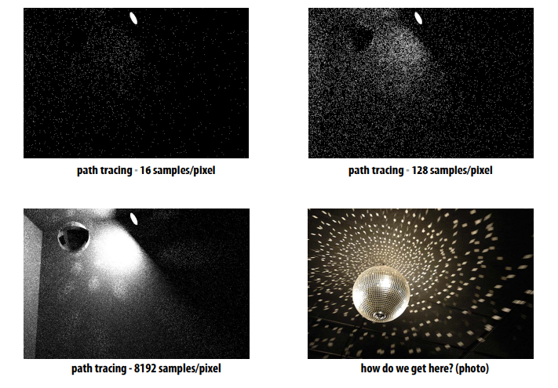
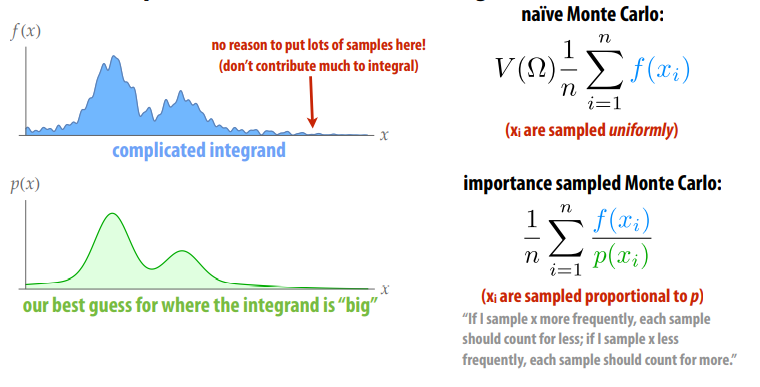
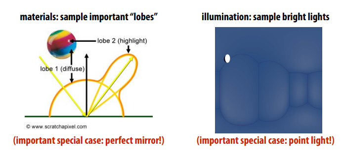
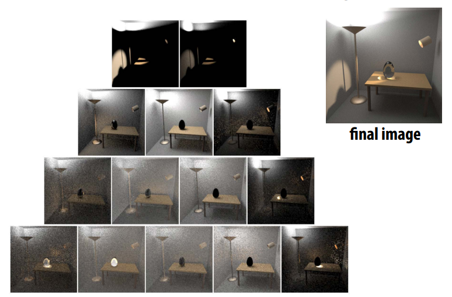
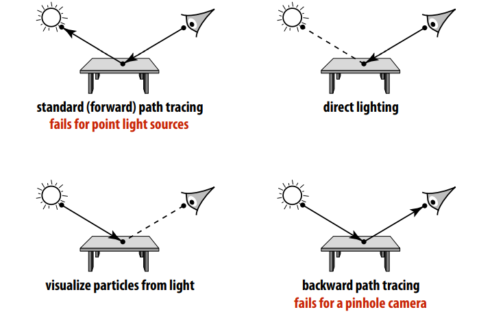
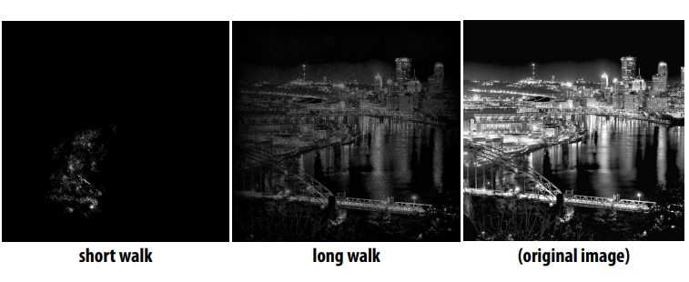
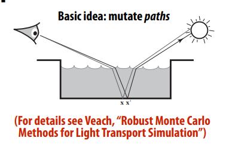
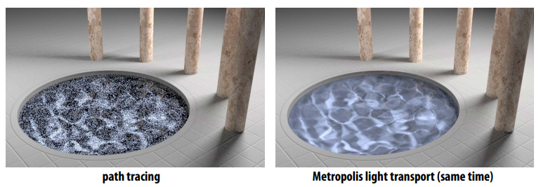

# Variance Reduction
### How do we reduce variance?
不能减少被积函数的方差！ 只能减少估计量的方差。You can’t reduce variance of the integrand! Can only reduce variance of an estimator.
**Variance of an Estimator**
ture integral : 
$$
I = \int_{\Omega}f(x)\text{d}x
$$
Monte Carlo estimate: 
$$
\hat{I} = V(\Omega)\frac{1}{N}\sum_{i =1}^{N} f(x_i) 
$$

### Bias & Consistency

关于方差，一致性，无偏性参考上篇[估计量的性质评估](https://zhuanlan.zhihu.com/p/553388212)

1. 一致性：“收敛到正确答案” Consistency: “converges to the correct answer”
$$
\lim_{n\to \infin} p(|I - \hat{I_n}| > 0 ) = 0 \\
$$
2. 无偏：“估计平均是正确的 Unbiased: “estimate is correct on average”
$$
E[I - \hat{I_n}] = 0 
$$

经验法则: 无偏估计器具有更可预测的行为/更少的参数需要调整以获得正确的结果

### Naive Path Tracing
The probability we sample the reflected direction
- Zero

The Probability we hit a point light source
- Zero 

如果沿着各个方向随机的发射光线，specular bounce的次数会很少, `因为光线数量很少某些渲染效果就无法呈现（比如焦散）` 
Naive path tracing ==misses== important phenomena! ((Formally: the result is biased)

从上图可以看到需要将增加采样数量增加到非常大才能出现渲染效果，此时普通的蒙特卡洛计算收敛太慢，从实际应用来说需要更好的采样方式，重要性采样就发挥作用了。

###  Importance Sampling in Rendering
**重要性采样**
>方差： 参考[Variance wiki](https://en.wikipedia.org/wiki/Variance) it is often represented by $\sigma^2 \,, s^{2} \,, \operatorname{Var}(X) \,, V(X)$

定义：
$$\sigma^2 = E[(X-\mu)^2] \quad or \quad  Var(X) = \frac{\sum(X-\mu)^2}{N}\\
  {\mu =\operatorname {E} [X]}\\
  \operatorname{Var}(X) = E[X^2] - E[X]^2 \\
$$

根据对积分贡献的大小来采样 Simple idea: sample the integrand according to how much we expect it to contribute to the integral
naive Monte Carlo  Vs Importance sample Monte Carlo: 
$$
V(\Omega)\frac{1}{n}\sum_{i=1}^Nf(x_i)  \quad  \text{VS}  \quad  \frac{1}{n}\sum_{i=1}^N\frac{f(x_i)}{p(x_i)}
$$

- 根据采样的分布权重区采样(xi are sampled proportional to p)
- 如果更频繁地对 x 进行采样，则每个样本的计数应该更少； 如果采样 x 的频率较低，则每个样本都应该计数更多. `样本取自与被积函数中的函数相似的分布，则收敛得更快`

### 光线传输空间公式 Path Space Formulation of Light Transport
$$
L_o(\mathbf{p},\omega_o)=L_e(\mathbf{p},\omega_o) + \int_{\mathcal{H}^2}f_r(\mathbf{p},\omega_i\to\omega_o)L_i(\mathbf{p},\omega_i)\cos\theta \ \text{d}\omega_i
$$

考虑重要性采样，由重要性采样的公式可以知道： $p(x)$ 应该接近 $f_r(\mathbf{p},\omega_i\to\omega_o)L_i(\mathbf{p},\omega_i)\cos\theta$，但我们并不知道这个函数的具体表达式，只能去一步步推导。

分别考虑乘积项
- $f_r(\mathbf{p},\omega_i\to\omega_o)$：我们可以根据BRDF来确定采样规律，如遇到镜面就往镜面反射方向采样
- $L_i(\mathbf{p},\omega_i)$：我们可以根据光源来确定采样规律，如在光源方向采样

**Bidirectional Path Tracing** 

* 正向路径跟踪：无法控制路径长度（命中n 次反弹后亮，或被俄罗斯轮盘赌终止）, 场景中大部分位置与光源之间都存在阻隔，故直接在灯光区域采样积分也无法起作用.
* 想法：直接连接来自光、眼睛的路径（“双向” `要求与光源之间无阻隔`） 
* 重要性采样： 需要根据采样策略仔细权衡路径的贡献。 

**Metropolis-Hastings Algorithm**

双向路径追踪算法，如何选择光源出发的路径? 有时候，光源的大部分路径都是无效的, 这时候可以使用Metropolis_Light_transport方法。
.png)

一旦我们找到一条好路径，就干扰采样光线以找到附近的“好”路径。
- 马尔可夫链帮助采样
  - 马尔可夫链：根据当前样本，根据一个概率分布，生成下一个相近的样本
- Jumping from the current sample to the next with some PDF
- 可以做到以任意函数为pdf生成样本
- Key idea: Locally perturb an existing path to get a new path 有一个路径的情况下，可以生成相似的路径
- 好处：Very good at locally exploring difficult light paths 有了种子，就能找到更多相似的
  - Caustics, Indirect Light Source
- 缺点：
  - Difficult to estimate the convergence rate
    - Monte Carlo可以估计Variance，可以量化
  - Does not guarantee equal convergence rate per pixel
  - So, usually produces “dirty” results 看上去比较脏
  - Therefore, usually not used to render animations（帧和帧之间会dirty 闪烁）

> 参考 [Metropolis-Hastings Algorithm—(wikipedia_MHA)](https://en.wikipedia.org/wiki/Metropolis%E2%80%93Hastings_algorithm) 

**Metropolis-Hastings: Sampling an Image**

- Want to take samples proportional to image density f
- Start at random point; take steps in (normal) random direction
- Occasionally jump to random point (ergodicity)
- Transition probability is “relative darkness” f(x’)/f(xi) 

**Metropolis Light Transport** 

**Multiple Importance Sampling (MIS)** 

Many possible importance sampling strategies 

Which one should we use for a given integrand? 

MIS: combine strategies to preserve strengths of all of them 

Balance heuristic is (provably!) about as good as anything

> $Nc_k$ 即为 策略k 的样本数

> 左图是依据BSDF来采样
>
> 右图是依据直接光来采样
>
> 中间的图是两者的结合
>
> 特别要注意分母的计算，**每个样本都需要计算一次分母** 

## 19.2 Sampling Patterns

**Sampling Patterns & Variance Reduction**

Want to pick samples according to a given density

But even for uniform density, lots of possible sampling patterns

Sampling pattern will affect variance (of estimator!) 

**Stratifed Sampling**

stratifed estimate never has larger variance (often lower) 

**Low-Discrepancy(差异) Sampling**

“No clumps(块)” hints at one possible criterion for a good sample 

Number of samples should be proportional to area

Discrepancy measures deviation(偏差) from this ideal 

**Quasi-Monte Carlo methods (QMC)**

Replace truly random samples with low-discrepancy samples 

Why? Koksma’s theorem: 

**Hammersley & Halton Points**

Can easy generate samples with near-optimal discrepancy 

First defne radical inverse  $\varphi_r(i)$ 

Express integer i in base r, then refect digits around decimal 

> φ10(1234) = 0.4321 

Can get n Halton points $x_1, …, x_n$ in k-dimensions via 
$$
x_i=(\phi_{P_1}(i),\phi_{P_2}(i),...,\phi_{P_k}(i))
$$
Similarly, Hammersley sequence is 
$$
x_i=(i/n,\phi_{P_1}(i),\phi_{P_2}(i),...,\phi_{P_{k-1}}(i))
$$

> n must be known ahead of time! 

**Adaptive Blue Noise**

Can adjust cell size to sample a given density (e.g., importance) 

## 19.3 efficiently sample from a large distribution 

**Sampling from the CDF** 

cost is $O(n\log n)$

> 不理解
>
> 用二分查找法的话只需$O(\log n)$
>
> 建表只需$O(n)$

**Alias Table** 

Get amortized **O(1)** sampling by building “alias table” 

Basic idea: rob from the rich, give to the poor (**O(n)**): 

Table just stores **two identities** & **ratio of heights** per column 

> 构建方法
>
> 1. n个事件则有n个column，分成有空的和溢出的两类
> 2. 对于每个溢出的，找一个有空的，**空多少就从溢出处搬多少过去**，之后溢出处可能溢出，有空或刚满
> 3. 重复步骤2即可

To sample: 

- pick uniform # between 1 and n
- biased coin flip to pick one of the two identities in nth column 

## 19.4 Other techniques

- Photon Mapping 
- Finite Element Radiosity 
- ...

### Photon Mapping

- A biased approach & A two-stage method
- Very good at handling Specular-Diffuse-Specular (SDS) paths and generating caustics

很多种实现方法，这里是其中一种：

Photon Mapping — Approach (variations apply)

- Stage 1 — photon tracing
  - 光源出发，Emitting photons from the light source, bouncing them around, finally recording photons on diffuse surfaces
- Stage 2 — photon collection (final gathering)
  - Shoot sub-paths from the camera, bouncing them around, until they hit diffuse surfaces
- Calculation — local density estimation 局部光子密度估计
  - Idea: areas with more photons should be brighter
  - For each shading point, find the nearest N photons (通过树状结构实现算法，N是固定的). Take the surface area they over 面积计算，然后光子密度=光子数量/面积
  - 光子数量少：面积大，噪声大；光子数量大：模糊
- 模糊是因为有偏
  - Local Density estimation dN / dA != ΔN / ΔA 光子密度估计在数量趋向无限时才与真正光子密度相等，所以biased but consistent!

有偏和无偏的实用辨别方法：

- 在渲染中：Biased == blurry
- 一致的Consistent == not blurry with infinite #samples

自己对有偏和无偏的理解：

- 我们要估计某个像素的颜色
  - 类似Path Tracing的无偏算法，射出光线之后获得的样本就是对这个像素的估计量，这个估计量的期望和真实一致（也就是说，估计越多越接近真实）
  - 而类似Photon Mapping，对于光子密度的估计，“渲染方程是基于光线路径定义的，而Photon Mapping在计算photon密度那一步用一个半径不为0的kernel去加权每个photon的contribution，这和直接计算渲染方程的结果是不一样的。”

[如何理解 (un)biased render？ - 知乎](https://www.zhihu.com/question/26683585)

- [ ]  Path Tracing有收敛的说法吗
- [ ]  什么时候能说一张图片渲染完了（收敛了）

### Vertex Connection and Merging (VCM)

- A combination of BDPT and Photon Mapping
- Key idea:  Let’s not waste the sub-paths in BDPT if their end points cannot be connected but can be merged, but Use photon mapping to handle the merging of nearby “photons”

  

- 比如，$x_2$和$x^{*}_{2}$ 在同一个面上，但是没有重合，按照BDPT，这种就是浪费
- 但是VCM决定利用这种情况，把其中一半光路转化成光子，进行Photon Mapping一样的计算

### Instant Radiosity (IR)

- aka many-light approaches 很多光源的方法
- Key idea: Lit surfaces can be treated as light sources 被照亮的表面就像是光源
- 模拟从光源发出光线，打到的地方相当于二级光源。如果此时Sample某个场景点的颜色，那么遍历这些二级光源，叠加计算即可
- Shoot light sub-paths and assume the end point of each sub-path is a Virtual Point Light (VPL), Then Render the scene as usual using these VPLs
- Pros: fast and usually gives good results on diffuse scenes
- Cons:
  - Spikes will emerge when VPLs are close to shading points
  - Cannot handle glossy materials

工业界：Path Tracing，不高端，但可靠

**参考资料**：
1. [Variance wiki](https://en.wikipedia.org/wiki/Variance)
2. [veach_thesis](http://graphics.stanford.edu/papers/veach_thesis/)

