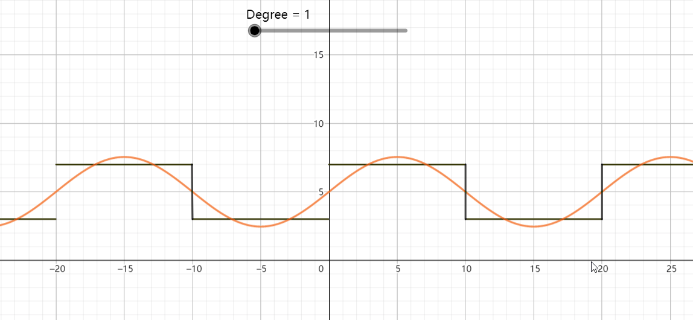

# 傅里叶级数数学推导
参考资料：
[Fourier_series](https://en.wikipedia.org/wiki/Fourier_series)
[Fourier transform](https://en.wikipedia.org/wiki/Fourier_transform)

**Prerequisite**
一个周期函数你能不能将他展开成傅里叶级数？展开的傅里叶级数的参数是怎么来的？ 
eg: 
$$
f(t) = 
\begin{cases}
    7 ,  \qquad (0 \le t < 10) \\
    3, \qquad   (10 \le t < 20)
\end{cases}
$$

简谐函数： $$ y = A \sin(\omega x + \phi)$$
傅里叶级数： 将一个周期函数展开成有简单的周期函数例如三角函数组成的级数， 具体就是将周期$T(\frac{2\pi}{w})$的周期函数用一系列以T为周期的正弦函数$A_n\sin(n \omega x + \phi_n)$组成的级数来表示：
$$
\begin{align}
f(x) = A_0  + \sum_{n = 1}^{\infin}A_n \sin(nwx + \phi_n) \qquad (n= 1, 2, 3,\dots)    
\end{align}
$$
含义： 就是把一个比较复杂的周期函数分解成许多不同频率的简谐函数的叠加。

### 1. 三角函数的正交性
**三角函数系集合：**
$$
\begin{align}
    & \sin(0x), \cos(1x), \cos(x), \sin(x), \cos(2x), \sin(2x), \dots, \cos(nx), \sin(nx),\dots \\
    & \Longrightarrow \sin(nx), \cos(nx)    \qquad   (n \in N)
\end{align}
$$
**正交理解**
向量正交：
$$\overrightarrow{A}\cdot \overrightarrow{B} = a_xb_x+ a_yb_y + a_zb_z+ \dotsb = 0$$
函数正交：
两个函数在区间内相乘的积分等于0
$$
\begin{align*}
    a = f(x)  \qquad   b = g(x)\\
    a\cdot b = \int_{x_o}^{x_1}f(x)g(x)\text{d}x = 0\\
\end{align*}
$$

**三角函数正交:**
* 在区间$[-\pi, \pi]$ 上正交，指三角函数系中任何不同的两个函数在一个周期（这个周期不一定是指最小正周期，也可以是最小正周期的整数倍）的积分为0
* 
$$
\begin{align}
    \int_{-\pi}^{\pi} \sin(nx)\cos(mx)\text{d}x = 0  \qquad (n \ne m) \\
    \int_{-\pi}^{\pi} \sin(nx)\cos(mx)\text{d}x = \pi \qquad (n = m) \\
\end{align}
$$
>正交性证明$(n \ne m)$：
$$
\begin{align*}
    \int_{-\pi}^{\pi}\cos(nx)\cos(mx)\text{d}x & = \frac{1}{2}[\int_{-\pi}^{\pi}\cos(n -m)x\text{d}x + \int_{-\pi}^{\pi}\cos(n+m)x\text{d}x] \\
    &= \frac{1}{2}\left[\frac{1}{n-m}sin(n-m)x\Big|_{-\pi}^{\pi} + \frac{1}{n+m}sin(n+m)x\Big|_{-\pi}^{\pi} \right]\\
    & = \frac{1}{2}[0 +0] \\
    &= 0
\end{align*}
$$
当$(n = m)$:
$$
\begin{align*}
\int_{-\pi}^{\pi}\cos(nx)\cos(mx)\text{d}x  & = \int_{-\pi}^{\pi}\frac{1}{2}(1 + \cos 2nx )\text{d}x \\
& = \frac{1}{2}[ \int_{-\pi}^{\pi}1\text{d}x + \int_{-\pi}^{\pi} \cos 2nx\text{d}x]\\
& = \frac{1}{2} * 2 * \pi \\
& = \pi
\end{align*}\\
$$
同理可证： 
$$
\int_{-\pi}^{\pi}\cos(nx)\sin(mx)\text{d}x =0  \\
\int_{-\pi}^{\pi}\sin(nx)\sin(mx)\text{d}x = 0
$$
  
### 2. 周期为$2\pi$的函数展开为傅里叶级数
对于周期为$2\pi$的函数f(x)，因为周期为$2\pi$（1）式中的$\omega$可以忽略,由此展开：
$$
\begin{align}
    f(x) &= f(x + 2 \pi) \qquad   (T = 2\pi)\\
    & = A_0 + \sum_{n = 1}^{\infin}A_n\sin(nx + \phi_n) \\
    & =A_0 + \sum_{n = 1}^{\infin}[ A_n\sin(\phi)\cos(nx) + A_n\cos(\phi_n)\sin(nx)]\\
    & = a_0 + \sum_{n= 1}^{\infin}(a_n\cos(nx) + b_n \sin(nx)) \\
\end{align}
$$
>备注：高数教科书中提供的是如下等式，但是原理都一样
$$
\begin{align}
    f(x) = \frac{a_0}{2} + \sum_{n= 0}^{\infin}(a_n \cos(nx) + b_n \sin(nx))
\end{align}
$$
证明如下：
step 1: 找$a_0$ , 对等式(7)两边同时积分：
$$
\begin{align*}
    \int_{-\pi}^{\pi}f(x)\text{d}x &= \int_{-\pi}^{\pi}a_0\text{d}x + \int_{-\pi}^{\pi}\sum_{n= 1}^{\infin} a_n \cos(nx)\text{d}x +  \int_{-\pi}^{\pi}\sum_{n= 1}^{\infin} b_n \sin(nx)\text{d}x \\
    & = a_0 \int_{-\pi}^{\pi} \text{d}x + \int_{-\pi}^{\pi}\sum_{n= 1}^{\infin} a_n \cos(nx)\cos(0x)\text{d}x +  \int_{-\pi}^{\pi}\sum_{n= 1}^{\infin} b_n \sin(nx)\cos(0x)\text{d}x \\
    & = a_0 x\Big|_{-\pi}^{\pi} + 0 +0 \\
    & = 2\pi a_0 
\end{align*}
$$
$$
\begin{align}
    \Longrightarrow a_0 &= \frac{1}{2\pi}\int_{-\pi}^{\pi}f(x)\text{d}x  
\end{align}
$$
> ==可以看到公式（9）和（10）只是$a_0$ 不同形式下的表达==
>step 2：找$a_n$, 对等式(9)两边, 乘以$cos(mx)$，再$\int_{-\pi}^{\pi}$积分
$$
\begin{aligned}
     \int_{-\pi}^{\pi}f(x)\cos(mx)\text{d}x &=  \int_{-\pi}^{\pi} a_0\cos(mx) \text{d}x + \int_{-\pi}^{\pi}\sum_{n= 1}^{\infin} a_n \cos(nx)\cos(mx)\text{d}x +  \int_{-\pi}^{\pi}\sum_{n= 1}^{\infin} b_n \sin(nx)\cos(mx)\text{d}x \\
     & = \int_{-\pi}^{\pi}\sum_{n= 1}^{\infin} a_n \cos(nx)\cos(mx)\text{d}x  \\
     (当n \ne m) \qquad  & = 0 \\
 (当 n = m)\qquad & = \int_{-\pi}^{\pi}\sum_{n= 1}^{\infin} a_n \cos(nx)\cos(nx)\text{d}x \\
 & = a_n \int_{-\pi}^{\pi}\sum_{n= 1}^{\infin}\cos^2(nx)\text{d}x \\
 & = a_n \pi
\end{aligned}
$$
$$
\begin{align}
    a_n &= \frac{1}{\pi}\int_{-\pi}^{\pi}f(x)\cos(nx)\text{d}x  
\end{align}
$$
>step 3: 找$b_n$, 对等式(9)两边, 乘以$\sin(mx)$，再$\int_{-\pi}^{\pi}$积分,同上可以得到：
$$
\begin{align}
    b_n &= \frac{1}{\pi}\int_{-\pi}^{\pi}f(x)\sin(nx)\text{d}x  
\end{align}
$$
综上(10), (11), (12),(13) 有：
$$
\begin{align}
    f(x) & = a_0 + \sum_{n = 1}^{\infty}[a_n \cos(nx) +b_n \sin(nx)]    
\end{align}
$$ 
$$
a_0 = \frac{1}{2\pi}\int_{-\pi}^{\pi}f(x)\text{d}x \\
a_n = \frac{1}{\pi}\int_{-\pi}^{\pi}f(x)\cos(nx)\text{d}x \\
b_n = \frac{1}{\pi}\int_{-\pi}^{\pi}f(x)\sin(nx)\text{d}x \\
$$

### 3. 将周期为2L的函数展开为傅里叶级数
对于周期为$T = 2L$的函数$f(t) = f(t+2L)$。

换元$x = \frac{\pi}{L}t, (t \in 0, 2L ,4L , \dotsb \Rightarrow  x \in 0, 2\pi, 4\pi,\dotsb) $ 得:
$$
 f(t) = f(\frac{L}{\pi}x) \triangleq  g(x)
$$
通过换元就将一个周期为2L的函数f(x)转化成周期为$2\pi$的函数g(x)， 由上面已经求得关于$2\pi$的公式(9), 带入得：
$$
\begin{align*}
    % g(x) &=  a_0 + \sum_{n = 1}^{\infty}[a_n \cos(nx) +b_n \sin(nx)] \\
    f(t) &= a_0 + \sum_{n = 1}^{\infty}[a_n \cos(n\frac{\pi}{L}t) +b_n \sin(n\frac{\pi}{L}t)]\\
    &a_0 = \frac{1}{2L}\int_{-L}^{L}f(t)\text{d}\frac{\pi}{L}t      \\
    &a_n = \frac{1}{L}\int_{-L}^{L}f(x)\cos(n\frac{\pi}{L}t)\text{d}t    \\
    &b_n = \frac{1}{L}\int_{-L}^{L}f(x)\sin(n\frac{\pi}{L}t)\text{d}t    \\
\end{align*}
$$
整理公式: 令 $\omega = \frac{\pi}{L} \Rightarrow \omega =  \frac{2\pi}{T} $ 积分域替换
$$\int_{-L}^{L}dt \longrightarrow  \int_{0}^{T}dt $$
得到新的表达式：
$$
\begin{align*}
    F(t) &= a_0 + \sum_{n = 1}^{\infty}[a_n \cos(n\omega t) +b_n \sin(n\omega t)]  \\
    a_0 &= \frac{1}{T}\int_{0}^{T}f(t)\text{d}t \\
    a_n &= \frac{2}{T}\int_{0}^{T}f(x)\cos(n\omega t)\text{d}t \\
    b_n &= \frac{2}{T}\int_{0}^{T}f(x)\sin(n\omega t)\text{d}t 
\end{align*}
$$
>实战演练
将Prerequisite中得周期函数
$$
f(t) = 
\begin{cases}
    7 ,  \qquad (0 \le t < 10) \\
    3, \qquad   (10 \le t < 20)
\end{cases}
$$
进行傅里叶展开：
$$
\begin{align*}
    T &= 20 \Longrightarrow w = \frac{2\pi}{T} = \frac{\pi}{10}\\   
    a_0 &= \frac{1}{T}\int_{0}^{T}f(t)\text{d}t \\
    & = \frac{1}{20}[\int_0^10 7\text{d}t + \int_{10}^{20} 3 \text{d}t]\\
    & = 5 \\
    a_n & = \frac{1}{10}\int_{0}^{20}f(t)\cos(n\frac{\pi}{10}t)\text{d}t \\
    & = \frac{1}{10}[\int_{0}^{10}7\cos(n\frac{\pi}{10}t)\text{d}t+ \int_{10}^{20}3\cos(n\frac{\pi}{10}t \text{d}t)] \\
    & =0\\
    b_n & = \frac{1}{10}\int_{0}^{20}f(t)\sin(n\frac{\pi}{10}t)\text{d}t \\
    & = \frac{1}{10}[\int_{0}^{10}7\sin(n\frac{\pi}{10}t)\text{d}t+ \int_{10}^{20}3\sin(n\frac{\pi}{10}t \text{d}t)]\\
    & = \frac{8}{n\pi}  \qquad  (n \in 奇数)\\
    f(x) &= 5 + \sum_{n =1}^{\infty}[\frac{8}{n\pi}\cos(n\frac{\pi}{10}t)] \qquad (n \in 奇数)\\
\end{align*}
$$

最终效果：

函数已经上传到geogebra，也可以手动操作玩玩
[Fourier_Series](https://www.geogebra.org/classic/hqfuwvxe)

