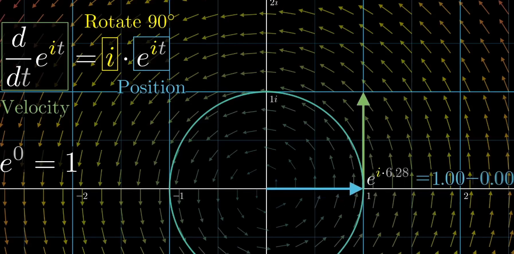
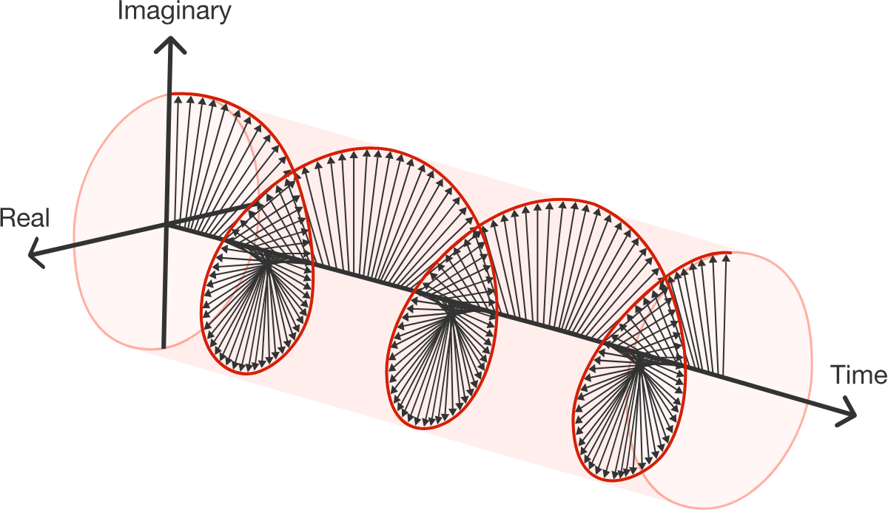

#! https://zhuanlan.zhihu.com/p/545992427
# 欧拉公式总结

**欧拉公式推导**

[微分方程概论-第五章：在3.14分钟内理解e^iπ](https://www.bilibili.com/video/BV1G4411D7kZ?share_source=copy_web&vd_source=e84f3d79efba7dc72e6306f35613222e)
这个视频可以直观的了解$e^ix$是一种怎样的变化过程： 通过关联速度和位置来直观的展现欧拉公式。
$$
d(e^{ix}) = ie^{ix} \\
$$
i其实就是一个逆时针的转动，并不会去改变原有数值，当velocity总是Position的逆时针旋转90°的时候，只有绕着圆周运动才满足这种条件。

这样就很容易理解欧拉等式在复平面上和x轴构成三维空间的曲线形式（等径螺旋线）

**利用泰勒展开证明**
$$
\begin{align}
\sin x &= x - \frac{x^3}{3!} + \frac{x^5}{5!} + \frac{x^7}{7!} + \dots \\
\cos x &= 1 - \frac{x^2}{2!} + \frac{x^4}{4!} + \frac{x^6}{6!} + \dots \\
e^x &=  1 + x +   \frac{x^2}{2!} + \frac{x^3}{3!} +\frac{x^3}{3!}+ \frac{x^4}{4!}+ \dots \\
e^{ix} &=  1 + ix - \frac{x^2}{2!} - i\frac{x^3}{3!} + \frac{x^4}{4!}+ i\frac{x^5}{5!} - \frac{x^6}{6!} - i\frac{x^7}{7!} + \dots \\
& = (1 - \frac{x^2}{2!} + \frac{x^4}{4!} + \frac{x^6}{6!}) + i(x - \frac{x^3}{3!} + \frac{x^5}{5!} + \frac{x^7}{7!}) + \dots \\
& = \cos x + i\sin x \\
\end{align}
$$
利用上述公式x取反做差和后可以得到如下公式：
$$
\sin x = \frac{e^{ix} - e^{-ix}}{2i} \\
\cos x = \frac{e^{ix} + e^{-ix}}{2} \\
$$
当$x = \pi$ 时，有欧拉公式：
$$
e^{i\pi} + 1 = 0 \\
$$

### 用欧拉公式求解指数函数和三角函数的积分
实战演练,例题：
$$ \int_{-\infty}^{\infty} e^x \cos x \text{d}x\\$$

解题思路： 将欧拉公式拆解成实部和虚部两个部分，直接丢弃虚部部分，只要实数部分。
$$
e^{ix} = \cos x + i\sin x \\
Re[e^{ix}] = \cos x \\
Im[e^{ix}] = \sin x \\
$$
步骤：
$$
\begin{align}
    \int_{-\infty}^{\infty} e^x \cos x \text{d}x & = Re[\int e^x  \cdot e^{ix} \text{d}x] \\
    & = Re[\int e^{(1+i)x}\text{d}x] \\
    & = Re[\frac{1}{1 +i} e^{(1+i)x} \text{d}x  + C] \\
    & = Re[\frac{1}{2}(1 - i) e^x e^{ix} +C] \\
    & = Re[\frac{1}{2}(1 - i) e^x (\cos x + i \sin x) +C] \\
    & = Re[\frac{1}{2}(\sin x + \cos x) e^x + \frac{i}{2} e^x  + C] \\
    & = \frac{1}{2}(\sin x + \cos x) e^x + C \\
\end{align}
$$

参考: 
1. [Euler's formula] (https://en.wikipedia.org/wiki/Euler%27s_formula)
2. [Intuitive Understanding Of Euler’s Formula] (https://betterexplained.com/articles/intuitive-understanding-of-eulers-formula/)
3. [欧拉公式B站](https://www.bilibili.com/video/BV1yJ411C7wG?share_source=copy_web&vd_source=e84f3d79efba7dc72e6306f35613222e)