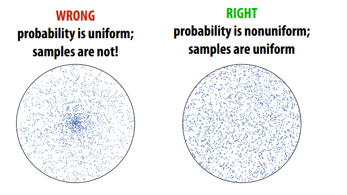
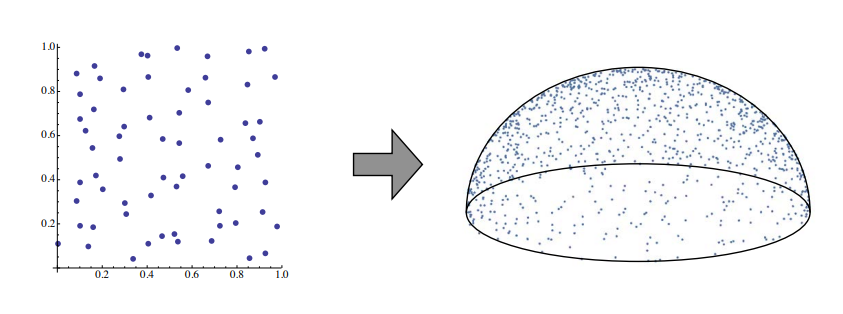
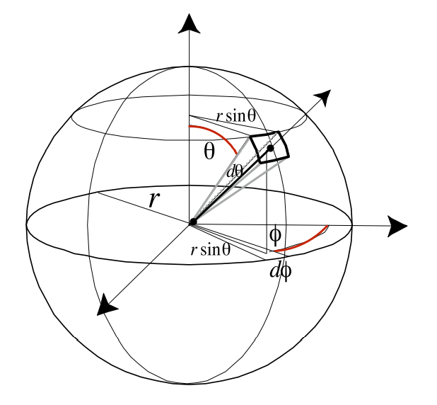
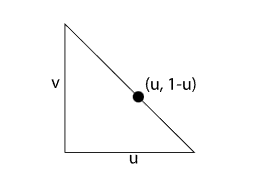

#! https://zhuanlan.zhihu.com/p/552773776
# 多维空间下的均匀采样方法

**参考资料:**
1. [《PBRT 13.6》](https://www.pbr-book.org/3ed-2018/Monte_Carlo_Integration/2D_Sampling_with_Multidimensional_Transformations#)

### 不同分布函数之间的转换
当我们将样本从任意分布转换为具有函数的其他分布时，我们需要研究新的分布函数和原始分布的关系。 

假设我们得到了已经从某个PDF中提取的随机变量$X_i$。现在，如果我们计算$Y_i = y(X_i)$，我们希望找到新随机变量$Y_i$的分布。这似乎是一个深奥的问题，但我们将看到理解这种转换对于从多维分布函数中抽取样本至关重要。

转换的前提：函数$y(x)$必须是一对一的转换；如果多个值$x$映射到同一个值$y$，那么就不可能明确地描述特定值$y$的概率密度。一对一的直接结果是$y$的导数必须严格大于 0 或严格小于 0，这意味着: (使用了概率论PMF性质)
$$P_r\{Y \le y(x)\} = P_r\{ X \le x\} \Longrightarrow  P_y(y) = P_x(x)\\$$

CDF之间的这种关系直接可以推导出PDF之间的关系。如果我们假设的导数大于0，则微分给出：
$$p_y(y)\frac{\text{d}y}{\text{d}x} = p_x(x)\\$$
一般来说，的导数要么是严格正的，要么是严格的负的(因为X和Y是一对一的关系)，密度之间的关系是 :
$$P_y(y) = \left|\frac{\text{d}y}{\text{d}x}\right|^{-1} p_x(x)\\$$

我们如何使用这个公式？假设在$p_x(x) = 2x$域上[0, 1]，并且让$Y = sinX$, 那么随机变量的Y的PDF是怎样？因为我们知道$\text{d}y/\text{d}x = \cos x$,
$$p_y(y)= \frac{p_x(x)}{|\cos x|} = \frac{2x}{\cos x} = \frac{2 \arcsin y}{\sqrt{1 - y^2}}\\$$ 

这个过程可能看起来很落后——通常我们有一些我们想要从中采样的 PDF，而不是给定的转换。例如，我们可能已经从一些$p_x(x)$中提取$X$并希望从一些$p_y(y)$分布中进行计算$Y$。我们应该使用什么转换？我们所需要的只是 CDF 相等，或者$P_x(x) = P_y(y)$，它立即给出转换:
$$y(x) = P_y^{-1}(P_x(x))\\$$

这是Inversion method（逆变换采样方法）[PBRT 13.3.1 THE INVERSION METHOD](https://www.pbr-book.org/3ed-2018/Monte_Carlo_Integration/Sampling_Random_Variables#TheInversionMethod)的推广，因为$X$均匀分布在[0, 1],那么$Px(x) =x$，我们有与之前介绍的相同的过程。 

## 多维空间下的概率密度转换

在一般n维的情况下，类似的推导给出了不同密度之间的类似关系。我们不会在这里展示推导,具体公式推导见上篇文章[概率密度函数在多维空间下的变换](https://zhuanlan.zhihu.com/p/552643817) 它遵循与一维案例相同的形式。假设我们有一个密度函数为$p_x(x)$的n维随机变量$X$。现在让$Y = T(x)$，T是变换矩阵。在这种情况下，有：
$$p_y(y) = \frac{p_x(x)}{|J_T(x)|}\\$$
其中$|J_T|$是T的雅可比矩阵行列式的绝对值，即:
$$
\left(\begin{array}{ccc}
\partial T_{1} / \partial x_{1} & \cdots & \partial T_{1} / \partial x_{n} \\
\vdots & \ddots & \vdots \\
\partial T_{n} / \partial x_{1} & \cdots & \partial T_{n} / \partial x_{n}
\end{array}\right)\\
$$

### 极坐标
极坐标变换由下式给出
$$
\begin{aligned}
&x=r \cos \theta \\
&y=r \sin \theta
\end{aligned}\\
$$
假设我们从某个密度$p(r, \theta)$中抽取样本。$p(x,y)$对应的密度是多少？这种变换的雅可比行列式是 
$$
J_{T}=\left(\begin{array}{ll}
\frac{\partial x}{\partial r} & \frac{\partial x}{\partial \theta} \\
\frac{\partial y}{\partial r} & \frac{\partial y}{\partial \theta}
\end{array}\right)=\left(\begin{array}{cc}
\cos \theta & -r \sin \theta \\
\sin \theta & r \cos \theta
\end{array}\right)\\
$$
行列式是$r\left(\cos ^{2} \theta+\sin ^{2} \theta\right)=r$。所以$p(x, y)=p(r, \theta) / r$。当然，这与我们通常想要的相反——通常我们从笛卡尔坐标中的采样策略开始，并希望将其转换为极坐标中的采样策略。在这种情况下，我们会有 :
$$
p(r, \theta)=r p(x, y) \\
$$

### 球坐标

给定方向的球坐标表示，
$$
\begin{aligned}
&x=r \sin \theta \cos \phi \\
&y=r \sin \theta \sin \phi \\
&z=r \cos \theta,
\end{aligned}\\
$$

该变换的雅可比行列式具有$\left|J_{T}\right|=r^{2} \sin \theta$，因此对应的密度函数为 
$$
p(r, \theta, \phi)=r^{2} \sin \theta p(x, y, z)\\
$$

这种转换很重要，因为它可以帮助我们将方向表示为单位球面上的点。请记住，立体角定义为单位球面上一组点的面积。在球坐标系中，我们之前推导出 (参考文章[从辐射度量学理解BRDF](https://zhuanlan.zhihu.com/p/549572824)中关于球面积分的部分)
$$d \omega=\sin \theta \mathrm{d} \theta \mathrm{d} \phi\\$$

所以如果我们有一个在立体角$\omega$上定义的密度函数，这意味着:
$$P_r\left\{\omega\in\Omega\right\}=\int_{\Omega}p(\omega)\,\mathrm{d}\omega\\$$

因此可以推导出关于$\theta$和$\phi$的密度：
$$
\begin{array}{c}{{p(\theta,\phi)\,\mathrm{d}\theta\,\mathrm{d}\phi=p(\omega)\,\mathrm{d}\omega}}\\ 
{{p(\theta,\phi)=\sin\theta\,p(\omega).}}\end{array}\\
$$

### 在圆上均匀采样

eg: 在`单位圆`的表面进行均匀采样。（Since we’re going to sample uniformly with respect to area）
  1. 因为要对圆是进行均匀采样，即==单位面积的采样数量是一样的，即PDF相等==.(可以理解为： 采样概率 = 1/采样面积 )
   $$p(x, y) = 1/\pi\\$$ 
  2. 利用jacobian矩阵将圆从笛卡尔坐标转化到极坐标系:
   $$
   p(x,y) = p(T(r,\theta))= \frac{p(r, \theta)}{|J_T(r, \theta)|}\\
   J_T = \begin{bmatrix}
    \frac{\partial x}{\partial r} & \frac{\partial x}{\partial \theta}  \\
    \frac{\partial y}{\partial \theta}& \frac{\partial y}{\partial \theta} \\
    \end{bmatrix} = 
    \begin{bmatrix}
    \cos\theta & -r\sin\theta  \\
    \sin\theta& r\cos\theta \\
    \end{bmatrix} = r \\
   $$
  3. 所以有 $rp(x, y) = p(r, \theta) \Longrightarrow p(r, \theta) = r/\pi$
  4. 求边缘概率密度： 
   $$
   \begin{align*}
    p(r) & = \int_0^{2\pi} p(r, \theta)\text{d}\theta = 2r  \\
    p(\theta) & = \frac{p(r,\theta)}{p(r)} = \frac{1}{2\pi} \\
   \end{align*}\\
   $$
  5. 求取累计概率分布： 
   $$
   P(r) = \int p(x)\text{d}r = r^2 \\
   P(\theta) = \int p(\theta) \text{d} \theta = \frac{1}{2\pi}\theta \\
   $$
  6. 均匀随机分布变量 $\xi_1 \,,\xi_2$
  7. 逆采样方法代入(inverse method):
   $$\quad \theta = 2\pi\xi_1 \quad \, r = \sqrt{\xi_2}\\$$

### 半球上均匀采样
考虑在[半球上均匀地选择相对于立体角的方向](https://www.pbr-book.org/3ed-2018/Monte_Carlo_Integration/2D_Sampling_with_Multidimensional_Transformations#UniformlySamplingaHemisphere),均匀分布意味着密度函数是一个常数
* 在半球面均匀采样方向 How do we uniformly sample directions from the hemisphere?  

* 使用Inversion Method采样,概率密度函数PDF如下：Picking points on unit hemisphere：
$$(\xi_1, \xi_2) = (\sqrt{1-\xi_1^2}\cos(2\pi\xi_2), \sqrt{1-\xi_1^2}\sin(2\pi\xi_2), \xi_1)$$ 
推导参考对圆的采样
 
1. 由球面坐标转换$\text{d}\omega = \sin\theta \text{d}\theta\text{d}\phi$
2. 在半球表面进行均匀采样所以有$p(\omega) = 1/2\pi$
3. 由分布函数: ( 随机变量关系是一一对应的，$P_r \{\omega \in H^2 \} = \int_{H^2} p(\theta, \phi)\text{d}\theta\text{d}\phi = \int_{H^2} p(\omega)\text{d}\omega$)
   $$
   \begin{align*}
    & p(θ , φ)\text{d}\theta\text{d}\phi = p(\omega)\text{d}\omega\\
   & p(θ , φ) = \sin\theta p(\omega) \\
   & p(\theta,\phi) =\frac{\sin\theta}{2\pi}\\
   \end{align*}\\
   $$
4. Inverse Method(先求边缘概率密度函数, 再求累计分布函数，最后求取反函数):
   $$
   \begin{align*}
   &p(\theta)=\sin\theta, P(\theta)=1-\cos\theta,  \Longrightarrow \theta =\cos^{-1}\xi_1(1-\xi_1 replace \xi_1)\\
   &p(\phi)=\frac{1}{2\pi}, \quad P(\phi)=\frac{\phi}{2\pi}, \Longrightarrow \phi=2\pi\xi_2\\
   \end{align*}\\
   $$
5. 转到笛卡尔坐标系得到如下结果：
   $$
   \begin{align*}
   &x= \sin\theta \cos \phi  = \sqrt{1- \xi^2} \cos(2\pi\xi_2)\\
   &y = \sin \theta \sin\phi =  \sqrt{1- \xi^2} \sin(2\pi\xi_2) \\
   &z = \cos\theta = \phi_1 \\
   \end{align*}\\
   $$

### 对三角形采样

尽管对三角形进行均匀采样似乎是一项简单的任务，但事实证明它比我们目前看到的要复杂得多。 为了简化问题，我们假设我们正在对面积为$\frac{1}{2}$的等腰直角三角形进行采样. 我们将导出的采样例程的输出将是重心坐标，因此尽管简化，该技术实际上适用于任何三角形。**该方法本质就是利用重心坐标插值采样点以实现均匀采样**。 图 13.15显示了要采样的形状。

我们将在这里用$(u ,v)$表示重心坐标。由于我们是相对于面积进行采样，我们知道 PDF必须是一个常数，等于形状面积$\frac{1}{2}$的倒数，所以$p(u,v) = 2$

首先，我们找到边缘概率密度： 
$$p(u)=\int_{0}^{1-u}p(u,v)\,\mathrm{d}v=2\int_{0}^{1-u}\mathrm{d}v=2(1-u)\\$$

和条件概率密度$p(v|u)$
$$p(v|u)=\frac{p(u,v)}{p(u)}=\frac{2}{2(1-u)}\,=\,\frac{1}{1-u}\\$$

与往常一样，CDF 是通过积分找到的：
$$
P(u)=\int_{0}^{u}p(u^{\prime})\,{\mathrm{d}u}^{\prime}=2u-u^{2}\\
P(v)=\int_{0}^{v}p(v^{\prime}|u)\,\mathrm{d}v^{\prime}={\frac{v}{1-u}}\\
$$
反转这些函数并将它们分配给统一的随机变量给出最终的采样策略：
$$
\begin{array}{c}{{u=1-\sqrt{\xi_{1}}}}\\ 
{{v=\xi_{2}\sqrt{\xi_{1}}.}}\end{array}\\
$$

请注意，这种情况下的两个变量不是独立的！

$ \frac{\partial y}{\partial u} du = \frac{dy}{du}  du$