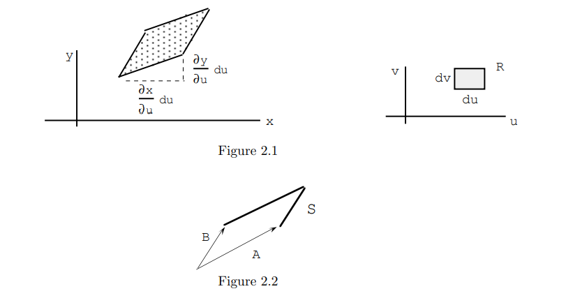
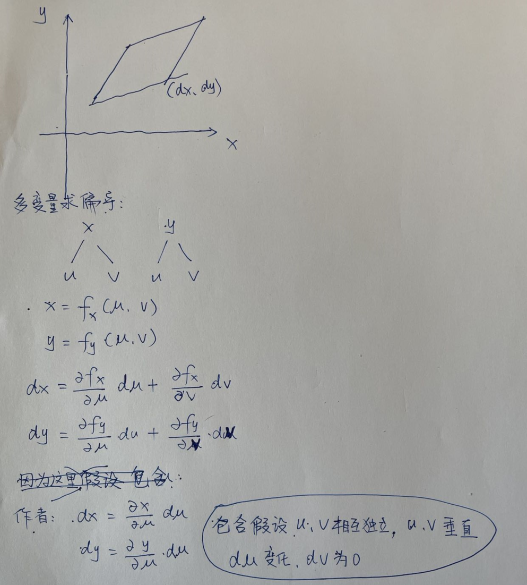

#! https://zhuanlan.zhihu.com/p/552643817
# 概率密度函数在多维空间下的变换

### 前言
当概率密度函数需要在多维空间转换的时候，需要将代表xy平面上的面积微元转换到uv平面上的面积微元， 这个时候需要使用到雅可比行列式这个工具。

###  雅可比行列式 Jacobians

设$X = X(U, V), Y = Y (U, V)$。 假设一对一的变换， 因此 $U = U(X,Y )，V = V (X,Y )$，这样我们就可以求解 U 和 V。 参见图 2.1。 如果u随du变化，则x随$(∂x/∂u)\text{d}u$变化，并且y随$(∂y/∂u)\text{d}u$变化。 同样，如果 v随dv变化，则 x随$(∂x/∂v)\text{d}v$变化，y随$(∂y/∂v)\text{d}v$变化。 u - v 平面中的小矩形对应于 x - y 平面中的小平行四边形（图 2.2），其中 $\vec{A} = (∂x/∂u, ∂y/∂u,0)\text{d}u$和 $\vec{B} = (∂x /∂v, ∂y/∂v, 0)\text{d}v$。 

向量$\vec{A} \times \vec{B}$叉乘等于平行四边形面积,所以有：
$$
\vec{A} \times \vec{B} = 
\begin{vmatrix}
I & J & K \\
\frac{\partial x}{\partial u} & \frac{\partial y}{\partial u} & 0\\
\frac{\partial x}{\partial v} & \frac{\partial y}{\partial v} & 0 \\
\end{vmatrix}\text{d}u\text{d}v =
\begin{vmatrix}
\frac{\partial x}{\partial u} & \frac{\partial y}{\partial u} \\
\frac{\partial x}{\partial v} & \frac{\partial y}{\partial v} \\
\end{vmatrix}\text{d}u\text{d}v K = 
\begin{vmatrix}
\frac{\partial x}{\partial u} &  \frac{\partial x}{\partial v} \\
\frac{\partial y}{\partial u} & \frac{\partial y}{\partial v} \\
\end{vmatrix}\text{d}u\text{d}v K \\
$$
(ps: 由行列式性质，K可以提出来; 转置矩阵行列式不变)

>注： 上面A向量和B向量的坐标公式详解如下：
>
### 在概率密度上的性质
由上面可知雅可比行列式: 
$$
J = 
\begin{vmatrix}
\frac{\partial x}{\partial u} &  \frac{\partial x}{\partial v} \\
\frac{\partial y}{\partial u} & \frac{\partial y}{\partial v} \\
\end{vmatrix} = 
\frac{\partial(x, y)}{\partial(u, v)} \\
$$

所以有： $\vec{A} \times \vec{B} = |J|\text{d}u\text{d}v$ , 现在 $P{(X,Y ) ∈ S} = P{(U, V ) ∈ R}$，换句话说，
$f_{XY}(x, y)$ 乘以 S 的面积等于 $f_{UV}(u, v)$ 乘以 R 的面积。因此: 
$$f_{XY}(x, y)|J|\text{d}u\text{d}v = f_{UV}(u, v)\text{d}u\text{d}v\\$$

(PS： $f_{XY}$为随机变量X，Y的概率密度函数，$f_{UV}$为随机变量U，V的概率密度函数， `在有的书上用小写的p()表示概率密度函数`)
所以有：
$$
f_{UV}(u, v) = f_{XY}(x, y)|J| = f_{XY}(x,y)\frac{\partial(x, y)}{\partial(u, v)} \\
$$

**Jacobian $∂(x, y)/∂(u, v)$ 的绝对值给出了从 u - v 坐标到 x - y 坐标的面积放大系数**。 另一个方向的放大因子是|∂(u, v)/∂(x, y)|。  有 ：

$$
f_{UV}(u, v) = f_{XY}(x, y)|J| = \frac{f_{XY}(x,y)}{ |\partial(u, v) / \partial(x, y)|} \\
$$

**参考资料：**

1. [Stat] (https://faculty.math.illinois.edu/~r-ash/Stat/StatLec1-5.pdf)
