# 微表面模型 Microfacet Models

### OverView
**Microfacet_Material_Motivation**
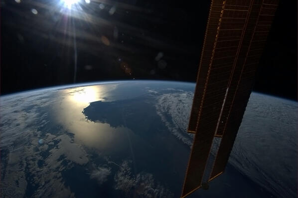
我们看不到微表面microfacet，看到的是微表面对光的宏观上整体的一个效果。

宏观上的效果：　
Key: the distribution of microfacets’ normals:(粗糙度贴图)
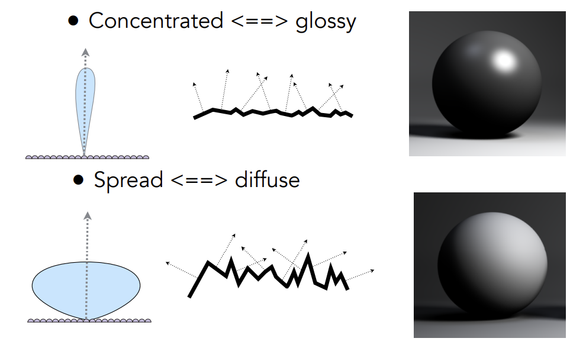

**法线分布函数**
有多少入射方向的光$\omega_i$可以反射到出射方向$\omega_o$去？
* 只有当微表面的法线方向和半程向量（half vector h）一致的时候，光线才能够从入射方向的光$w_i$可以反射到出射方向$w_o$去
* $D(\omega_h)$含义：单位宏观表⾯上法向量落在h⽅向微分⽴体⾓$\text{d}\omega_h$内的微表面$\text{d}A$面积与$\text{d}\omega_h$的商
* 同时可以看到： `NDF 根本不是概率密度！相反，它是立体角联合域上的微观区域密度和宏观区域的比值`
* 要想归一化为1，那么`所有微面的总投影面积应该等于宏观表面的面积。换句话说，有足够多的微面来覆盖宏观表面，没有孔,可以重叠，重叠抵消`
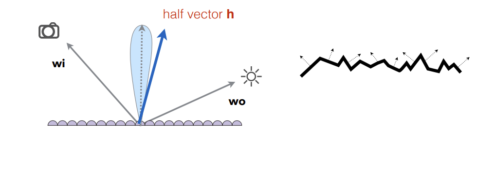

**几何函数**
几何函数与法线分布函数作为Microfacet Specular BRDF中的重要两项，两者之间具有紧密的联系：
* 几何函数的解析形式依赖法线分布函数： 在微平面理论中，通过可见微平面的投影面积之和等于宏观表面的投影面积的恒等式，选定法线分布函数，并选定几何函数的模型，就可以唯一确认几何函数的准确形式。在选定几何函数的模型后（一般为Smith），几何函数的解析形式的确认则由对应的法线分布函数决定
* 法线分布函数需要结合几何函数，得到有效的法线分布强度： 单纯的法线分布函数的输出值并不是能产生有效反射的法线强度，因为光线的入射和出射会被微平面部分遮挡，即并不是所有朝向m=h的微表面，能在给定光照方向L和观察方向V时可以顺利完成有效的反射。几何函数即是对能顺利完成入射和出射的微平面概率进行建模的函数。法线分布函数需要结合几何函数，得到最终对microfacet BRDF能产生贡献的有效法线分布强度。
* 几何函数G(l,v,h)和分母中的校正因子4（n·l）（n·v）会合并为可见性项（The Visibility Term），Vis项，简称V项。其也经常作为几何函数的代指：
* 几何函数也叫`阴影掩蔽函数`,`遮蔽函数`,`阴影函数`,`双向遮蔽阴影函数`
$$
V({\bf v},1)=\frac{G({\bf l},{\bf v},{\bf h})}{4({\bf n}\cdot{\bf l})({\bf n}\cdot{\bf v})}\\
$$
**几何函数选择合适的微表面轮廓**：
为了确定唯一的G项，Heitz在[Heitz 2014]中引入了第二个约束：选择合适的微表面轮廓（microsurface profile），从而对G项进行具象化建模
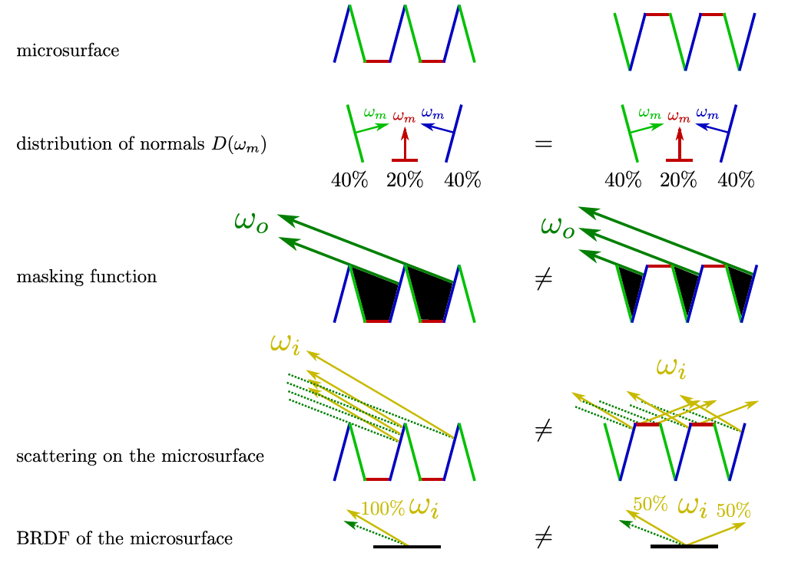
具有相同法线分布但具有不同轮廓（profiles）的微表面导致不同的BRDF,一旦选择好合适的微表面轮廓（microsurface profile），即选择了合适的微表面模型.

**法线分布和几何函数的组合**
GGX分布和GGX –Smith遮蔽阴影函数的组合，是目前游戏和电影业界主流的方案

**局限性：**
* 由于微表面模型是基于单词散射建模的，没有考虑多次散射。其假设所有被遮挡的光线都别丢失，会导致与现实行为相比的能量损失。

下面详解解释含义。
### 基于微表面模型的BSDF：
在前面[从BSDF散射模型建立渲染方程](https://zhuanlan.zhihu.com/p/545564030)中BSDF散射模型中提到，几何光学的表面反射和透射建模方法中基于粗糙表面可以建模为microfacets集。由微面组成的表面通常被建模为高度场，其中面方向的分布是统计描述的。下图显示了一个相对粗糙的表面和一个更光滑的微平面表面的横截面。
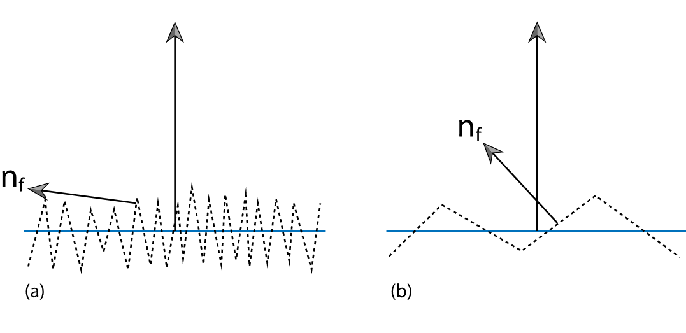

基于微面的 BRDF 模型通过对来自大量微面的光的散射进行统计建模来工作。如果我们假设被照亮的微分面积$\text{d}A$与单个微面的大小相比相对较大，那么大量的微面被照亮，并且它们的聚合行为决定了观察到的散射。 

**微面模型**: 两个主要组成部分是`面分布的表示和描述光如何从单个微面散射的 BRDF`。鉴于这些，任务是推导出一个封闭形式的表达式，给出描述这种表面散射的 BRDF。完美镜面反射最常用于微平面 BRDF，尽管镜面透射对于模拟许多半透明材料很有用，并且 Oren-Nayar 模型将微平面视为朗伯反射器。

**微平面级别的局部光照效果**: 为了计算这种模型的反射，需要考虑微平面级别的局部光照效果（图）。
1. 掩蔽：由于另一个微平面的遮挡，观察者看不到感兴趣的微平面，
2. 阴影：类似地，光不会到达微平面
3. 相互反射：光在到达观察者之前在微平面之间反射，可能导致微面反射的光比直接照明量和低级微面 BRDF 预测的更多。
特定的基于微平面的 BRDF 模型以不同程度的准确度考虑了这些影响中的每一个。一般的方法是尽可能获得最佳近似值，同时仍然获得易于评估的表达式。
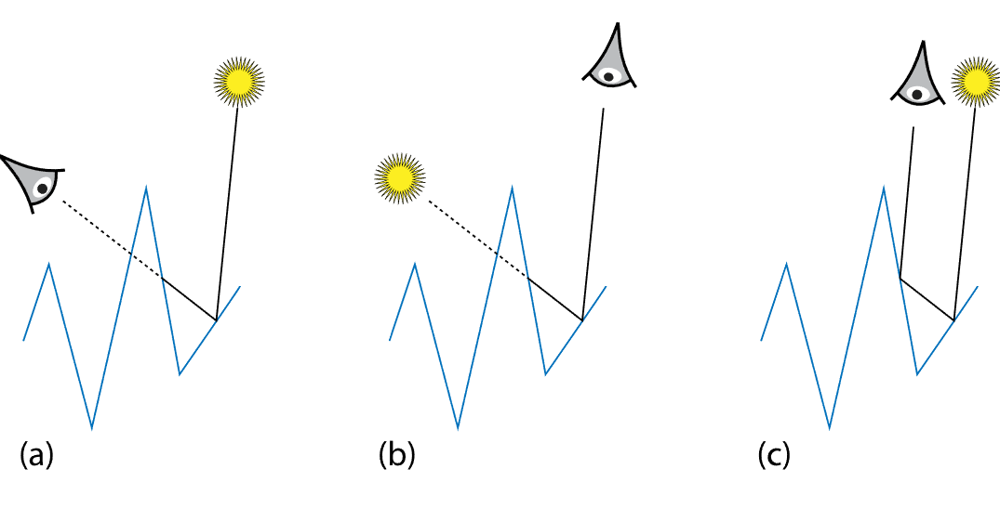

### Oren-Nayar 漫反射

Oren 和 Nayar ( 1994 ) 观察到现实世界的物体不会表现出完美的朗伯反射。具体而言，粗糙表面通常随着照明方向接近观察方向而显得更亮。他们开发了一种反射模型，该模型通过 V 形微面(V-shaped microfacets)描述粗糙表面，该 V 形微面由具有单个参数$\sigma$的球面高斯分布描述 ，即微面方位角的标准差。 

**V-shaped microfacets假设** :只考虑相邻的微平面就可以解释相互反射；Oren 和 Nayar 利用这一点推导出了一个 BRDF，它对凹槽集合的聚合反射进行建模。

产生的模型考虑了微面之间的阴影、掩蔽和相互反射，没有封闭形式的解决方案，因此他们找到了以下近似值，非常适合它：
$$f_{\mathrm{r}}(\omega_{\mathrm{i}},\omega_{\mathrm{o}})={\frac{R}{\pi}}(A+B\operatorname{max}(0,\cos(\phi_{\mathrm{i}}-\phi_{\mathrm{o}}))\sin\alpha\tan\beta)\\$$
如果$\sigma$是弧度:  
$$
\begin{align*}
    A&=1-\frac{\sigma^{2}}{2(\sigma^{2}+(\ldots33)}\\
    B& =\frac{0.45\sigma^{2}}{\sigma^{2}+(\mathrm{}).09}\\
    \alpha & = max(\theta_i, \theta_o)\\
    \beta & = min(\theta_i, \theta_o) \\
\end{align*}
$$

ps: （b）使用 Oren-Nayar 模型，轮廓边缘处的反射增加和光终结器边缘处的一般不太拉长的过渡. 这里的实现预先计算和存储构造函数中的A和B参数的值，以节省以后计算BRDF 的工作。上图比较了使用理想漫反射和使用 Oren-Nayar 模型进行渲染之间的差异

### 微表面分布函数(法线分布函数) Microfacet Distribution Functions

基于具有完美镜面反射和透射的微面的反射模型在模拟各种光泽材料（包括金属、塑料和磨砂玻璃）的光散射方面非常有效。 

**分布函数$D(\omega_h)$:** 

微平面表面的一个重要特征是由分布函数，它给出了微平面的微分面积与微分表面法线$\omega_h$。因为microfacet 分布函数定义在与 BxDF相同的 BSDF 坐标系中；所以，一个完全光滑的表面可以用一个只有当microfacet的$\omega_h$等于表面法线时才为非零的 delta 分布 来描述： 
$$D(\omega_{\mathrm{h}})=\delta(\omega_{\mathrm{h}}-(0,0,1))\\$$

**归一化** : 必须对微平面分布函数进行归一化，以确保它们在物理上是合理的。直观地说，如果我们考虑沿法线方向$\mathrm{n}$入射到微表面上的光线，那么每条光线必须与微表面恰好相交一次。更正式地说，给定微表面的微分面积$\text{d}A$，那么在该面积之上的微平面面的投影面积必须等于$\text{d}A$ （图 8.15）。在数学上，这对应于以下要求：
$$
\int_{H^2(n)}D(\omega_h)\cos\theta_h\text{d}\omega_h =\int_{H^2(n)}D(\omega_h)(\vec{n}\cdot \vec{h})\text{d}\omega_h =  1\\
$$
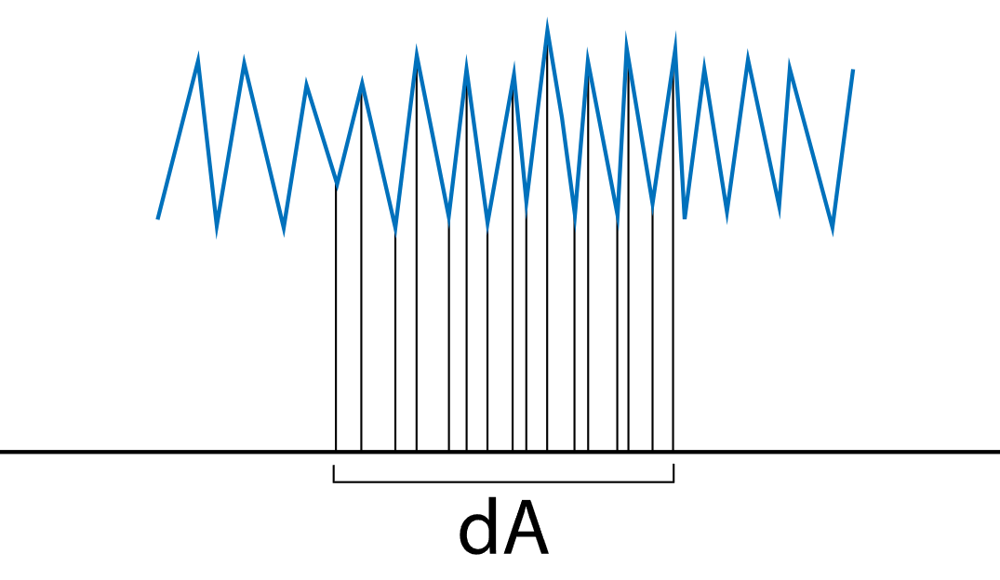

> 推导分布函数:
Walter 等人的 GGX 论文《Microfacet Models for Refraction through Rough Surfaces》给出 了答案。根据他们的说法，NDF 遵循以下等式：
$$d A_{h}=D(h)\,d\omega_{h}\,A\\$$
$A$一个是一块小到足以被认为是平坦的宏观表面，但比单个微面大得多，并且$\text{d}A_h$是$A$中所有法线朝向$\text{d}\omega_h$的微面（microfacet）面积之和 
在这个观点上，NDF 根本不是概率密度！相反，它是宏观区域和立体角联合域上的微观区域密度。面积单位相消，所以 NDF 仍然有倒立体角单位，但它涉及面积这一事实需要正确理解和推理。
然后可以从上面的等式推导出归一化条件：
$$\frac{1}{A}\int(n\cdot h)\,d A_{h}=\int_{\Omega}D(h)\,(n\cdot h)\,d\omega_{h}\\$$
左边的积分是在所有微面的面积上完成的，右边的积分是在法线半球的立体角上完成的。如果我们要求这个方程等于 1，我们就是说`所有微面的总投影面积应该等于宏观表面的面积。换句话说，有足够多的微面来覆盖宏观表面，没有孔,可以重叠，重叠抵消`。沃尔特Walter 等人。给出一个更强的条件：对于任何方向$v$，有：
$$\int_{\Omega}D(h)\left(v\cdot h\right)d\omega_{h}=n\cdot v\\$$
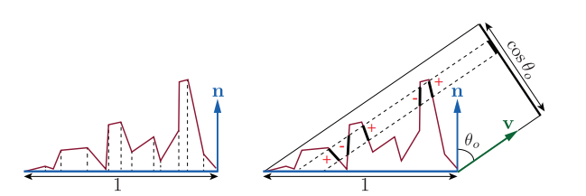
在特殊情况下，归一化条件由此而来$v=n$. 更一般的条件确保 NDF 与微表面一致，而不仅仅是一个三角形soup。微观表面的边界必须与宏观表面的边界相匹配。
顺便说一句，这里假设微平面法线始终位于法线半球，这与流形条件一起迫使微表面成为高度场。这很方便，但不是必需的。对于一般的 3D 微表面，只需将所有积分从半球扩展到整个球体。请注意，所有点积均 unclamped，并且许多标准 NDF，如 Blinn-Phong、Beckmann 和 GGX 分布在反正态半球(antinormal hemisphere)中为零。
NDF 不仅仅是立体角上微平面法线的概率密度，而且它需要一个$n \cdot h$规范化.

**Beckmann–Spizzichino** microfacet distribution function ：
Beckmann 和 Spizzichino ( 1963 )提出了一种基于微平面斜率高斯分布的广泛使用的微平面分布函数:
$$
D(\omega_{\mathrm{h}})=\frac{\mathrm{e}^{-\tan^{2}\theta_{\mathrm{h}}/\alpha^{2}}}{\pi\alpha^{2}\cos^{4}\theta_{\mathrm{h}}}\\
$$
**材质的粗糙度参数$\alpha$:**
其中，如果$\sigma$是微面的RMS斜率， 则$\alpha = \sqrt{2}\sigma$
* 形状不变性（shape-invariant）是一个合格的法线分布函数需要具备的重要性质。对于形状不变的NDF，缩放粗糙度参数相当于通过倒数拉伸微观几何,如下图所示
* 具有形状不变性（shape-invariant）的法线分布函数，可以用于推导该函数的归一化的各向异性版本，并且可以很方便地推导出对应的遮蔽阴影项G。
* 方便基于NDF或可见法线分布推导其重要性采样
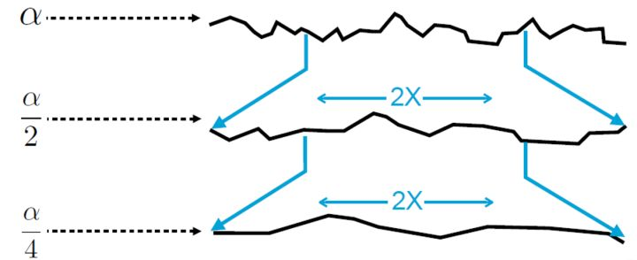

**定义各向异性分布:**
定义各向异性分布很有用，其中正态分布也根据$\omega_h$的方位角方向而变化。例如，给定$\alpha_x$垂直于x轴的微面和$\alpha_y$垂直与y轴，则可以通过这些值构造椭圆来内插中间方向的$\sigma$值。 
相应的各向异性微面分布函数为:
$$D(\omega_{\mathrm{h}})=\frac{\mathrm{e}^{-\tan^{2}\theta_{\mathrm{h}}(\mathrm{cos}^{2}\phi_{\mathrm{h}}/\alpha_{x}^{2}+\mathrm{sin}^{2}\phi_{\mathrm{h}}/\alpha_{y}^{2})}}{\pi\alpha_{x}\alpha_{y}\;\mathrm{cos}^{4}\ \theta_{\mathrm{h}}}\\$$

当$\alpha_x = \alpha_y$贝克曼-斯皮齐奇诺Beckmann–Spizzichino模型的退化成各向同性了. 

**Trowbridge and Reitz microfacet distribution function：**
另一个有用的微平面分布函数来自 Trowbridge 和 Reitz ( 1975 )。 其各向异性变体由下式给出
$$
D\left(\omega_{\mathrm{h}}\right)=\frac{1}{\pi \alpha_{x} \alpha_{y} \cos ^{4} \theta_{\mathrm{h}}\left(1+\tan ^{2} \theta_{\mathrm{h}}\left(\cos ^{2} \phi_{\mathrm{h}} / \alpha_{x}^{2}+\sin ^{2} \phi_{\mathrm{h}} / \alpha_{y}^{2}\right)\right)^{2}}
$$
与 Beckmann-Spizzichino 模型相比，Trowbridge-Heitz 具有更高的尾部——对于远离表面法线的方向，它更慢地下降到零。这个特性很好地匹配了许多真实世界表面的属性。有关这两个微平面分布函数的图表，请参见图
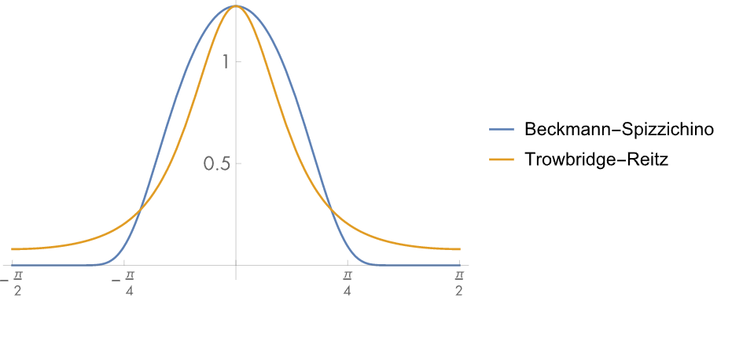
注： Trowbridge-Heitz 对于较大量级的$\theta$值具有较高的尾部，
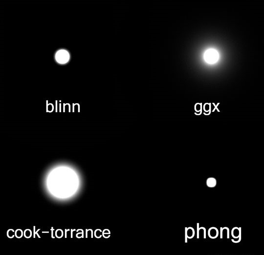

### 掩蔽和阴影 Masking and Shadowing
仅微平面法线的分布不足以完全表征用于渲染的微表面。同样重要的是要考虑到一些微面在给定的观察或照明方向上是不可见的，因为它们是背面的（因其他微面在它们前面）以及一些面向微面的区域将被隐藏，因为它被背面的微面遮挡。
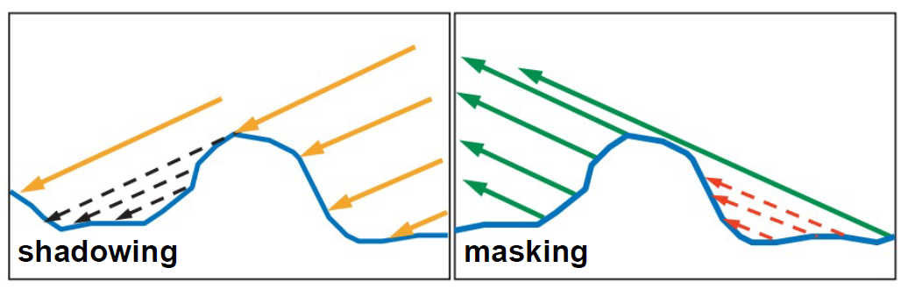

这些影响由Smith的遮蔽阴影函数(masking-shadowing function)$G_1(\omega, \omega_h)$解释，它给出了从方向$\omega$可见的$\omega_h$微面的比例。（请注意：$0\leq G_{1}\left(\omega,\omega_{\mathrm{h}}\right)\leq1$）在通常情况下，微面可见的概率与其方向$\omega_h$无关 ，我们可以将此函数写为$G_1(\omega)$

如图所示，从与表面法线成角度$\theta$的方向$\omega$看，表面上的微分面积$\text{d}A$具有面积$\text{d}A\cos\theta$。从这个方向看到的可见微面面积也必须等于$\text{d}A\cos\theta$，这导致$G_1(\omega)$的归一化约束： 
$$
\cos\theta=\int_{\mathrm{H^{2}(n)}}G_{1}(\omega,\omega_{\mathrm{h}})\,\mathrm{max}(0,\omega\cdot\omega_{\mathrm{h}})\,D(\omega_{\mathrm{h}})\,\mathrm{d}\omega_{\mathrm{b}}  \tag{2.1}\\
$$
换句话说，给定方向$\omega$的可见微平面的投影面积必须等于宏观表面的微分面积$\text{d}A$的乘$(\omega \cdot \mathrm{n}) = \cos \theta$
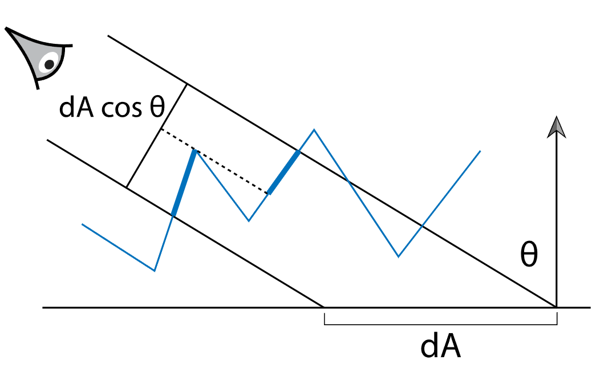

因为微面形成了一个高度场，所以每个背面的微面都会在$\omega$方向上投影一个具有相等投影面积的前向微面 。如果$A^+(\omega)$是从方向$\omega$看的前向微面的投影面积，$A^-(\omega)$是后向微面的投影面积，因此$\cos\theta=A^{+}(\omega)-A^{-}(\omega)$，我们也可以将遮蔽阴影函数写为可见微平面面积与前向微平面总面积之比
$$
G_{1}(\omega)=\frac{A^{+}(\omega)-A^{-}(\omega)}{A^{+}(\omega)}\\
$$
**阴影掩蔽函数:** 传统上用辅助函数$\Lambda(\omega)$来表示，它测量每个可见微面面积的不可见遮挡微面面积。（which measures invisible masked microfacet area per visible microfacet area.）
$$
\begin{align*}
\Lambda(\omega)&=\frac{A^{-}(\omega)}{A^{+}(\omega)-A^{-}(\omega)} =\frac{A^{-}(\omega)}{\cos\theta}\\
\\
G_{1}(\omega)&=\frac{A^{+}(\omega)-A^{-}(\omega)}{A^{+}(\omega)} = {\frac{1}{1+\Lambda(\omega)}}\\
\end{align*}
$$

单独的微面分布并没有施加足够的条件来指定特定的$\Lambda(\omega)$函数。许多函数可以满足方程（2.1）中的约束。例如，如果我们假设微表面上附近点的高度之间没有相关性，给定$D(\omega)$那么就有可能找到一个唯一的$\Lambda(\omega)$. （对于许多微平面模型，可以找到一个封闭形式的表达式。）虽然基本假设在现实中并不正确——对于实际的微表面，一个点的高度通常接近附近点的高度——结果函数$\Lambda(\omega)$会变成与实际表面的测量反射相比，结果相当准确。 

**Beckmann-Spizzichino分布**: 各向同性在附近点的高度没有相关性的假设下，是 
$$
\Lambda(\omega)=\frac{1}{2}\left(\mathrm{erf}(a)-1+\frac{{\mathrm e}^{-a^{2}}}{a\sqrt{\pi}}\right)\\
$$
其中$a=1/(\alpha\tan\theta)$ ， erf 是误差函数 $\operatorname{erf}(x)=2/\sqrt{\pi}\int_{0}^{x}\mathrm{e}^{-x^{\prime2}}\mathrm{d}x^{\prime}$

**Smith遮蔽函数:** 各向异性分布(anisotropic distributions)的掩蔽阴影函数最容易通过获取它们相应的各向同性函数并根据$\alpha_x$和$\alpha_y$值拉伸底层微表面来计算。
在不相关高度假设下，Trowbridge-Heitz 分布函数推导的$\Lambda(\omega)$形式非常简单： 
$$
\Lambda(\omega)={\frac{-1+\sqrt{1+\alpha^{2}\tan^{2}\theta}}{2}}\\
$$

图显示了 Trowbridge-heitz $G_1(\omega)$函数对于$\alpha$的几个值的图。请注意，该函数在大部分域中接近 1，但在掠射角处下降为零。另请注意，增加表面粗糙度（即，较高的$\alpha$值）会导致函数更快地衰减。
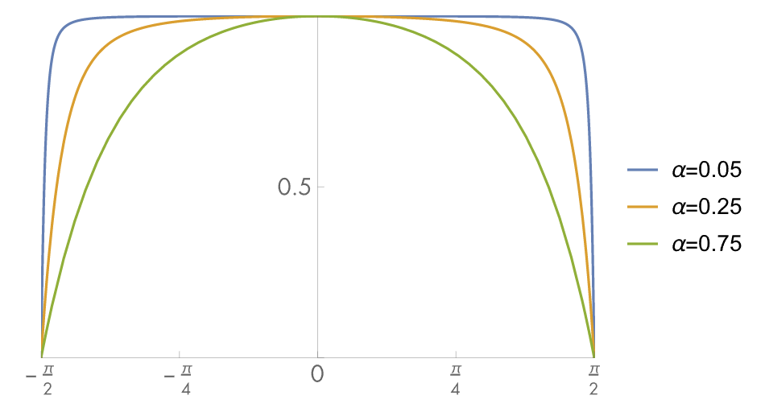

与微平面分布的几何特性有关的最后一个有用函数是$G(\omega_o, \omega_i)$，它给出了微分区域中从两个方向$\omega_i$和$\omega_o$可见的微平面的比值。定义$G$需要一些额外的假设。对于初学者，我们知道$G_1(\omega_o)$给出了从方向$\omega_o$可见的微面的比值，$G_1(\omega_i)$给出了$\omega_i$的比值 。如果我们假设一个微平面从两个方向可见的概率是它从每个方向独立可见的概率，那么我们有 :
$$
G(\omega_{0},\omega_{\mathrm{i}})=G_{1}(\omega_{0})\,G_{1}(\omega_{\mathrm{i}})\\
$$

然而，在实践中，这些概率并不是独立的，而且这个公式低估了$G$。要了解原因，请考虑以下情况$\omega_o = \omega_i$：在这种情况下，任何从$\omega_o$可见的微平面也从$\omega_i$可见，依此类推$G(\omega_{0},\omega_{\mathrm{i}})=G_{1}(\omega_{0})=G_{1}(\omega_{\mathrm{i}})$。因为$G_{1}(\omega)\leq 1$，在这种情况下，他们的乘积会导致$G(\omega_o, \omega_i)$太小（除非$G_{1}(\omega)=1$，通常只有在$\omega=(0,0,1)$时才成立）。更一般地，两个方向越接近， $G_1(\omega_o)$和$G_1(\omega_i)$ 之间的相关性就越大。 

假设微平面上的给定点越高，微平面可见性越有可能推导出更准确的模型。这个假设导致模型:
$$
G(\omega_{0},\omega_{\mathrm{i}})=\frac{1}{1+\Lambda(\omega_{0})+\Lambda(\omega_{\mathrm{i}})}\\
$$
这个近似值在实践中相当准确.

### The Torrance–Sparrow Model
Torrance 和 Sparrow ( 1967 )开发了一个`早期的微平面模型来模拟金属表面`。他们将表面建模为完美光滑的镜像微面的集合。因为微平面是完全镜面反射的，只有那些法线等于半角向量 的微平面，导致从$\omega_i$到的$\omega_o$完美镜面反射
$$
\omega_{\mathrm{h}}=\widehat{\omega_{\mathrm{i}}+\omega_{\mathrm{o}}}
$$
Torrance-Sparrow 模型的推导有许多有趣的步骤；我们将在这里详细介绍。首先，考虑以$\omega_i$方向和$\omega_o$方向半程向量$\omega_h$为的微平面上入射的微分通量 。从辐射的定义，有
$$
\mathrm{d}\Phi_{\mathrm{h}}=L_{\mathrm{i}}(\omega_{\mathrm{i}})\,\mathrm{d}\omega\,\mathrm{d}A^{\perp}(\omega_{\mathrm{h}})=L_{\mathrm{i}}(\omega_{\mathrm{i}})\,\mathrm{d}\omega\,\cos\theta_{\mathrm{h}}\,\mathrm{d}A(\omega_{\mathrm{h}})\\
$$

我们已经写了带有方向$\omega_h$的微面$\text{d}A(\omega_h)$的面积测量和$\omega_i$和$\omega_o$之间的夹角的余弦$\cos \theta_h$（图）
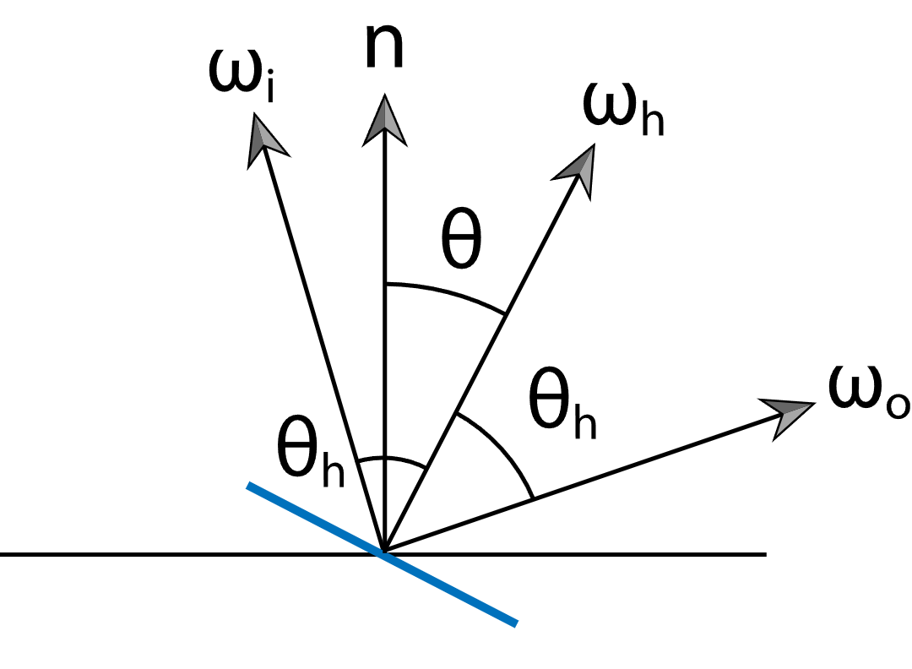 

具有方向$\omega_h$的微面的微分面积是 
$$
\mathrm{d}A(\omega_{h})=D(\omega_{h})\,\mathrm{d}\omega_{h}\,\mathrm{d}A\\
$$

等式的前两个项描述了具有某方向的每单位面积的面的微分面积，同时$\text{d}A$项将其转换为微分面积。 
$$
\mathrm{d}\Phi_{\mathrm{h}}\,=\,L_{\mathrm{i}}\,(\omega_{\mathrm{i}})\,\mathrm{d}\omega\,\cos\theta_{\mathrm{h}}\,D(\omega_{\mathrm{h}})\,\mathrm{d}\omega_{\mathrm{h}}\,\mathrm{d}A\\
$$

所以，

( 8.15 )
如果我们假设微面根据菲涅耳定律单独反射光，则出射通量为

( 8.16 )
再次使用辐射度的定义，反射的出射辐射度为

如果我们将方程 ( 8.16 ) 代入这个，然后将方程 ( 8.15 ) 代入结果，我们有

在第 14.1.1节中，我们将推导出镜面反射 之间和下的重要关系：

( 8.17 )
我们可以将此关系代入前面的等式并简化，给出

我们现在可以应用 BRDF 的定义，方程 ( 5.8 ) 并添加几何衰减项，这给了我们 Torrance-Sparrow BRDF： 

( 8.18 )
Torrance-Sparrow 模型的优点之一是推导不依赖于所使用的特定微平面分布。此外，它不依赖于特定的菲涅耳函数，因此可用于导体和电介质。然而，推导中使用的和之间的关系确实取决于微面镜面反射的假设。 

**参考资料**

1. [《Microfacet Models for Refraction through Rough Surfaces》(大名鼎鼎的GGX)] (https://www.cs.cornell.edu/~srm/publications/EGSR07-btdf.pdf)
2. [Games101-p17] (https://www.bilibili.com/video/BV1X7411F744?p=17&share_source=copy_web&vd_source=e84f3d79efba7dc72e6306f35613222e)
3. [How Is The NDF Really Defined?] (https://www.reedbeta.com/blog/hows-the-ndf-really-defined/)
4. [《Average irregularity representation of a rough surface for ray reflection》] (https://gitea.yiem.net/QianMo/Real-Time-Rendering-4th-Bibliography-Collection/raw/branch/main/Chapter%201-24/[1788]%20[Paper%201975]%20Average%20Irregularity%20Representation%20of%20a%20Roughened%20Surface%20for%20Ray%20Reflection.pdf)
5. [基于物理的渲染（PBR）白皮书】（四）法线分布函数相关总结] (https://zhuanlan.zhihu.com/p/69380665)
6. [Understanding the Masking-Shadowing Function in Microfacet-Based BRDFs] (https://jcgt.org/published/0003/02/03/paper.pdf)
7. [《Theory for off-specular reflection from roughened surfaces》（这篇文章并不是图形领域的论文，而是理论物理的. 震惊!）] (http://www.graphics.cornell.edu/~westin/pubs/TorranceSparrowJOSA1967.pdf)